# DBT Introduction

什么是数据库技术（DBT）？

研究如何科学组织和存储数据，如何高效地获取和处理数据，以及如何保障数据安全，实现数据共享。

## 1.1 数据库技术相关概念

### 1.1.1 四个基本概念
+ 数据(Data)
+ 数据库(Database)
+ 数据库管理系统(DBMS)
+ 数据库系统(DBS)

#### 数据
数据(Data)是**数据库中存储的基本对象**。

+ 数据的定义：描述事物的符号记录，是现实世界信息的载体

+ 数据的种类：文本、图形、图像、音频、视频、学生的档案记录、货物的运输情况等

+ 数据的含义称为数据的语义，数据与其语义是不可分的，例如93是一个数据
  + 语义1：学生某门课的成绩
  + 语义2：某人的体重
  + 语义3：计算机系2009级学生人数

#### 数据库
数据库(Database,简称DB)是**长期储存在计算机内、有组织的、可共享的大量数据的**集合。

数据库的基本特征
+ 数据按一定的数据模型组织、描述和储存
+ 可为各种用户共享
+ 冗余度较小
+ 数据独立性较高
+ 易扩展

#### 数据库管理系统 
数据库管理系统（DBMS，DatabaseManagementSystem）
+ 位于用户与操作系统之间的一层数据管理软件。
+ 是基础软件，是一个大型复杂的软件系统。

DBMS的用途
+ 科学地组织和存储数据、高效地获取和维护数据等

DBMS在计算机系统中的位置
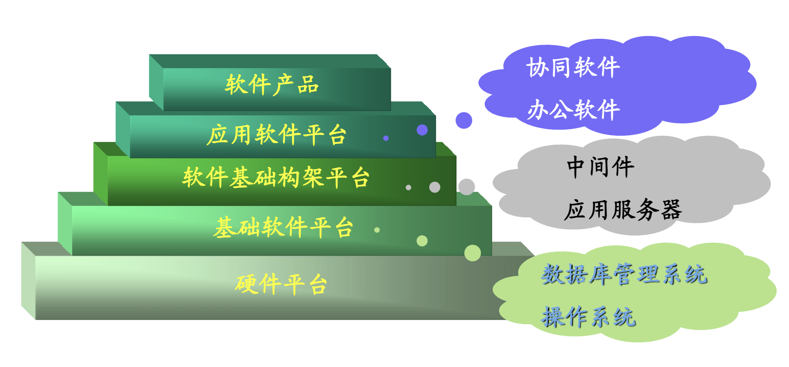

DBMS的主要功能
+ 数据定义功能
  + 提供数据定义语言(DDL)
  + 定义数据库中的数据对象

+ 数据组织、存储和管理
  + 分类组织、存储和管理各种数据
  + 确定组织数据的文件结构和存取方式
  + 实现数据之间的联系
  + 提供多种存取方法提高存取效率

+ 数据操纵功能
  + 提供数据操纵语言(DML)
  + 实现对数据库的基本操作 (查询、插入、删除和修改)

+ 数据库的事务管理和运行管理
  + 数据库在建立、运行和维护时由DBMS统一管理和控制
  + 保证数据的安全性、完整性、多用户对数据的并发使用
  + 发生故障后的系统恢复

+ 数据库的建立和维护功能
  + 数据库初始数据装载转换
  + 数据库转储
  + 介质故障恢复
  + 数据库的重组织
  + 性能监视分析等

+ 其它功能
  + DBMS与网络中其它软件系统的通信
  + 两个DBMS系统的数据转换
  + 异构数据库之间的互访和互操作

#### 数据库系统

数据库系统（DatabaseSystem，简称DBS）
+ **在计算机系统中引入数据库后的系统构成，包括硬件、软件、数据和人员。**

数据库系统的构成
+ 硬件（内存、大容量存储设备等）
+ 软件
  + OS(操作系统)
  + 数据库(Database)
  + 数据库管理系统（及其开发工具）(DatabaseManagementSystem)
  + 应用系统
+ 数据（目标数据、描述数据）
+ 人员（数据库管理员(Database Administrator)、系统分析员、应用程序员、最终用户）
  + 数据库管理员（DBA）：负责管理数据库资源；确定用户需求，设计、实现数据库，并负责维护和管理数据库。
  + 系统分析员：能参与应用信息系统的规划、设计、构建、运行和管理，能按照用户需求，设计、建立、运行、维护高质量的数据库和数据仓库；
  + 应用程序员
  + 最终用户

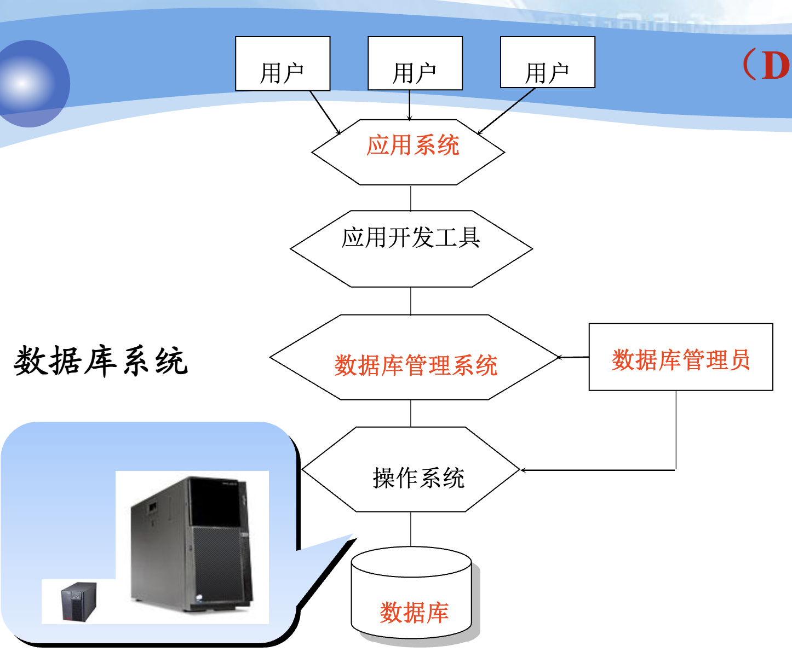

### 1.1.2 数据管理技术的产生和发展

什么是数据管理
+ 对数据进行分类、组织、编码、存储、检索和维护
+ 数据处理的中心问题

数据管理技术的发展过程
+ 人工管理阶段(20世纪40年代中~ 50年代中)
+ 文件系统阶段(20世纪50年代末~ 60年代中)
+ 数据库系统阶段(20世纪60年代末~ 现在)

数据管理技术的发展动力
+ 应用需求的推动
+ 计算机硬件的发展
+ 计算机软件的发展
+ 理论的发展

#### 人工管理阶段
时期
+ 20世纪40年代中~ 50年代中期

产生的背景
+ 应用需求:科学计算
+ 硬件水平:无直接存取存储设备
+ 软件水平:没有操作系统
+ 处理方式:批处理

特点
+ 数据的管理者：用户（程序员），数据不保存
+ 数据面向的对象：某一应用程序
+ 数据的共享程度：无共享、冗余度极大
+ 数据的独立性：不独立，完全依赖于程序
+ 数据的结构化：无结构
+ 数据控制能力：应用程序自己控制

#### 文件系统阶段

时期
+ 20世纪50年代末~ 60年代中期

产生的背景
+ 应用需求 ：科学计算、管理
+ 硬件水平 ：磁盘、磁鼓
+ 软件水平 ：有文件系统
+ 处理方式 ：联机实时处理、批处理

特点
+ 数据的管理者：文件系统，数据可长期保存
+ 数据面向的对象：某一应用程序
+ 数据的共享程度：共享性差、冗余度大
+ 数据的结构化：记录内有结构，整体无结构
+ 数据的独立性：独立性差，数据的逻辑结构改变必须修改应用程序
+ 数据控制能力：应用程序自己控制

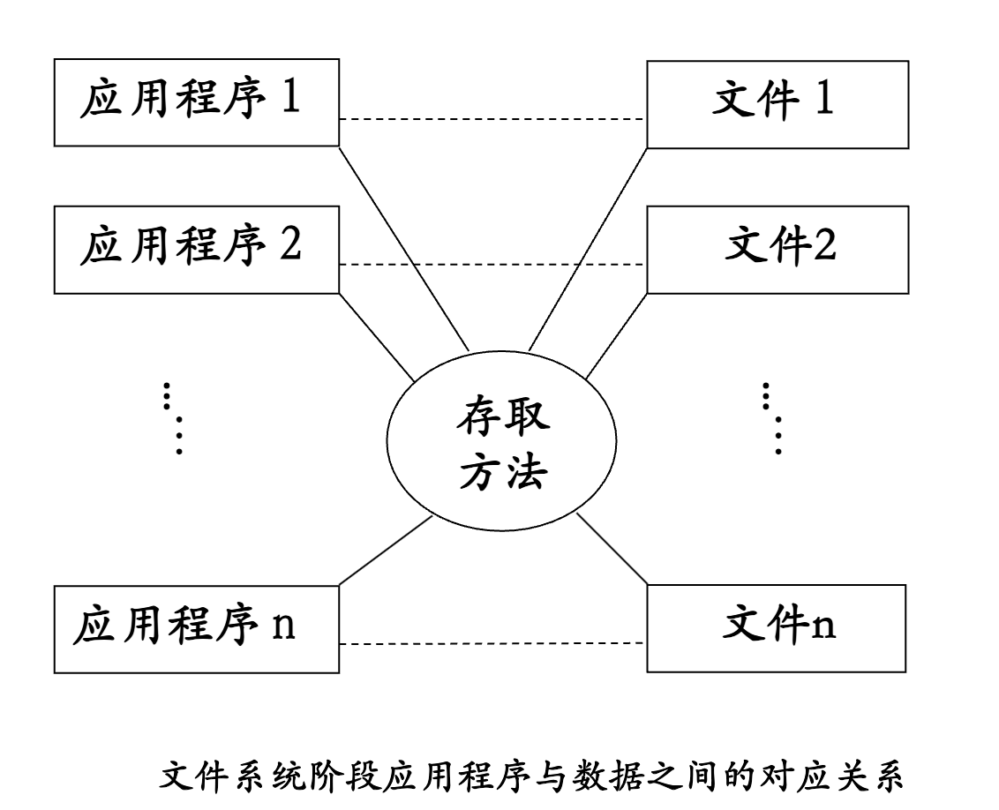

文件系统中数据的结构
+ 记录内有结构。
+ 数据的结构是靠程序定义和解释的。
+ 数据只能是定长的。
+ 可以间接实现数据变长要求，但访问相应数据的应用程序复杂了。
+ 文件间是独立的，因此数据整体无结构。
+ 可以间接实现数据整体的有结构，但必须在应用程序中对描述数据间的联系。
+ 数据的最小存取单位是记录。

#### 数据库系统阶段

时期
+ 20世纪60年代末以来

产生的背景
+ 应用背景 ：大规模管理
+ 硬件背景 ：大容量磁盘、磁盘阵列
+ 软件背景 ：有数据库管理系统
+ 处理方式 ：联机实时处理,分布处理,批处理

### 1.1.3 数据库系统的特点

+ **数据结构化**：数据库里的数据不是零散存储（比如单独的文件），而是按统一的结构（如表格、关系模型）组织，不同数据之间存在关联，能更有条理地表达复杂的业务关系。
+ **数据的共享性高，冗余度低，易扩充**：共享性高：多个用户、不同应用可以同时使用同一份数据；冗余度低：重复存储的数据少，既节省空间，也避免了 “同一信息多处不一致” 的问题；易扩充：后续新增数据类型、拓展业务场景时，不用大幅改动原有数据结构。
+ **数据独立性高**：分 “物理独立性” 和 “逻辑独立性”：物理独立性：数据的存储方式（比如存在哪个硬盘、用什么格式存）改变时，应用程序不用修改；逻辑独立性：数据的逻辑结构（比如表的字段调整）改变时，应用程序也能保持稳定。
+ **数据由DBMS统一管理和控制** ：DBMS（数据库管理系统）会统一负责数据的存储、安全、并发访问（比如多用户同时操作数据不冲突）、备份恢复等工作，不用用户手动维护，更可靠高效。数据独立性是由DBMS的二级映像功能来保证的。

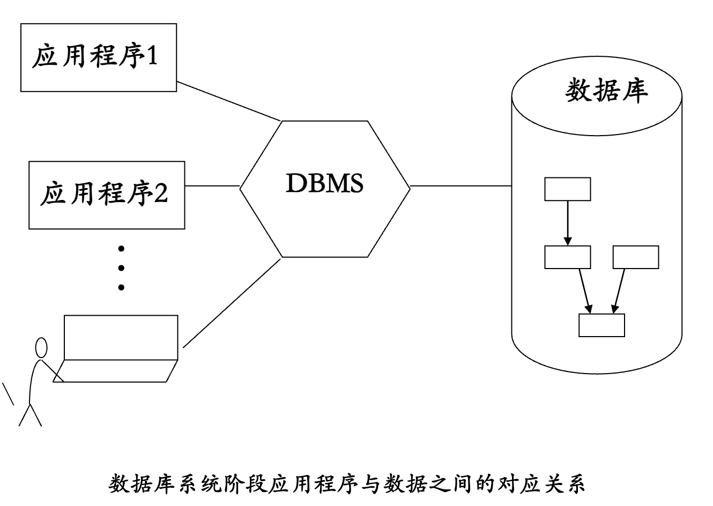

### 1.1.4 常用的数据库管理系统介绍

+ 关系型数据库管理系统(RDBMS)
  + Oracle Database
  + MySQL
  + Microsoft SQL Server
  + PostgreSQL
  + SQLite
  + IBM Db2
+ 非关系型数据库管理系统(NoSQL)
  + MongoDB
  + Redis
  + Cassandra
  + CouchDB
  + Amazon DynamoDB     
  + HBase
+ 分布式数据库管理系统
  + Apache Cassandra
  + Google Spanner      
  + CockroachDB
  + Amazon Aurora

国产数据库：

**2019年5月15日，华为推出分布式数据库GaussDB**

## 1.2 数据模型

回顾：什么是数据、数据库？
+ 数据：描述事物的符号记录，是现实世界信息的载体
+ 数据库：长期储存在计算机内、有组织的、可共享的大量数据的集合

问题：数据如何描述、解释客观世界？是杂乱无章、毫无规则的存入计算机？
+ 思路：用一些方法和手段来规范我们的数据
+ 解决：建立数据模型

### 1.2.1  两大类数据模型

在数据库中用数据模型这个工具来抽象、表示和处理现实世界中的数据和信息。通俗地讲数据模型就是现实世界的模拟。

数据模型应满足三方面要求
+ 能比较真实地模拟现实世界
+ 容易为人所理解
+ 便于在计算机上实现

数据模型分为两类（分属两个不同的层次）
+ **概念模型也称信息模型**，它是按用户的观点来对数据和信息建
模，用于数据库设计。
+ **逻辑模型和物理模型**
  + 逻辑模型主要包括网状模型、层次模型、关系模型、面向对象
  模型等，按计算机系统的观点对数据建模，用于DBMS实现。
  + 物理模型是对数据最底层的抽象，描述数据在系统内部的表示
  方式和存取方法，在磁盘或磁带上的存储方式和存取方法。

客观对象的抽象过程---两步抽象
+ 现实世界中的客观对象抽象为概念模型；
+ 把概念模型转换为某一DBMS支持的数据模型。

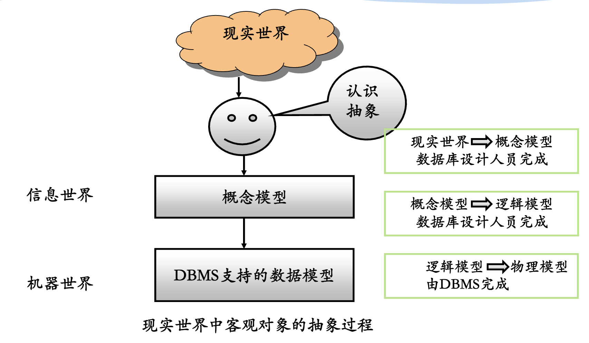

### 1.2.2  数据模型的组成要素

数据模型：是描述数据、数据联系、数据语义和完整性约束的概念集，由以下三部分组成：
+ 数据结构
+ 数据操作
+ 完整性约束条件

#### 数据结构
什么是数据结构
+ 描述数据库的组成对象，以及对象之间的联系

描述的内容
+ 与数据类型、内容、性质有关的对象
+ 与数据之间联系有关的对象

数据结构是对系统静态特性的描述

#### 数据操作
数据操作
+ 对数据库中各种对象(型)的实例(值)允许执行的操作及有关的操作规则

数据操作的类型
+ 查询
+ 更新(包括插入、删除、修改)

数据模型对操作的定义
+ 操作的确切含义
+ 操作符号
+ 操作规则（如优先级）
+ 实现操作的语言

数据操作是对系统动态特性的描述

#### 数据的完整性约束条件

+ 一组完整性规则的集合
+ 完整性规则：给定的数据模型中数据及其联系所具有的制约和储存规则
+ 用以限定符合数据模型的数据库状态以及状态的变化，以保证数据的正确、有效、相容

数据模型对完整性约束条件的定义
+ 反映和规定本数据模型必须遵守的基本的、通用的完整性约束条件。例如在关系模型中，任何关系必须满足实体完整性和参照完整性两个条件。
+ 提供定义完整性约束条件的机制，以反映具体应用所涉及的数据必须遵守的特定的语义约束条件。

### 1.2.3  概念模型

+ 信息世界中的基本概念
+ 两个实体型之间的联系
+ 两个以上实体型之间的联系
+ 单个实体型内的联系
+ 概念模型的一种表示方法

概念模型的用途
+ 概念模型用于信息世界的建模
+ 是现实世界到机器世界的一个中间层次
+ 是数据库设计的有力工具
+ 数据库设计人员和用户之间进行交流的语言

对概念模型的基本要求
+ 较强的语义表达能力
+ 能够方便、直接地表达应用中的各种语义知识
+ 简单、清晰、易于用户理解

#### 信息世界中的基本概念

1. 实体（Entity）
客观存在并可相互区别的事物称为实体。
可以是具体的人、事、物或抽象的概念。
2. 属性（Attribute）
实体所具有的某一特性称为属性。
一个实体可以由若干个属性来刻画。
3. 码（Key）
唯一标识实体的属性集称为码。
4. 域（Domain）
属性的取值范围称为该属性的域。
5. 实体型（EntityType）
用实体名及其属性名集合来抽象和刻画同类实体称为实体型
6. 实体集（Entity Set）
同一类型实体的集合称为实体集
7. 联系（Relationship）
现实世界中事物内部以及事物之间的联系在信息世界中反映为实体内部的联系和实体之间的联系。
实体内部的联系通常是指组成实体的各属性之间的联系,实体之间的联系通常是指不同实体集之间的联系

#### 两个实体型之间的联系

用图形来表示两个实体型之间的这三类联系

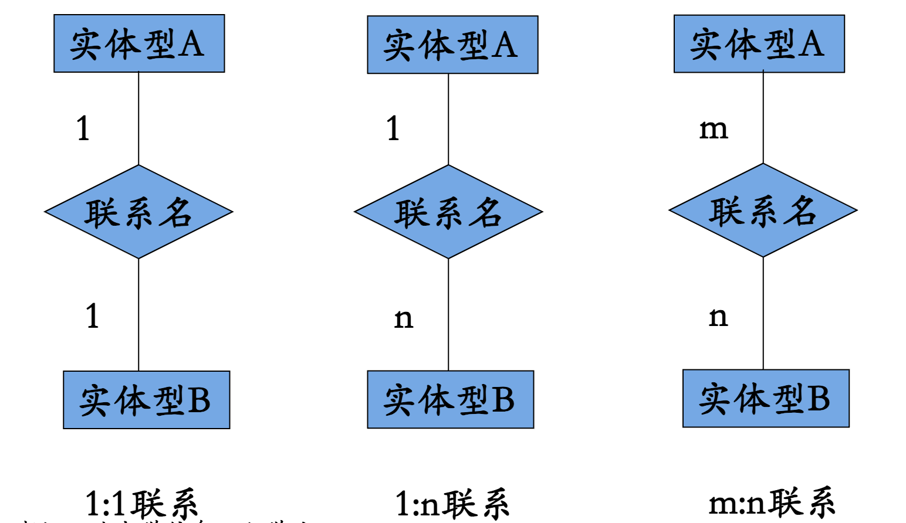

**一对一联系（1:1）**

实例
+ 一个班级只有一个正班长
+ 一个班长只在一个班中任职

定义：
+ 如果对于实体集A中的每一个实体，实体集B中至多有一个（也可以没有）实体与之联系，反之亦然，则称实体集A与实体
集B具有一对一联系，记为1:1

**一对多联系（1：n）**

实例
+ 一个班级中有若干名学生，
+ 每个学生只在一个班级中学习

定义：
+ 如果对于实体集A中的每一个实体，实体集B中有n个实体（n≥0）与之联系，反之，对于实体集B中的每一个实体，实体集A中至多只有一个实体与之联系，则称实体集A与实体集B有一对多联系，记为1:n

**多对多联系（m:n）**

实例
+ 课程与学生之间的联系：
一门课程同时有若干个学生选修,一个学生可以同时选修多门课程

定义：
+ 如果对于实体集A中的每一个实体，实体集B中有n个实体（n≥0）与之联系，反之，对于实体集B中的每一个实体，实体集A中也有m个实体（m≥0）与之联系，则称实体集A与实体B
具有多对多联系，记为m:n

#### 两个以上实体型之间的联系

**两个以上实体型之间一对多联系**

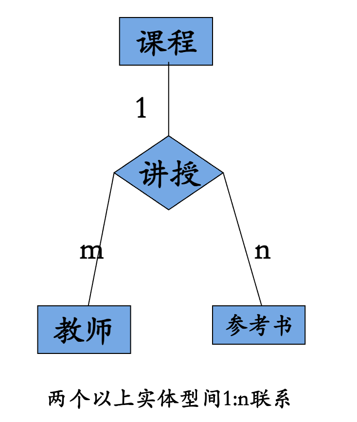

课程、教师与参考书三个实体型
+ 一门课程可以有若干个教师讲授，使用若干本参考书，
+ 每一个教师只讲授一门课程，
+ 每一本参考书只供一门课程使用

**多个实体型间的一对一联系**

**两个以上实体型间的多对多联系**

供应商、项目、零件三个实体型
+ 一个供应商可以供给多个项目多种零件
+ 每个项目可以使用多个供应商供应的零件
+ 每种零件可由不同供应商供给

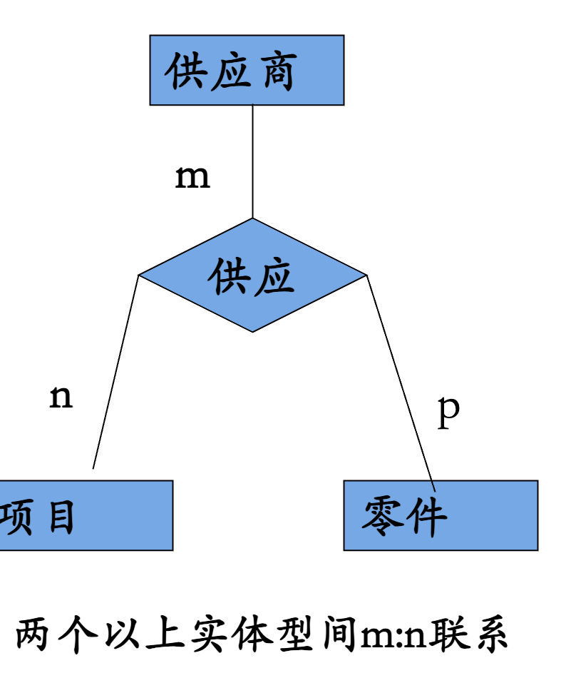

**一对多联系**

职工实体型内部具有领导与被领导的联系
+ 某一职工（干部）“领导”若干名职工
+ 一个职工仅被另外一个职工直接领导

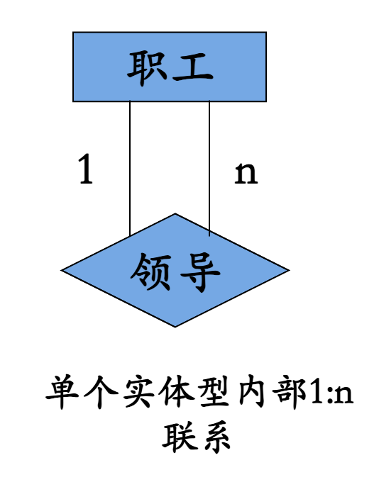

**多对多联系**

比如零件，零件中有些零件可以组合成新零件，而有些零件是由多个
零件组合而成。

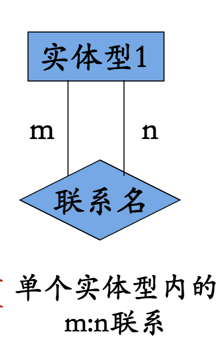

#### 概念模型的一种表示方法

实体－联系方法(E-R方法，Entity Relationship 
Diagram)
+ 用E-R图来描述现实世界的概念模型
+ E-R方法也称为E-R模型

**E-R图**

+ 实体型
用矩形表示，矩形框内写明实体名。

+ 属性
用椭圆形表示，并用无向边将其与相应的实体连接起来
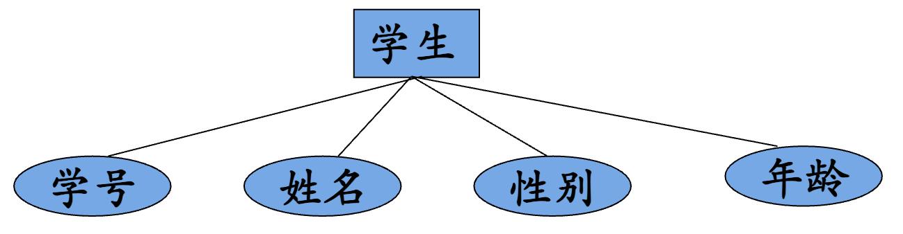

+ 联系
用菱形表示，菱形框内写明联系名，并用无向边分别
与有关实体连接起来，同时在无向边旁标上联系的类
型（1:1、1:n或m:n）
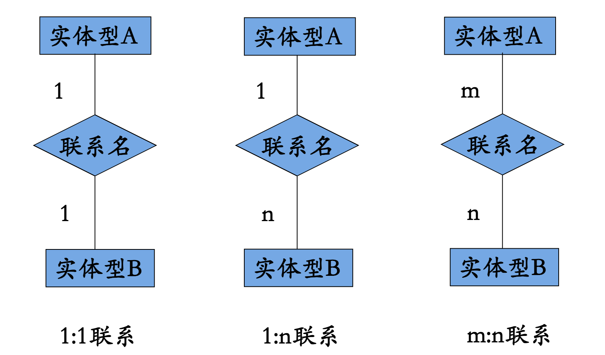

+ 联系的属性
联系本身也是一种实体型，也可以有属性。如果一个联系具
有属性，则这些属性也要用无向边与该联系连接起来。

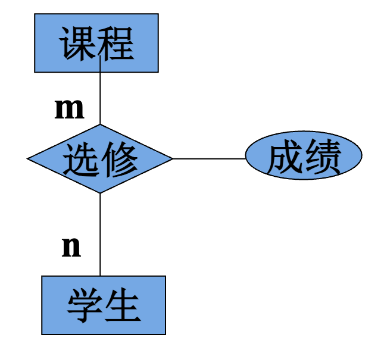

### 1.2.4  三种最常用的数据模型及相应的数据库系统

+ 非关系模型
  + 层次模型(Hierarchical Model)
  + 网状模型(NetworkModel)
+ 关系模型(RelationalModel)
+ 面向对象模型（ObjectOrientedModel）
+ 对象关系模型(ObjectRelationalModel)
+ NoSQL数据模型（key-value、文档、列簇、graph）

NoSQL (通常指“Not Only SQL”)是一类数据库管理系统的总称。它不是用来完全替代传统的关系型数据库（如SQLServer，MySQL, PostgreSQL）的，而是作为一种补充，用于解决传统数据库在某些特定场景下遇到的挑战。

出现NoSQL主要是为了适应互联网的爆发式的增长，尤其是：
+ 海量数据（Volume）:数据量从GB、TB级别暴增至PB、EB级别，传统数据库难以处理。
+ 高并发读写（Velocity）:需要支持数以万计甚至百万计的并发用户访问，对数据库的读写性能要求极高。
+ 数据类型多样化（Variety）:数据不再仅仅是结构化的表格数据，还包括了大量的半结构化（如JSON、XML）和非结构化数据（如文本、图片、视频）。
+ 高可用性和可扩展性（Availability &Scalability）:系统要求7x24小时不间断服务，并且能够通过增加更多服务器（而不是升级单个服务器）来线性地提升性能。

| 分类               | Examples举例                          | 典型应用场景                                                     | 数据模型                               | 优点                                         | 缺点                                                     |
| :----------------- | :------------------------------------ | :--------------------------------------------------------------- | :------------------------------------- | :------------------------------------------- | :------------------------------------------------------- |
| 键值（key-value）  | Tokyo Cabinet/Tyrant，Redis，Voldemort，Oracle BDB | 内容缓存，主要用于处理大量数据的高访问负载，也用于一些日志系统等等。 | Key指向Value的键值对，通常用hash table来实现 | 查找速度快                                   | 数据无结构化，通常只被当作字符串或者二进制数据           |
| 列存储数据库       | Cassandra，HBase，Riak                | 分布式的文件系统                                                 | 以列簇式存储，将同一列数据存在一起     | 查找速度快，可扩展性强，更容易进行分布式扩展 | 功能相对局限                                             |
| 文档型数据库       | CouchDB，MongoDB                      | Web应用（与Key-Value类似，Value是结构化的，不同的是数据库能够了解Value的内容） | Key-Value对应的键值对，Value为结构化数据 | 数据结构要求不严格，表结构可变，不需要像关系型数据库一样需要预先定义表结构 | 查询性能不高，而且缺乏统一的查询语法。                   |
| 图形(Graph)数据库 | Neo4J，InfoGrid，Infinite Graph       | 社交网络，推荐系统等。专注于构建关系图谱                         | 图结构                                 | 利用图结构相关算法。比如最短路径寻址，N度关系查找等 | 很多时候需要对整个图做计算才能得出需要的信息，而且这种结构不太好做分布式的集群方案。 |

#### 层次模型

+ 层次模型是数据库系统中最早出现的数据模型
+ 层次数据库系统的典型代表是IBM公司的IMS（Information 
Management System）数据库管理系统
+ 层次模型用树形结构来表示各类实体以及实体间的联系

**层次数据模型的数据结构**

满足下面两个条件的基本层次联系的集合为层次模型
1. 有且只有一个结点没有双亲结点，这个结点称为根结点
2. 根以外的其它结点有且只有一个双亲结点

层次模型中的几个术语
+ 根结点，双亲结点，兄弟结点，叶结点
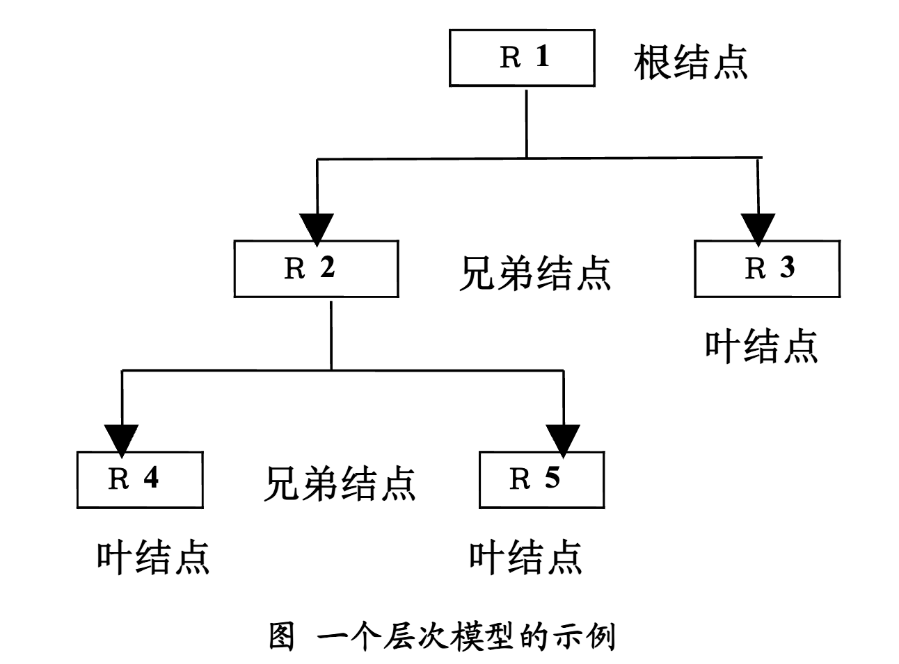

层次模型的特点：
+ 结点的双亲是唯一的
+ 只能直接处理一对多的实体联系
+ 每个记录类型可以定义一个排序字段，也称为码字段
+ 任何记录值只有按其路径查看时，才能显出它的全部意义
+ 没有一个子女记录值能够脱离双亲记录值而独立存在

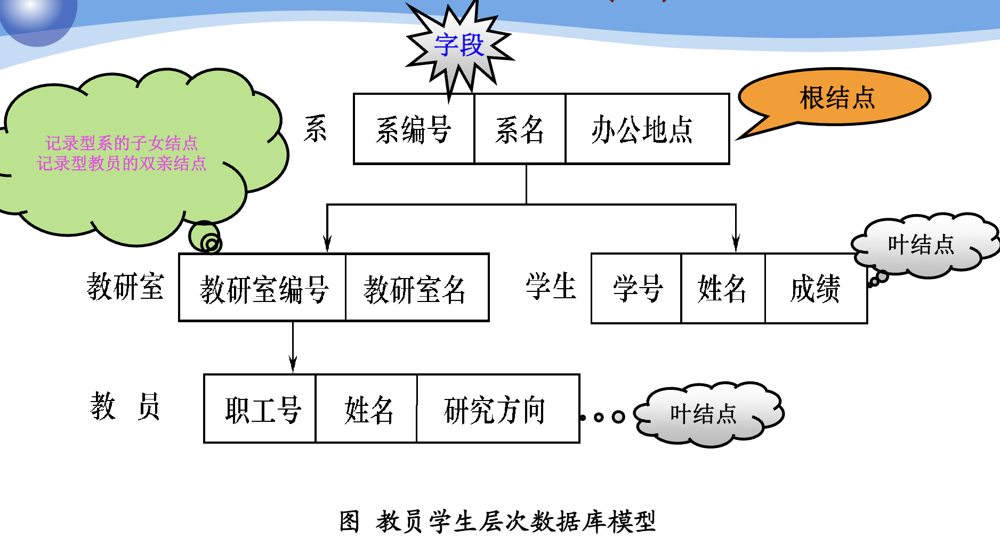
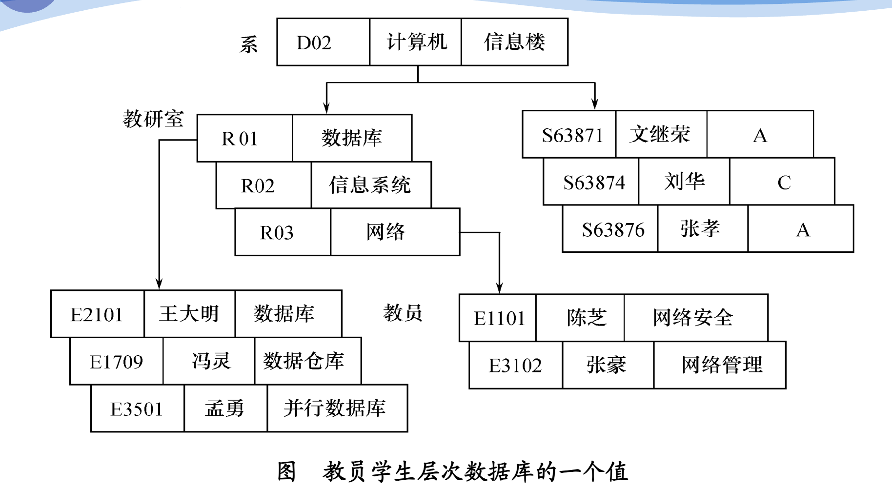

**多对多联系在层次模型中的表示**

+ 用层次模型间接表示多对多联系
+ 方法
  + 将多对多联系分解成一对多联系
+ 分解方法
  + 冗余结点法
  + 虚拟结点法

层次模型的数据操纵
+ 查询
+ 插入
+ 删除
+ 更新

层次模型的完整性约束条件
+ 无相应的双亲结点值就不能插入子女结点值
+ 如果删除双亲结点值，则相应的子女结点值也被同时
删除
+ 更新操作时，应更新所有相应记录，以保证数据的一
致性

**层次模型的优缺点**

优点
+ 层次模型的数据结构比较简单清晰
+ 查询效率高，性能优于关系模型，不低于网状模型
+ 层次数据模型提供了良好的完整性支持

缺点
+ 多对多联系表示不自然
+ 对插入和删除操作的限制多，应用程序的编写比较
复杂
+ 查询子女结点必须通过双亲结点
+ 由于结构严密，层次命令趋于程序化

#### 网状模型

+ 网状数据库系统采用网状模型作为数据的组织方式
+ 典型代表是DBTG系统：
  + 亦称CODASYL系统
  + 70年代由DBTG提出的一个系统方案
  + 奠定了数据库系统的基本概念、方法和技术

网状模型满足下面两个条件的基本层次联系的集合：
1. 允许一个以上的结点无双亲；
2. 一个结点可以有多于一个的双亲。

表示方法(与层次数据模型相同)
+ 实体型：用记录类型描述，每个结点表示一个记录类型（实体）
+ 属 性：用字段描述，每个记录类型可包含若干个字段
+ 联 系：用结点之间的连线表示记录类型（实体）之间的一对多的父子联系

网状模型与层次模型的区别
+ 网状模型允许多个结点没有双亲结点
+ 网状模型允许结点有多个双亲结点
+ 网状模型允许两个结点之间有多种联系（复合联系）
+ 网状模型可以更直接地去描述现实世界
+ 层次模型实际上是网状模型的一个特例

**网状数据模型的优缺点**

优点
+ 能够更为直接地描述现实世界，如一个结点可以有多个双亲
+ 具有良好的性能，存取效率较高

缺点
+ 结构比较复杂，而且随着应用环境的扩大，数据库的结构就变得
越来越复杂，不利于最终用户掌握
+ DDL、DML语言复杂，用户不容易使用

#### 关系模型
关系数据库系统采用关系模型作为数据的组织方式

1970年美国IBM公司San Jose[圣何塞]研究室的研究员E.F.Codd发表关于关系数据库的论文（A Relational Model of Data for Large Shared Data Banks），首次提出了数据库系统的关系模型。

计算机厂商新推出的数据库管理系统几乎都支持关系模型
+ SQL Server
+ Oracle
+ DB2
+ MySQL
+ Sybase
+ 达梦
+ 人大金仓

关系模型中数据的逻辑结构是一张二维表，它由行和列组成。
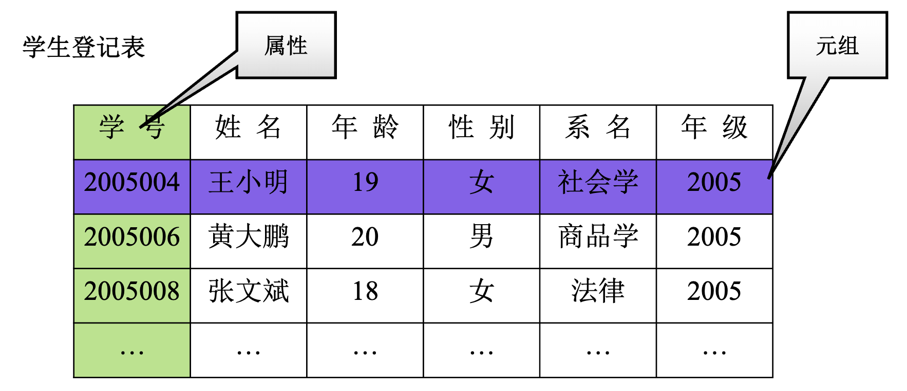

+ 关系（Relation）
一个关系对应通常说的一张二维表

+ 元组（Tuple）
表中的一行即为一个元组

+ 属性（Attribute）
表中的一列即为一个属性，给每一个属性起一个名称即属性名

+ 主码（Key）或关键字
表中的某个属性组，它可以唯一确定一个元组。

+ 域（Domain）
属性的取值范围。

+ 分量
元组中的一个属性值。

+ 关系模式
对关系的描述，关系名（属性1，属性2，...，属性n），如：学生（学号，姓名，年龄，性别，系，年级）

关系必须是规范化的，满足一定的规范条件，最基本的规范条件：关系的每一个分量必须是一个不可分的数据项,不允许表中还有表（1NF），下图中工资和扣除是可分的数据项,不符合关系模型要求：

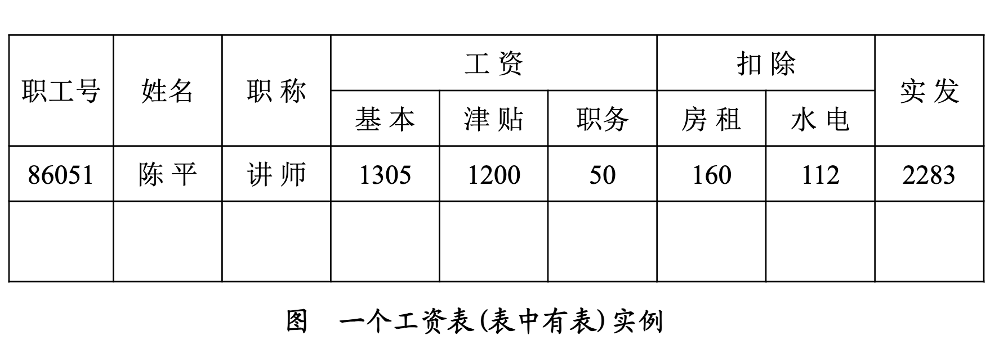

目前关系数据库有以下几种范式：第一范式（1NF）、第二范式（2NF）、第三范式（3NF）、Boyce-Codd范式（BCNF）
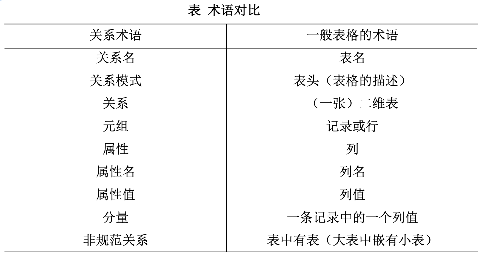

优点
+ 建立在严格的数学理论的基础上（关系代数）
+ 概念单一
  + 实体和各类联系都用关系来表示
  + 对数据的检索结果也是关系
+ 关系模型的存取路径对用户透明
  + 具有更高的数据独立性，更好的安全保密性
  + 简化了程序员的工作和数据库开发建立的工作

缺点
+ 存取路径对用户透明导致查询效率往往不如非关系数据模型
+ 为提高性能，必须对用户的查询请求进行优化增加了开发DBMS的难度

## 1.3 数据库系统结构

从数据库管理系统角度看，数据库系统通常采用三级模式结构，是数据库系统内部的系统结构；

从数据库最终用户角度看（数据库系统外部的体系结构），数据库系统的结构分为:
+ 单用户结构
+ 主从式结构
+ 分布式结构
+ 客户／服务器
+ 浏览器／应用服务器／数据库服务器多层结构等

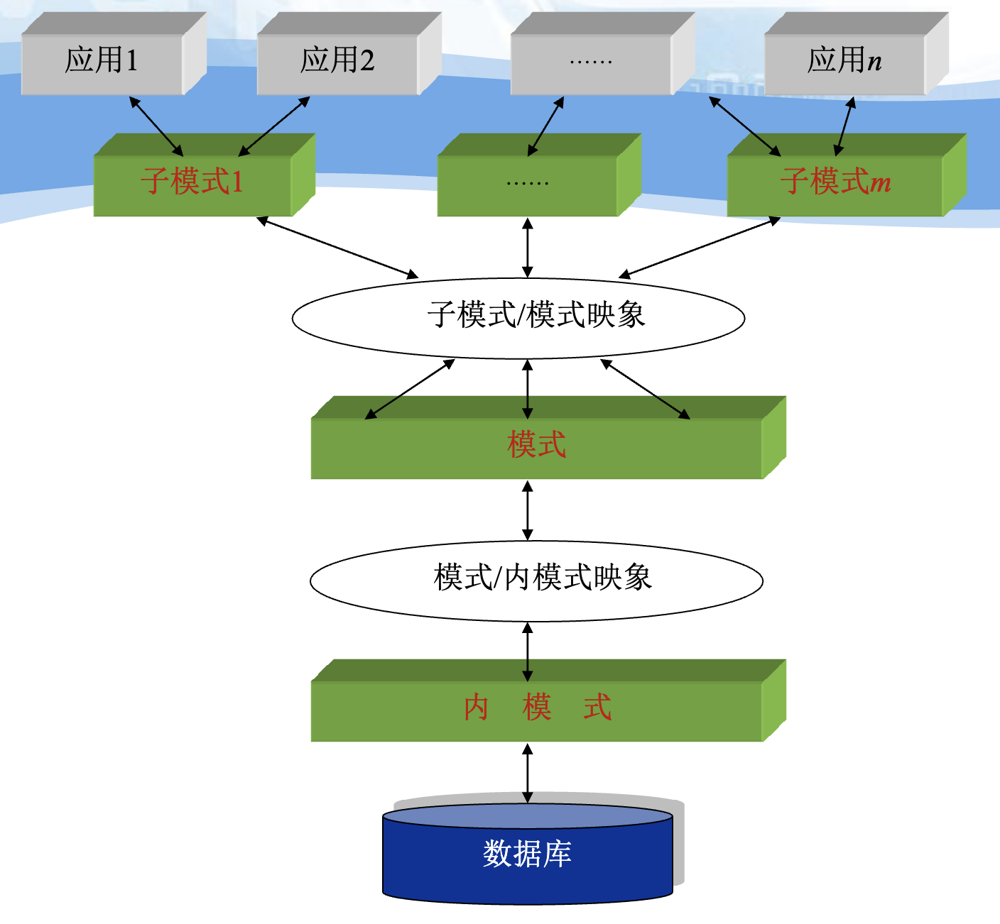

### 1.3.1 模式结构
+ **外模式**
外模式也称子模式或用户模式，它是数据库用户（包括应用程序员和最终用户）看见和使用的局部数据的逻辑结构和特征的描述，是数据库用户的数据视图，是与某一应用有关的数据的逻辑表示。一个数据库可以有多个外模式。

+ **模式**
模式也称逻辑模式，是数据库中全体数据的逻辑结构和特征的描述，是所有用户的公用数据视图。一个数据库只有一个模式。

+ **内模式**
内模式也称存储模式，它是数据物理和存储结构的描述，是数据在数据库内部的表示方式。一个数据库只有一个内模式。

+ **外模式/模式映像**
模式描述的是数据的全局逻辑结构，外模式描述的是数据的局部逻辑结构。对应于同一个模式可以有任意多个外模式。对于每一个外模式，数据库系统都有一个外模式/模式映像，它定义了该外模式与模式之间的对应关系。当模式改变时（例如，增加新的数据类型、新的数据项、新的关系等），由数据库管理员对各个外模式/模式的映像作相应改变，可以使外模式保持不变，从而应用程序不必修改，保证了数据的逻辑独立性。

+ **模式/内模式映像**
数据库中只有一个模式，也只有一个内模式，所以模式/内模式映
像是惟一的，它定义了数据全局逻辑结构与存储结构之间的对应
关系。

**外模式/模式映像**还有**模式/内模式映像**被称为两级映像结构。

优点
+ 保证数据的独立性
  + 将模式和内模式分开，保证了数据的物理独立性；
  + 将外模式和模式分开，保证了数据的逻辑独立性。

+ 简化了用户接口
  + 按照外模式编写应用程序或敲入命令，而不需了解数据库内部的
存储结构，方便用户使用系统。

+ 有利于数据共享
  + 在不同的外模式下可有多个用户共享系统中数据，减少了数据冗
余。

+ 利于数据的安全保密
  + 在外模式下根据要求进行操作，不能对限定的数据操作，保证了
其他数据的安全。

### 1.3.2 体系结构
+ **单用户数据库系统**
单用户数据库系统是一种早期的最简单的数据库系统。在这种系统中，整个数据库系统（包括应用程序、DBMS、数据）都装在一台计算机上，由一个用户独占，不同机器之间不能共享数据。

+ **主从式结构**
主从式结构是指一个主机带多个终端的多用户结构。在这种结构中，数据库系统（包括应用程序、DBMS、数据）都集中存放在主机上，所有处理任务都由主机来完成，各个用户通过主机的终端并发地存取数据库，共享数据资源。

+ **分布式结构**
分布式结构是指数据库中的数据在逻辑上是一个整体，但物理地分布在计算机网络的不同节点上。网络中的每个节点都可以独立处理本地数据库中的数据，执行局部应用；同时也可以同时存取和处理多个异地数据库中的数据，执行全局应用。

+ **客户/服务器结构**
  + 客户端的用户请求被传送到数据库服务器，数据库服务器进行处理后，只将结果返回给用户，从而显著减少了数据传输量
  + 存在胖客户端问题，维护量大

+ **浏览器/服务器结构**
客户端以浏览器作为用户界面，服务器端包括Web服务器、应用服务器和数据库服务器，大大减少了系统开发和维护代价能够支持数万甚至更多的用户。

## 1.4 数据库系统的组成

