[TOC]

# 关系数据库标准语言 - SQL

SQL是结构化查询语言（Structured Query Language）的缩写，其功能包括数据查询、数据操纵、数据定义和数据控制四个部分。SQL 语言简洁、方便实用、功能齐全，已成为目前应用最广的关系数据库语言。


## SQL语言的基本概念与特点

### SQL语言的基本概念

首先介绍两个基本概念：基本表和视图。
+ **基本表（BASE TABLE）**：是独立存在的表，不是由其它的表导出的表。一个关系对应一个基本表，一个或多个基本表对应一个存储文件。

+ **视图（VIEW）**：
  + 是一个虚拟的表，是从一个或几个基本表导出的表。它本身不独立存在于数据库中，数据库中只存放视图的定义而不存放视图对应的数据，这些数据仍存放在导出视图的基本表中。
  + 当基本表中的数据发生变化时，从视图中查询出来的数据也随之改变。


例如：学生数据库中有学生基本情况表STUDENT(SNO,SNAME,SSEX,SAGE,SDEPT)，此表为基本表，对应一个存储文件。可以在其基础上定义一个男生基本情况表

STUDENT_MALE(SNO,SNAME,SAGE,SDEPT)，
+ 它是从STUDENT中选择SSEX=’男’的各个行，然后在SNO,SNAME,SAGE,SDEPT上投影得到的。
+ 在数据库中只存有STUDENT_MALE的定义，而STUDENT_MALE的记录不重复存储。
+ 在用户看来，视图是通过不同路径去看一个实际表，就像一个窗口一样，我们通过窗户去看外面的高楼，可以看到高楼的不同部分，而透过视图可以看到数据库中自己感兴趣的内容。


SQL语言支持数据库的三级模式结构。其中**外模式**对应于视图和部分基本表，**模式**对应于基本表，**内模式**对应于存储文件。


外模式，模式，内模式的三者区分：
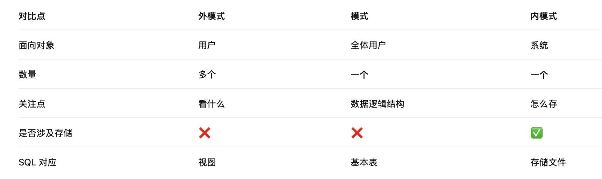

### SQL语言的主要特点

+ SQL语言类似于英语的自然语言，简洁易用。
+ SQL语言是一种非过程语言，即用户只要提出“干什么”即可，不必管具体操作过程，也不必了解数据的存取路径，只要指明所需的数据即可。
+ SQL语言是一种面向集合的语言，每个命令的操作对象是一个或多个关系，结果也是一个关系。
+ SQL语言既是自含式语言，又是嵌入式语言。可独立使用，也可嵌入到宿主语言中。
  + 自含式语言可以独立使用交互命令，适用于终端用
  户、应用程序员和DBA；
  + 嵌入式语言使其嵌入在高级语言中使用，供应用程
  序员开发应用程序。


## SQL语言功能
SQL语言具有:
+ 数据定义DDL（DEFINITION）
  + CREATE
  + ALTER
  + DROP
+ 数据查询DQL（QUERY）
  + SELECT
+ 数据操纵DML（MANIPULATION）
  + INSERT
  + UPDATE
  + DELETE
+ 数据控制DCL（CONTROL）
  + GRANT
  + REVOKE

四种语言一体化的功能。

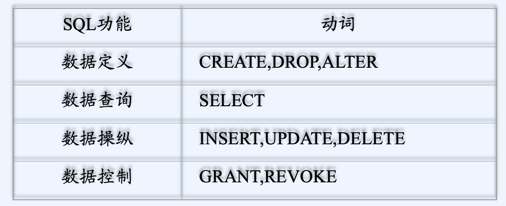


### 创建与管理数据库(DDL)


#### 数据库架构 SQL Server 2019


SQL Server 2019 数据库具有三种类型的文件：
+ 数据文件（Data File）：用于存储数据库中的数据和对象。数据文件有两种类型：
  + 主数据文件（Primary Data File，扩展名为 .mdf）：每个数据库都有一个主数据文件，包含数据库的基本结构和信息。
  + 辅助数据文件（Secondary Data File，扩展名为 .ndf）：可选的，用于存储数据库的其他数据，可以有多个辅助数据文件，以便分散存储和提高性能。
+ 日志文件（Log File，扩展名为 .ldf）：用于记录数据库中的所有事务和更改操作，以确保数据的完整性和恢复能力。每个数据库**至少有一个日志文件**。   
```
MDF ≈ 主文件
NDF ≈ 扩展文件
LDF ≈ 操作日志
```


SQL Server 2019 数据库包含以下系统数据库：
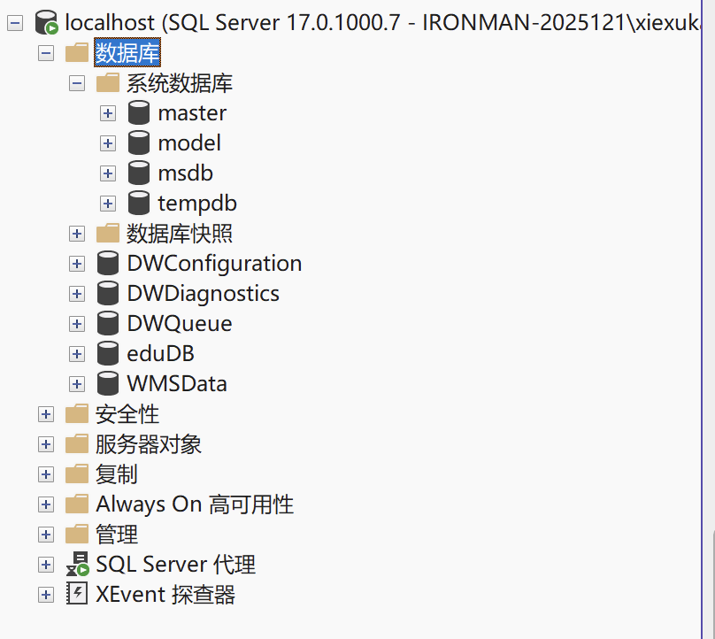

+ Master：记录 SQL Server 系统的所有系统级信息的数据库。
+ Model：在 SQL Server 实例上**创建的所有数据库的模板**。
+ Msdb：SQL Server 代理用来**安排警报和作业以及记录操作员信息**的数据库。
+ Tempdb：用于保存临时或中间结果集的工作空间。每次启动 SQL Server 实例时都会重新创建此数据库。**服务器实例关闭时，将永久删除tempdb 中的所有数据**。
+ Resource (RDB)：包含Microsoft SQL Server 2019 附带的所有系统对象副本的只读数据库。在安装目录的…\MSSQL\Binn目录下
+ Distribution
只有将服务器配置为复制分发服务器时才存在此数据库。此数据库存储元数据、各种复制的历史记录数据以及用于事务复制的事务。


主要组件的功能辨析
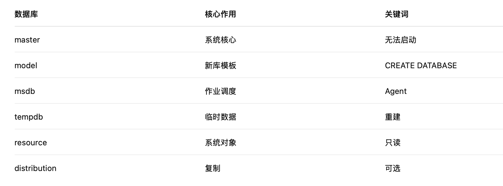


#### 区和页

**区是管理空间的基本单位**。一个区是八个物理上连续的页（即 64 KB）。这意味着 SQL Server 数据库中每 MB 有 16个区。为了使空间分配更有效，SQL Server 不会将所有区分配给包含少量数据的表。SQL Server 有两种类型的区：
+ 统一区，由单个对象所有。区中的所有 8 页只能由所属对象使用。
+ 混合区，最多可由八个对象共享。区中八页的每页可由不同的对象所有。

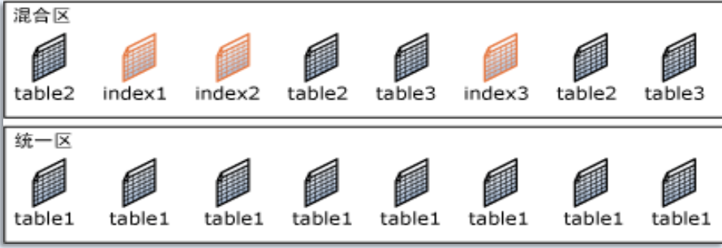

在 SQL Server 中，页的大小为 8 KB。这意味着 SQL Server数据库中每 MB 有 128 页。每页的开头是 96 字节的标头，用于存储有关页的系统信息。此信息包括页码、页类型、页的可用空间以及拥有该页的对象的分配单元 ID。

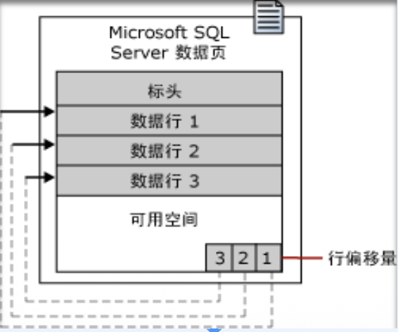


#### FILE vs FILEGROUP
数据库 → FILEGROUP → FILE
```
Database
 ├── PRIMARY Filegroup
 │    ├── file1.mdf
 │    └── file2.ndf
 └── FG_SALES
      ├── sales1.ndf
      └── sales2.ndf
```


表属于 FILEGROUP，数据存到 FILE，一个 FILE 只能属于一个 FILEGROUP，PRIMARY 是默认 FILEGROUP，必须存在，不能删除

**日志文件属于文件组吗**

日志文件不属于任何文件组。日志文件是数据库的一部分，但它们独立于数据文件和文件组进行管理。


#### SQL server 核心组件

SQL Server 以数据库引擎为核心提供数据存储与事务处理能力，并可选配 SSAS/SSRS/SSIS 等服务实现分析、报表与数据集成；通过 SSMS 等工具进行管理，借助 SQL Server Agent 实现数据库任务的计划与自动化执行。

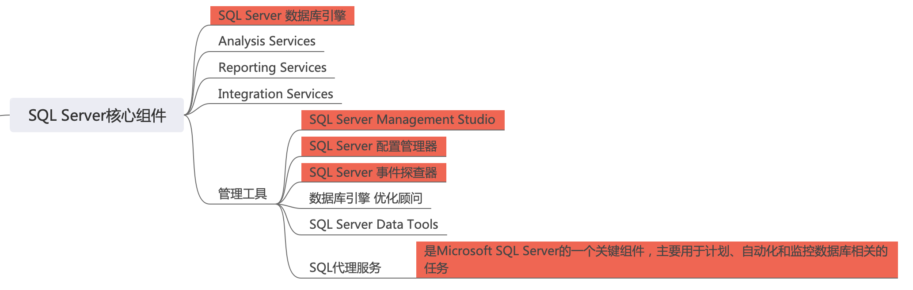

##### SQL Server 数据库引擎（Database Engine）

是什么？

真正存数据、执行 SQL、保证事务/并发/恢复/安全的“发动机”。

负责什么？
+ 存储：表/索引/视图/存储过程/触发器等
+ 查询：优化器生成执行计划、执行 SQL
+ 事务：ACID、锁、隔离级别、日志
+ 安全：登录、用户、权限
+ 备份恢复：full/diff/log

负责操办接触到的：
+ CREATE TABLE / SELECT / JOIN / GROUP BY
+ 事务：BEGIN TRAN / COMMIT / ROLLBACK
+ 备份：BACKUP DATABASE、恢复：RESTORE

##### 三大“服务”组件（跟引擎是并列的可选项）

**Analysis Services（SSAS）——分析/多维/模型**

做什么？
+ OLAP（多维分析）
+ Tabular 模型（类似数据仓库的分析模型）
+ 支持快速做“按维度汇总”的分析


**Reporting Services（SSRS）——报表**

做什么？
+ 把数据做成报表（参数报表、分页报表）
+ 发布到报表服务器给别人看

会在哪看到？

“报表系统”“打印报表”“权限控制的报表门户”。


**Integration Services（SSIS）——ETL/数据集成**

做什么？
+ 把数据从 A 导到 B（Excel→SQL、SQL→SQL、CSV→SQL）
+ 清洗转换数据（ETL：Extract/Transform/Load）
+ 定时跑导入任务

会在哪看到？

“导入导出 Excel”那块，本质就是 SSIS 能做的事（SSMS 的导入向导底层也和 SSIS 思路类似）。


##### 管理工具

###### SQL Server Management Studio（SSMS）

干什么？
+ 连接实例、管理数据库对象
+ 写 SQL、执行查询
+ 备份/还原、查看作业、看表设计、权限管理

考试/实验高频：
+ 对象资源管理器里看：数据库、表、视图、存储过程、代理作业
+ 右键数据库：属性/文件/文件组/备份/还原


###### SQL Server 配置管理器（Configuration Manager）

干什么？
+ 管服务：SQL Server 服务启动/停止
+ 管网络协议：TCP/IP 是否开启、端口号
+ 管客户端协议

会用到的典型场景：
+ “为啥连不上 SQL Server？”→ 看 TCP/IP、服务是否启动
+ 改端口、启用远程连接

###### SQL Server 事件探查器（Profiler）/ XEvent

干什么？
+ 抓取 SQL 执行事件（谁在执行什么 SQL、耗时多少）
+ 用来排查性能问题、调试

新版本更推荐 Extended Events（XEvent），Profiler 更像“老工具”。


###### 数据库引擎优化顾问（DTA）

干什么？
+ 根据你的查询工作负载，建议你建哪些索引、统计信息
+ 本质是“自动化的索引建议工具”


###### SQL Server Data Tools（SSDT）

干什么？
+ 在 Visual Studio 里做数据库开发
+ 管理数据库项目、版本控制、发布脚本（DevOps 风格）


###### SQL 代理服务（SQL Server Agent）
是什么？

SQL Server 的“任务调度器/自动化执行器”。

能干什么？
+ 定时备份数据库（你做的“每周日 00:00 全备”）
+ 定时执行 T-SQL（清理日志、统计、维护）
+ 跑 SSIS 包（ETL）
+ 发通知（邮件/警报）

关键概念
+ Job（作业）：一个任务
+ Step（步骤）：作业里面每一步干什么（T-SQL/PowerShell/SSIS 等）
+ Schedule（计划）：什么时候运行（每天/每周/一次）
+ Operator/Alert（操作员/警报）：出错通知谁


#### 1. 创建数据库（CREATE DATABASE）

创建之前需要考虑的问题？
+ 数据库名字？
  + 一般创建后不能修改，见名知意，如：eduDB
+ 数据库文件存储路径？
  + 要根据实际物理磁盘情况进行分配
+ 数据库的大小？
  + 根据具体应用需求计算，如表的数量、业务量
+ 数据库的增长方式？
  + 以什么方式增长

两种创建方式
+ SQL Management Studio
+ SQL DDL=Data Definition Language数据定义语言

为什么需要两种方式？


如何查看管理数据库？
```
SELECT name FROM sys.databases;
```
如何修改数据库？
```
ALTER DATABASE eduDB MODIFY NAME = eduDB2;
```


##### 用图形界面


[数据库] -> 右键-> 新建数据库->属性设置

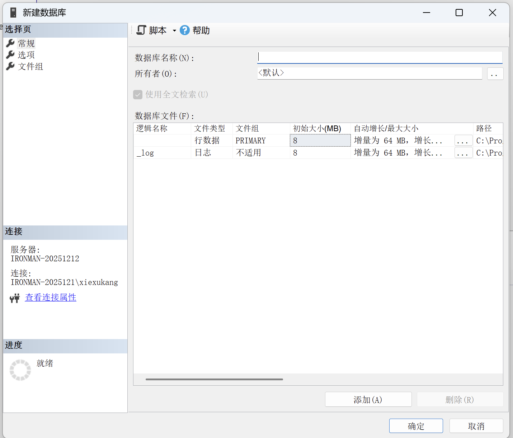

[数据库] -> 右键->附加数据库


##### 用SQL DDL
 
创建数据库db_sale，要求
1. 数据文件D:/Data，初始大小4M，增长方式2M
2. 日志文件D:/Log，初始大小2M，增长方式10%

```sql
CREATE DATABASE db_sale
ON
(
    NAME=db_sale_data,
    FILENAME='D:\DATA\db_sale.mdf',
    SZIE=4MB,
    FILEGROTH=2MB
)
LOG ON
(
    NAME=db_sale_log,
    FILENAME='D:\DATA\db_sale.ldf',
    SZIE=2MB,
    FILEGROTH=10%
)
```

Master Data File (.MDF) 和 Log Data File (.LDF) 的区别：
+ MDF（Master Data File）用于存储数据库的实际数据；
+ LDF（Log Data File）用于存储数据库的事务日志信息。


创建数据库的语法模板
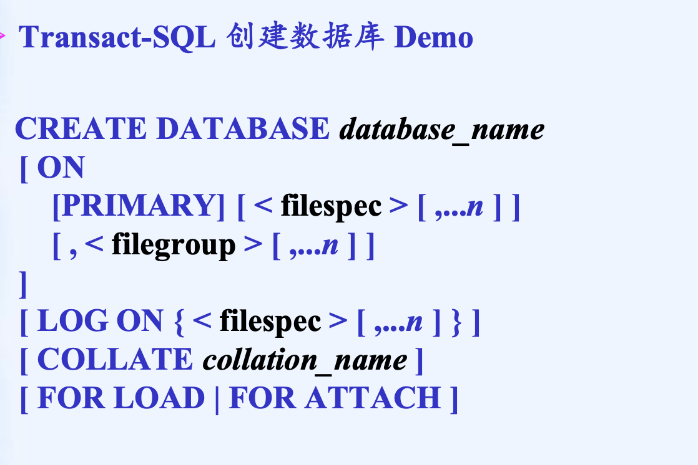
这是一个SQL Server 专用的 Transact-SQL（T-SQL）语法定义/语法模板
```
[ ... ]  
< ... >
```
+ 是语法描述符号，不是 SQL 关键字,[ ]意思是可选，< >
是占位符（需要你替换），, … n意思是可以有多个
+ `<filespec>`就是类似上面的定义
```sql
(
    NAME= logical_file_name,
    FILENAME= 'os_file_name' ,
    SIZE= size [ KB | MB | GB | TB ] ,
    MAXSIZE= { max_size | UNLIMITED } ,
    FILEGROWTH= growth_increment [ KB | MB | GB | TB | % ]
)
```
+ `[ , <filegroup> ]`定义额外文件组（高级内容），定义多个数据文件，大型数据库才用
+ `[ COLLATE collation_name ]`是指定指定字符排序规则，比如大小写是否敏感，以及中文 / 英文排序方式
+ ` [ FOR LOAD | FOR ATTACH ]`是特殊的创建方式，FOR LOAD很少用，用于快速装载数据，FOR ATTACH用于附加数据库，使用已有 .mdf / .ldf


例子：
```sql
USE [master]
GO
CREATE DATABASE db_sale
ON PRIMARY
( 
    NAME = N‘da_sale',
    FILENAME = N'F:\Data\db_sale.MDF' ,
    SIZE = 2176KB ,
    MAXSIZE = UNLIMITED,
    FILEGROWTH = 10%
)
LOG ON
( 
    NAME = N‘db_sale_Log',
    FILENAME = N'F:\Data\db_sale_Log.LDF' ,
    SIZE = 3840KB ,
    MAXSIZE = UNLIMITED,
    FILEGROWTH = 10%
)
COLLATE Chinese_PRC_CI_AS
GO
```


N'字符串' 表示这是一个 Unicode（NVARCHAR）字符串常量。在 SQL Server（T-SQL）里：'abc'是普通字符串（VARCHAR，非 Unicode），N'abc'是 Unicode 字符串（NVARCHAR）。N = National Character，表示国家字符集。为了支持中文等多字节字符，必须使用 Unicode 字符串，如果你写：NAME = '数据库'，在某些排序规则 / 编码下会报错。而：NAME = N'数据库' 就不会报错。

> Unicode 是字符集（字符编号标准），UTF-8 是 Unicode 的一种编码方式。
```
字符 → Unicode（编号）
        ↓
     UTF-8 / UTF-16 / UTF-32（编码方式）
```

> Unicode 是一种字符集标准，为世界上几乎所有文字和符号分配唯一的编号（码点）。UTF-8 是 Unicode 的一种变长编码方式，用 1–4 个字节表示一个字符。兼容 ASCII。二者的区别在于 Unicode 负责字符定义，而 UTF-8 负责字符的存储表示。
> **变长**是指不同字符在存储时所占用的字节数不固定。UTF-32是定长编码，每个字符 4 字节。


**char 是定长，varchar 是变长，nvarchar 是支持 Unicode 的变长字符类型。**


```sql
CHAR(10) 
```
不管你存几个字符,都固定占 10 个字符长度,空余部分用空格填充
```sql
VARCHAR(10) 
```
存几个字符,就占几个字符长度,不够就占用实际长度,不补空格,不支持 Unicode，最多存 10 个字符
```sql
NVARCHAR(10) 
```
存几个字符,就占几个字符长度,不够就占用实际长度,不补空格,支持 Unicode，最多存 10 个字符,每个字符占两个字节


#### 2.查看数据库（sp_helpdb）

调用系统存储过程sp_helpdb，sp_helpdb 是 SQL Server **自带的系统存储过程**，用来查看数据库的基本信息 + 文件信息。


sp_helpdb 能回答很多“数据库体检”问题：
+ 数据库有哪些？
+ 某个数据库当前状态（ONLINE/OFFLINE/RESTORING…）
+ 数据库大小是多少？
+ 数据库的数据文件/日志文件在哪？属于哪个 filegroup？
+ 兼容级别、排序规则、所有者等

```sql
EXEC sp_helpdb;
```
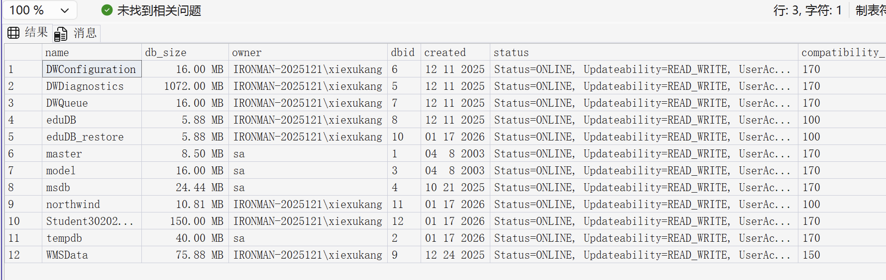

查看指定数据库的信息
```sql
EXEC sp_helpdb 'eduDB';
```
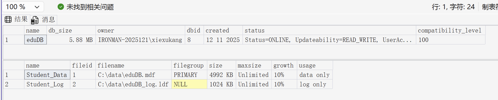

更现代的方式
```sql  
SELECT name, type_desc, physical_name, size
FROM sys.database_files;
```


#### 3.修改数据库（ALTER DATABASE）
ALTER DATABASE 用于修改已有数据库的结构和属性，例如文件、文件组、名称、选项和排序规则。


例子：
```sql
ALTER DATABASE database
{ 
    ADD FILE < filespec > [ ,...n ] [ TO FILEGROUP filegroup_name ]
    | ADD LOG FILE < filespec > [ ,...n ]
    | REMOVE FILE logical_file_name
    | ADD FILEGROUP filegroup_name
    | REMOVE FILEGROUP filegroup_name
    | MODIFY FILE < filespec >
    | MODIFY NAME = new_dbname
    | MODIFY FILEGROUP filegroup_name {filegroup_property |NAME = new_filegroup_name }
    | SET < optionspec > [ ,...n ] [ WITH < termination > ]
    | COLLATE < collation_name >
}
```
+ 大括号 { } 表示：这些操作“选一个来用”（不是一起用）,竖线 | 表示：“或”的关系
+ `ADD FILE <filespec> [ TO FILEGROUP filegroup_name ]`,给数据库 添加一个数据文件（.mdf / .ndf）
+ `ADD LOG FILE <filespec>`给数据库 添加日志文件（.ldf）
+ `REMOVE FILE logical_file_name`从数据库中移除一个文件（逻辑名）
+  `ADD FILEGROUP filegroup_name`新建一个文件组，文件组是数据文件的“逻辑容器”，用于大数据库、分区、性能优化，一个数据库可以有多个文件组
+  `REMOVE FILEGROUP filegroup_name`删除文件组,前提条件是文件组必须为空，不能是 PRIMARY
+  `MODIFY FILE <filespec>`，修改文件属性，可改什么？
   +  SIZE
   +  FILEGROWTH
   +  MAXSIZE
   +  路径（部分场景）
+  `MODIFY NAME = new_dbname`用于修改数据库名称，例如：ALTER DATABASE oldDB MODIFY NAME = newDB;
+  `MODIFY FILEGROUP filegroup_name { … }`修改文件组属性或名称,可以修改默认文件组,PRIMARY 文件组不能删除.
+  `SET <optionspec> [ WITH <termination> ]`修改数据库运行选项,用于数据库状态和访问控制，常见选项：
   + READ_ONLY
   + RECOVERY
   + AUTO_CLOSE
   + SINGLE_USER
+ `COLLATE <collation_name>`修改数据库的排序规则


**例子：**

新增文件组,文件组只是“逻辑容器”，还没文件
```sql
ALTER DATABASE eduDB
ADD FILEGROUP FG_Data;
```

给数据库 db_sale 添加一个数据文件到文件组 FG_SALES
```sql
ALTER DATABASE eduDB
ADD FILE
(
    NAME = 'eduDB_Data2',
    FILENAME = 'D:\Data\eduDB_Data2.ndf',
    SIZE = 10MB,
    FILEGROWTH = 5MB
)
TO FILEGROUP FG_Data;
```

新增日志文件（ADD LOG FILE）
```sql
ALTER DATABASE eduDB
ADD LOG FILE
(
    NAME = 'eduDB_Log2',
    FILENAME = 'D:\Log\eduDB_Log2.ldf',
    SIZE = 5MB,
    FILEGROWTH = 10%
);
```

修改文件属性
```sql
ALTER DATABASE eduDB
MODIFY FILE
(
    NAME = 'eduDB_Data2',
    FILEGROWTH = 20MB
);
```

删除数据文件
```sql
ALTER DATABASE eduDB
REMOVE FILE eduDB_Data2;
```

修改数据库名
```sql
ALTER DATABASE eduDB
MODIFY NAME = eduDB_New;
```

修改默认文件夹组
```sql
ALTER DATABASE eduDB
MODIFY FILEGROUP FG_Data DEFAULT;
```

重命名文件夹组
```sql
ALTER DATABASE eduDB
MODIFY FILEGROUP FG_Data
NAME = FG_Data_New;
```

删除文件组
```sql
ALTER DATABASE eduDB
REMOVE FILEGROUP FG_Data;
```

#### 4.删除数据库（DROP DATABASE）

```sql
DROP DATABASE database_name
[ ,...n ]
```
DROP DATABASE 会永久删除数据库及其所有对象和数据，且不可回滚。如果有人正在连接该数据库，会报错。

**DROP DATABASE 是自动提交的语句。**

删除数据库会同步删除表、视图、索引、存储过程，并删除数据文件（mdf/ndf/ldf），所以 误删数据库 = 文件也没了。

支持删除多个数据库
```sql
DROP DATABASE db1, db2;
```

master,model,msdb,empdb是不可以被删除的


#### 5.压缩数据库（DBCC SHRINKDATABASE）


```sql
DBCC SHRINKDATABASE
(
    'database_name' | database_id | 0
    [, target_percent ]
    [, { NOTRUNCATE | TRUNCATEONLY } ]
)
[ WITH NO_INFOMSGS ]
```
这是SQL Server 的 DBCC SHRINKDATABASE 命令，DBCC SHRINKDATABASE 用于收缩数据库文件，回收数据库中未使用的磁盘空间。
+ `database_name | database_id | 0`：指定要收缩的数据库，可以使用数据库名称、数据库 ID 或 0（表示当前数据库）。
+ `target_percent`：收缩后数据库中保留的“空闲空间百分比”.例子：DBCC SHRINKDATABASE(db_sale, 10);	收缩后,数据文件中 保留 10% 的空闲空间，为剩余可用空间百分比。
+ `{ NOTRUNCATE | TRUNCATEONLY }`：指定收缩方式。
  + NOTRUNCATE：只整理内部空间，不释放磁盘空间给操作系统。数据页会被移动，文件大小不变，让数据库内部更紧凑，但磁盘文件大小不变。
  + TRUNCATEONLY：只释放文件末尾的空闲空间，不移动数据页，不整理内部碎片，直接“截断”文件末尾，忽略 target_percent，速度快，风险低
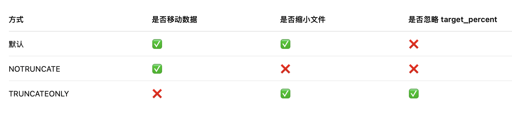
+ `WITH NO_INFOMSGS`：可选参数，表示在执行命令时不显示信息消息。取消严重级别从0 到10 的所有信息性消息。

当数据库经历过：
+ 大量 DELETE
+ 临时数据写入
+ 批量操作

数据库文件（mdf / ndf / ldf）可能变得很大，但里面其实有很多空闲空间。DBCC SHRINKDATABASE 的作用就是：把这些空闲空间“挤掉”，让数据库文件变小。

DBCC SHRINKDATABASE 不应频繁使用，只适合临时或一次性回收空间。


SHRINK 会 移动数据页，索引的物理顺序被打乱，导致：
+ 查询性能下降
+ 索引扫描效率变差


Shrink 后通常需要重建索引
```sql
ALTER INDEX ALL ON table_name REBUILD;
```
只有在大量数据永久删除后,且 磁盘空间确实需要回收 才考虑


#### 关系数据库定义(RDBMS)

创建数据库
+ 若要创建数据库，必须至少拥有 CREATE DATABASE、CREATE ANY DATABASE或 ALTER ANY DATABASE 权限。
+ 创建数据库的用户将成为该数据库的所有者。
+ 对于一个 SQL Server 实例，最多可以创建 32,767 个数据库。
+ 数据库名称必须遵循为标识符指定的规则。
+ model 数据库中的所有用户定义对象都将复制到所有新创建的数据库中。

**创建者默认成为数据库所有者（dbo），但	DBA 可以在创建后更改 owner**

SQL Server 2019标识符，下列规则适用：
+ 第一个字符必须是下列字符之一：
  + Unicode 标准 3.2 所定义的字母。Unicode 中定义的字母包括拉丁字符 a-z 和 A-Z，以及来自其他语言的字母字符。
  + 下划线 (_)、“at”符号 (@) 或者数字符号 (#)。
+ 后续字符可以包括：
  + 如 Unicode 标准 3.2 中所定义的字母。
  + 基本拉丁字符或其他国家/地区字符中的十进制数字。
  + “at”符号、美元符号 ($)、数字符号或下划线。
+ 标识符不能是 Transact-SQL 保留字。SQL Server 保留其保留字的大写和小写形式。
+ 不允许嵌入空格或其他特殊字符。


技术上往往
```
@xxx → 变量名
#xxx → 临时表名
```
下面这个例子中，虽然标识符不能加空格，但是加了中括号之后是合法的
```sql
CREATE TABLE [Student Info] (...);  -- ✔ 合法
```


### 创建、修改和删除数据表（CREATE, ALTER, DROP TABLE）（DDL）


#### 0.数据类型

数据类型类别：
+ 精确数字（bigint、int、samllint、tinyint、bit、decimal、numeric、money、smallmoney）
+ 近似数字（float、real）
+ 日期和时间（datetime、smalldatetime、date）
+ 字符串（char、varchar、text）
+ Unicode 字符串（ nchar、nvarchar、ntext ）
+ 二进制字符串（binary、varbinary、image）
+ 其他数据类型（cursor、sql_variant、table、timestamp、xml）
+ 用户自定义数据类型


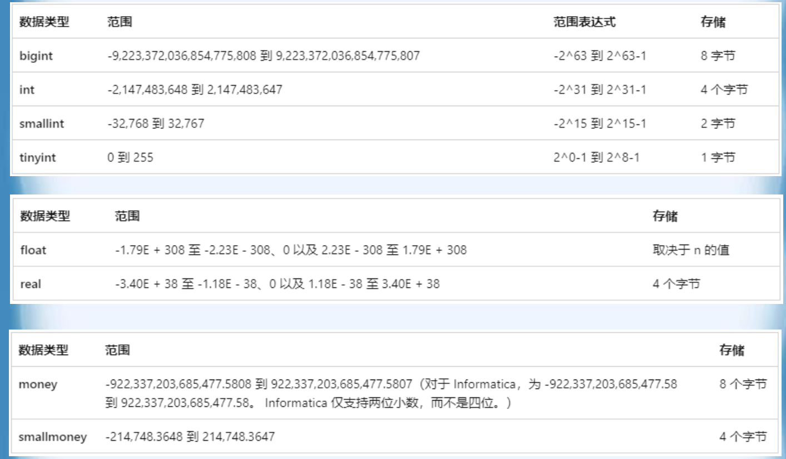

+ `decimal[ (p[ , s] )] 和 numeric[ (p[ , s] )]`
固定精度和小数位数。使用最大精度时，有效值从- 10^38 +1 到
10^38 - 1。decimal 的 SQL-92 同义词为dec 和 dec(p, s)。numeric 在功能上等价于decimal。
  + **p（精度）**
  最多可以存储的十进制数字的总位数，包括小数点左边和右边的
  位数。该精度必须是从1 到最大精度38 之间的值。默认精度为
  18。
  + **s（小数位数）**
  小数点右边可以存储的十进制数字的最大位数。小数位数必须是
  从 0 到 p 之间的值。仅在指定精度后才可以指定小数位数。默认
  的小数位数为0；因此，0 <= s <= p。最大存储大小基于精度而
  变化。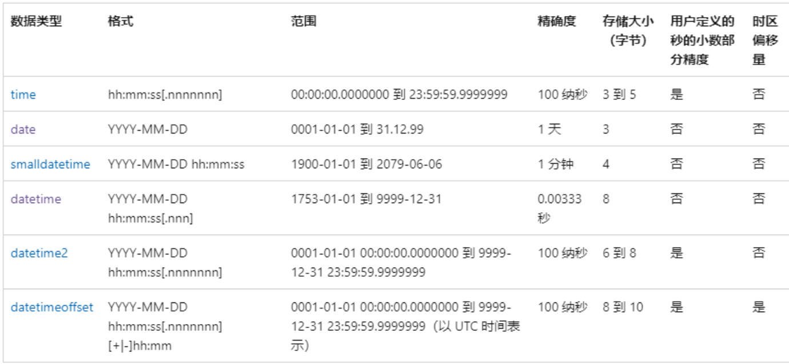
+ `char [ ( n ) ]` 固定长度，非Unicode 字符数据，长度为n 个字节。n 的取值范围为1 至8,000，存储大小是n 个字节。char 的SQL 2003 同义词为character。
+ `varchar [ ( n | max ) ]` 可变长度，非Unicode 字符数据。n 的取值范围为 1 至 8,000。max 指示最大存储大小是 2^31-1 个字节。存储大小是输入数据的实际长度加2 个字节。所输入数据的长度可以为0 个字符。SQL-2003 中的varchar 就是char varying 或character varying。
+ `nchar [ ( n ) ]`n 个字符的固定长度的Unicode 字符数据。n 值必须在1 到 4,000之间（含）。存储大小为两倍n 字节。nchar 的 SQL-2003 同义词为national char 和 national character。
+ `nvarchar [ ( n | max ) ]`为可变长度Unicode 字符数据。n 值在1 到 4,000 之间（含）。max指示最大存储大小为2^31-1 字节。存储大小是所输入字符个数的两倍+ 2 个字节。所输入数据的长度可以为 0 个字符。nvarchar 的 SQL-2003 同义词为national char varying 和 national character varying。
+ `binary [ ( n ) ]`为长度为n 字节的固定长度二进制数据，其中n 是从1 到 8,000 的值。存储大小为n 字节。
+ `varbinary [ ( n | max ) ]`为可变长度二进制数据。n 可以取从1 到 8,000 的值。max 指示最大的存储大小为2^31-1 字节。存储大小为所输入数据的实际长度+2 个字节。所输入数据的长度可以是0 字节。varbinary 的 SQL-2003 同义词为binary varying。

+ 自定义数据类型
```
EXEC sp_addtype name, 'varchar(10)', 'NOT NULL';
GO
EXEC sp_droptype name;
GO
```
查看系统存储过程源码：
```
EXEC sp_helptext 'sp_addtype’
```


#### 1.创建数据表（CREATE TABLE）
数据表是关系数据库的基本组成单位，它物理地存储于数据库的存储文件中。

创建一个数据表时主要包括以下几个组成部分：
+ **字段名（列名）**：字段名可长达128个字符。字段名**可包含中文、英文字母、下划线、#号、货币符号（$）及AT符号(@**)。**同一表中不许有重名列**；
+ 字段数据类型；
+ 字段的长度、精度和小数位数；
+ NULL值与DEFAULT值：DEFAULT值表示某一字段的默认值，当没有输入数据时，则使用此默认的值。


> **字段的长度**：指字段所能容纳的最大数据量，但对不同的数据类型来说，长度对字段的意义可能有些不同。
>  + 对字符串与UNICODE数据类型而言，长度代表字段所能容纳的字符的数目，因此它会限制用户所能输入的文本长度。
>  + 对数值类的数据类型而言，长度则代表字段使用多少个字节来存放数字。
>  + 对BINARY、VARBINARY、IMAGE数据类型而言，长度代表字段所能容纳的字节数。
> 
> **精度和小数位数**
> + 精度是指数中数字的位数，包括小数点左侧的整数部分和小数点右侧的小数部分；
> + 小数位数则是指数字小数点右侧的位数。
> + 例如：数字12345.678，其精度为8，小数位数为3；
> + 所以只有数值类的数据类型才有必要指定精度和小数位数。


经常以如下所示的格式来表示数据类型以及它所采用的长度、精度和小数位数，其中的N代表长度，P代表精度，S表示小数位数。
+ BINARY(N) ------- BINARY(10)
+ CHAR(N) ------- CHAR(20)
+ NUMERIC(P,[S]) ------- NUMERIC(8,3)

但有的数据类型的精度与小数位数是固定的，对采用此类数据类型的字段而言，不需设置精度与小数位数:
+ 如：如果某字段采用INT数据类型，其长度固定是4，精度固定是10，小数位数则固定是0，这表示字段将能存放10位数没有小数点的整数。存储大小则是4个字节。


##### 创建数据表的SQL语法格式

建表时必须先确定字段、数据类型和约束，主键唯一、外键一致、NULL 与默认值要合理。


在SQL语言中，使用语句CREATE TABLE创建数据表，其基本语法格式为：
```sql
CREATE TABLE [ database_name . [ schema_name ] . |
schema_name . ] <表名>
( <列定义>[{，<列定义>|<列约束>}][,
[CONSTRAINT 主键约束] PRIMARY KY （属性名）][,
[CONSTRAINT 检查约束] CHECK（逻辑表达式）][,
[CONSTRAINT 外键约束] REFRENCES 参照表（参照属性）
[,…n]]
)
[ON {文件组|默认文件组}]
```
+ <表名>是合法标识符，最多可有128个字符，如S,SC,C，不允许重名。
+ <列定义>：<列名><数据类型>[DEFAULT] [{<列约束>}]
  + DEFAULT：若是某字段设置有默认值，当该字段未被输入数据时，则以该默认值自动填入该字段。`gender CHAR(1) DEFAULT 'M'`
  + 例如 `age INT DEFAULT 18 NOT NULL`
+ ON 文件组（PRIMARY），指定表存在哪个 FILEGROUP，不写 → 默认 PRIMARY

举例
```sql
CREATE TABLE dbo.student
(
    id INT NOT NULL,
    name NVARCHAR(20) NOT NULL,
    age INT DEFAULT 18,
    class_id INT,

    CONSTRAINT pk_student PRIMARY KEY (id),
    CONSTRAINT ck_age CHECK (age >= 0),
    CONSTRAINT fk_student_class
        FOREIGN KEY (class_id)
        REFERENCES class(id)
);
```
+ `CONSTRAINT pk_student PRIMARY KEY (id)`是主键约束（PRIMARY KEY），**主键字段必须 NOT NULL**，一个表只能有一个主键，SQL Server 会自动创建索引
+ 未写 NOT NULL 的字段，默认允许 NULL，	DEFAULT ≠ NOT NULL，仍然可以插入 NULL
+ dbo 是 SQL Server 中的默认架构（Schema），dbo 是系统默认的 schema 名称
```
数据库
 └── 架构（Schema）
       └── 表 / 视图 / 存储过程
```
+ 外键约束（REFERENCES）,用于保证参照完整性
```
CONSTRAINT fk_class
FOREIGN KEY (class_id)
REFERENCES class(id)
```
这句话规定了 student 表中的 class_id 必须来自 class 表中的 id。

##### 定义完整性约束

上列为创建基本表的最简单形式，还可以对表进一步定义，如主键、空值的设定，使数据库用户能够根据应用的需要对基本表的定义做出更为精确和详尽的规定。
+ 在SQL SERVER中，对于基本表的约束分为列约束和表约束。
+ 列约束是对某一个特定列的约束，包含在列定义中，直接跟在该列的其他定义之后，用空格分隔，不必指定列名；
+ 表约束与列定义相互独立，不包括在列定义中，通常用于对多个列一起进行约束，与列定义用’,’分隔，定义表约束时必须指出要约束的那些列的名称。完整性约束的基本语法格式为：
```
[ CONSTRAINT <约束名> ] <约束类型>
```
+ 约束名：约束不指定名称时，系统会给定一个名称。

**约束类型：**

在定义完整性约束时必须指定完整性约束的类型。在SQL SERVER中可以定义五种类型的完整性约束，下面分别加以介绍：

+ **NULL/NOT NULL**
    + 是否允许该字段的值为NULL。
    +  NULL值不是0也不是空白，更不是填入字符串“NULL”，而是表示“不知道”、“不确定”或“没有数据”的意思。
    + 当某一字段的值一定要输入才有意义的时候，则可以设置为NOT NULL。
    + 如主键列就不允许出现空值，否则就失去了唯一标识一条记录的作用。
    + 只能用于定义列约束， 其语法格式如下：
    `[CONSTRAINT <约束名> ][NULL|NOT NULL]`

+ **UNIQUE约束**
    + UNIQUE约束用于指明基本表在某一列或多个列的组合上的取值必须唯一。
    + 定义了UNIQUE约束的那些列称为唯一键，系统自动为唯一键建立唯一索引，从而保证了唯一键的唯一性。
    + 唯一键允许为空，但系统为保证其唯一性，最多只可以出
    现一个NULL值。
    + UNIQUE既可用于列约束，也可用于表约束。
    + UNIQUE用于定义列约束时，其语法格式如下：
    `[CONSTRAINT <约束名>] UNIQUE`

+ **PRIMARY KEY约束**
  + PRIMARY KEY约束用于定义基本表的主键，起唯一
  标识作用，其值不能为NULL，也不能重复，以此来
  保证实体的完整性。
  + PRIMARY KEY与UNIQUE约束类似，通过建立唯一
  索引来保证基本表在主键列取值的唯一性，但它们之
  间存在着很大的区别：
    + 在一个基本表中只能定义一个PRIMARY KEY约束，但可定义多个UNIQUE约束；
    + 对于指定为PRIMARY KEY的一个列或多个列的组合，其中任何一个列都不能出现空值，而对于UNIQUE所约束的唯一键，则允许为空。


> 注意：不能为同一个列或一组列既定义UNIQUE约束，又定义PRIMARY KEY约束。
> + PRIMARY KEY既可用于列约束，也可用于表约束。
> + PRIMARY KEY用于定义列约束时，其语法格式如下：
> `CONSTRAINT <约束名> PRIMARY KEY（列名）`
> + 双主键`CONSTRAINT pk_order PRIMARY KEY (order_id, product_id)`


+ **FOREIGN KEY约束**
  + FOREIGN KEY约束指定某一个列或一组列作为外部键，其中，包含外部键的表称为从表，包含外部键所引用的主键或唯一键的表称主表。
  + 系统保证从表在外部键上的取值要么是主表中某一个主键值或唯一键值，要么取空值。以此保证两个表之间的连接，确保了实体的参照完整性。
  + FOREIGN KEY既可用于列约束，也可用于表约束，
  + 其语法格式为：
    ```sql
    [CONSTRAINT <约束名>] FOREIGN KEY
    REFERENCES <主表名> (<列名>[{<列名>}])
    ```
  + **被引用字段必须是 PRIMARY KEY 或 UNIQUE**，以保证外键引用的目标必须是“能唯一定位一行”的键。


+ **CHECK约束**
  + CHECK约束用来检查字段值所允许的范围，如，一个字段只能输入整数，而且限定在0-100的整数，以此来保证域的完整性。**CHECK 不检查 NULL**。
  + CHECK既可用于列约束，也可用于表约束，
  + 其语法格式为：`[CONSTRAINT <约束名>] CHECK (<条件>)`


例子：


**外键的例子**

先写主表
```sql
CREATE TABLE class(
  id INT PRIMARY KEY,
  name NVARCHAR(20) NOT NULL
);
```
再写从表
```sql
CREATE TABLE student(
  id INT PRIMARY KEY,
  name NVARCHAR(20) NOT NULL,
  class_id INT NULL,
  CONSTRAINT fk_student_class
    FOREIGN KEY(class_id) REFERENCES class(id)
);
```


#### 2.修改基本表（ALTER TABLE...ADD,ALTER, DROP）
由于应用环境和应用需求的变化，经常需要修改基本表的结构，比如，增加新列和完整性约束、修改原有的列定义和完整性约束等。SQL语言使用ALTER TABLE命令来完成这一功能，有如下三种修改方式：


##### ADD 方式
用于增加新列和完整性约束，定义方式同CREATE TABLE语句中的定义方式相同，其语法格式为：
```
ALTER TABLE <表名> ADD <列定义> | <完整性约束定义>；
```
例子1：增加新列
```sql
ALTER TABLE student
ADD email NVARCHAR(50);
```
例子2：增加约束
```sql
ALTER TABLE student   
ADD CONSTRAINT ck_age CHECK (age >= 0);
```


##### ALTER 方式

用于修改某些列的定义，其语法格式为：
```
ALTER TABLE<表名>
ALTER COLUMN <列名><数据类型>[NULL|NOT NULL]
```
例子：
```sql
ALTER TABLE student
ALTER COLUMN name NVARCHAR(50) NOT NULL;
```


注意：使用此方式有如下一些限制：
1. 不能改变列名；
2. 不能将含有空值的列的定义修改为NOT NULL约束；
3. 若列中已有数据，则不能减少该列的宽度，也不能改变其数据类型；
4. 只能修改NULL|NOT NULL约束，其它类型的约束在修改之前必须先删除，然后再重新添加修改过的约束定义。


##### DROP 方式
删除完整性约束定义，其语法格式为：
```sql
ALTER TABLE<表名>
DROP CONSTRAINT <约束名>
```

这里只能 DROP 约束，不能 DROP 列，**删除列用 DROP COLUMN**
```sql
ALTER TABLE student
DROP COLUMN email;
``` 

如果列上有约束，必须先删约束
```sql
-- 先删约束
ALTER TABLE student
DROP CONSTRAINT ck_age;

-- 再删列
ALTER TABLE student
DROP COLUMN age;
```


#### 3.删除基本表


当某个基本表无用时，可将其删除。
+ 删除后，该表中的数据和在此表上所建的索引都被删除，而建立在该表上的视图不会随之删除，系统将继续保留其定义，但已无法使用。
+ 如果重新恢复该表，这些视图可重新使用。
+ 删除表的语法格式：
```sql
DROP TABLE <表名>
```
注意：只能删除自己建立的表，不能删除其他用户所建的表。


### 数据库表的操作

SQL语言的数据更新语句DML主要包括插入数据、修改数据和删除数据三种语句。

#### 1 插入数据记录（INSERT INTO）
插入数据是把新的记录插入到一个存在的表中。插入数据使用语句INSERT INTO，可分为以下几种情况。


##### 插入一行新记录


语法格式为：
```
INSERT INTO <表名>[(<列名1>[,<列名2>…])] VALUES(<值>)
```
其中，<表名>是指要插入新记录的表<列名>是可选项，指定待添加数据的列VALUES子句指定待添加数据的具体值。

+ 列名的排列顺序不一定要和表定义时的顺序一致。
+ 但当指定列名表时VALUES子句值的排列顺序必须和列名表中的列名排列顺序一致，个数相等，数据类型一一对应。
+ 例 在S表中插入一条学生记录（学号：S7；姓名：郑冬；性别：女；年龄：21；系别：计算机）。
```sql
INSERT INTO S
VALUES ('s7','郑冬','女',21,'计算机')
```
注意：
+ 必须用逗号将各个数据分开，字符型数据要用单引号括起来。
+ INTO子句中没有指定列名，则新插入的记录必须在每个属性列上均有值，且VALUES子句中值的排列顺序要和表中各属性列的排列顺序一致。


##### 插入一行的部分数据值

在SC表中插入一条选课记录（’S7’,’C1’）。
```sql
INSERT INTO SC (SNO,CNO)
VALUES ('s7','c1')
```

+ 将VALUES子句中的值按照INTO子句中指定列名的顺序插入到表中
+ 对于INTO子句中没有出现的列，则新插入的记录在这些列上将取空值，如上例的SCORE即赋空值。
+ 但在表定义时有NOT NULL约束的属性列不能取空值。


##### 插入多行记录

+ 用于表间的拷贝，将一个表中的数据抽取数行插入另一表中，可以通过子查询来实现。
+ 插入数据的命令语法格式为：
```sql
INSERT INTO <表名> [(<列名1>[,<列名2>…])]
子查询
```


例：求出各系教师的平均工资，把结果存放在新表AVGSAL中。
```sql    
CREATE TABLE AVGSAL
(
    DEPARTMENT VARCHAR(20),
    AVGSAL SMALLINT
);
INSERT INTO AVGSAL (DEPARTMENT, AVGSAL)
SELECT
    department,
    AVG(salary)
FROM Employee
GROUP BY department;
```


#### 2 修改数据记录（UPDATE）
SQL语言可以使用UPDATE语句对表中的一行或多行记录的某些列值进行修改，其语法格式为：
```sql
UPDATE <表名>
SET <列名>=<表达式> [,<列名>=<表达式>]…
[WHERE <条件>]
```
其中：
+ <表名>是指要修改的表。
+ SET子句给出要修改的列及其修改后的值。
+ WHERE子句指定待修改的记录应当满足的条件，WHERE子句省略时，则修改表中的所有记录。


##### 修改一行

例 把刘伟教师转到信息系。
```sql
UPDATE T
  SET DEPT='信息'
WHERE TN='刘伟'
```

##### 修改多行

例 将所有学生年龄增加1岁
```sql
UPDATE S
  SET AGE=AGE+1
```

例 把教师表中工资小于等于5000元的教授的工资提高20%。
```sql
UPDATE T
  SET SAL=1.2*SAL
WHERE PROF=‘教授'
  AND SAL <=5000
```


##### 用子查询选择要修改的行

例 把讲授C5课程的教师的岗位津贴增加100元。
```sql
UPDATE T
  SET COMN=COMN+100
  WHERE TNO IN
  (SELECT T.TNO
    FROM T,TC
   WHERE T.TNO=TC.TNO
        AND TC.CNO='C5')
```
子查询的作用是得到讲授C5课程的教师号。


##### 用子查询提供要修改的值

例 把所有教师的工资提高到平均工资的1.2倍
```sql
UPDATE T
SET SAL =
  (SELECT 1.2*AVG(SAL)
  FROM T)
```

子查询的作用是得到所有教师的平均工资。

#### 3.删除数据记录（DELETE）
使用DELETE语句可以删除表中的一行或多行记录，其语法格式为：
```
DELETE
 FROM <表名>
[WHERE <条件>]
```
其中，
+ <表名>是指要删除数据的表。
+ WHERE子句指定待删除的记录应当满足的条件，WHERE子句省略时，则删除表中的所有记录。

##### 删除一行记录

例 删除刘伟教师的记录。
```sql
DELETE
FROM T
WHERE TN=’刘伟’
```

##### 删除多行记录

例 删除所有教师的授课记录
```sql
DELETE
FROM TC
```
执行此语句后，TC表即为一个空表，但其定义仍存在数据字典中。

##### 利用子查询选择要删除的行

例 删除刘伟教师授课的记录。
```sql
DELETE
FROM TC
WHERE TNO=
  (SELECT TNO
  FROM T
  WHERE TN=’ 刘伟’)
```


### 设计、创建和维护索引(DDL)

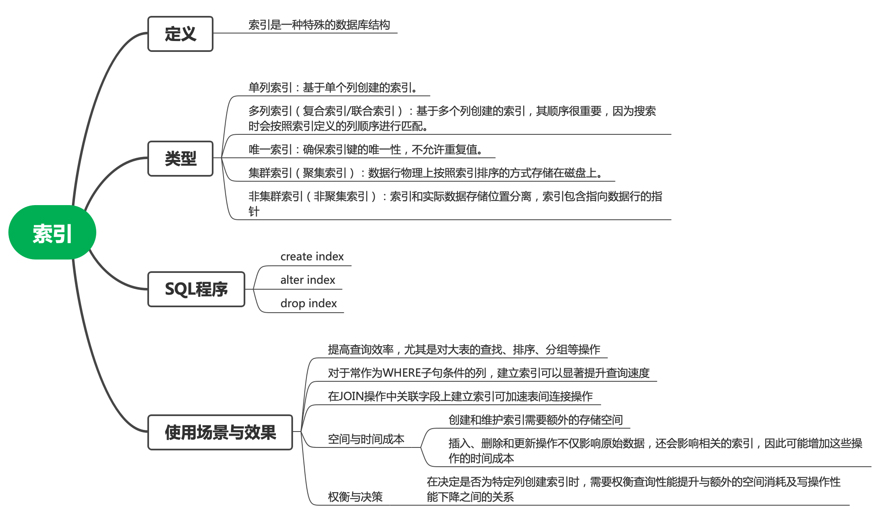

#### 索引的作用
在日常生活中我们会经常遇到索引，例如图书目录、词典索引等。借助索引，人们会很快地找到需要的东西。索引是数据库随机检索的常用手段，它实际上就是记录的关键字与其相应地址的对应表。

例如，当我们要在本书中查找有关“SQL查询”的内容时，应该先通过目录找到“SQL查询”所对应的页码，然后从该页码中找出所要的信息。这种方法比直接翻阅书的内容要快。

如果把数据库表比作一本书，则表的索引就如书的目录一样，通过索引可大大提高查询速度。此外，在SQL SERVER中，行的唯一性也是通过建立唯一索引来维护的。

索引的作用可归纳为：
+ 加快查询速度；
+ 保证行的唯一性。


#### 索引的分类
+ 按照索引记录的存放位置可分为**聚集索引与非聚集索引**
  + 聚集索引：按照索引的字段排列记录，并且依照排好的
  顺序将记录存储在表中。表中数据 按索引键顺序实际存放，**一张表只能有一个聚集索引，常建在PRIMARY KEY 上。**
  + 非聚集索引：按照索引的字段排列记录，但是排列的结
  果并不会存储在表中，而是另外存储。索引和数据分离，一张表可以有多个
+ 唯一索引的概念
  + 唯一索引表示表中每一个索引值只对应唯一的数据记录，
  + 这与表的PRIMARY KEY的特性类似，因此唯一性索引常用于PRIMARY KEY的字段上，以区别每一笔记录。
  + 当表中有被设置为UNIQUE的字段时，SQL SERVER会自动建立一个非聚集的唯一性索引。
  + 而当表中有PRIMARY KEY的字段时，SQL SERVER会在PRIMARY KEY字段建立一个聚集索引。
+ 复合索引的概念
  + 复合索引是将两个字段或多个字段组合起来建立的索引，而单独的字段允许有重复的值。


UNIQUE 和 PRIMARY KEY 的关系
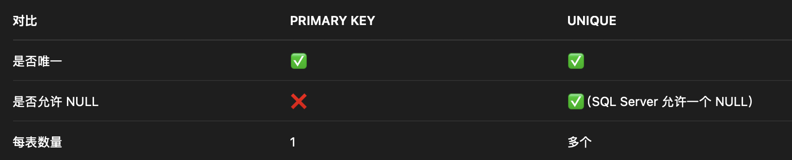


#### 建立索引(CREATE INDEX)

CREATE INDEX 语句用于在表或视图上创建索引，以提高查询性能。建立索引的语句是CREATE INDEX，其语法格式为：
```sql
CREATE [UNIQUE] [CLUSTERED|NONCLUSTERED]
INDEX <索引名>
  ON <表名>
(<列名> [次序] [{,<列名>}] [次序]…)
[WITH
  [PAD_INDEX]
  [[,]FILLFACTOR=填充因子]
  [[,]IGNORE_DUP_KEY]
  [[,]STATISTICS_NORECOMPUTE]]
```
+ UNIQUE表明建立唯一索引。
+ CLUSTERED表示建立聚集索引，NONCLUSTERED表示建立非聚集索引。
+ 次序用来指定索引值的排列顺序，可为ASC（升序）或DESC
（降序），缺省值为ASC。


注意点：
+ 不能对大型数据类型Ntext、Text、Varchar（Max）、
nVarchar（Max）、Xml、Image的列指定索引；
+ PAD_INDEX指定索引页保持开放的空间，它必须与“FILLFACTOR=填充因子”同时使用；
+ STATISTICS_NORECOMPUTE表示过期索引不会自动重新计
算；
+ IGNORE_DUP_KEY = { ON | OFF }，指定在插入操作尝试向唯一索引插入重复键值时的错误响应。
+ STATISTICS_NORECOMPUTE = { ON | OFF}，指定是否重新计算分布统计信息。默认为OFF。


示例 1：普通非聚集索引
```sql
CREATE INDEX idx_student_name
ON student(name);
```

示例 2：唯一索引
```sql
CREATE UNIQUE INDEX idx_student_email
ON student(email);
```

示例 3：复合索引 + 降序
```sql
CREATE NONCLUSTERED INDEX idx_order
ON orders(customer_id ASC, order_date DESC);
```

示例 4：为表SC在SNO和CNO上建立唯一索引。
```sql
USE STUDENT
CREATE UNIQUE INDEX SCI ON SC(SNO,CNO)
```
+ 执行此命令后，为SC表建立一个索引名为SCI的唯一索引
+  此索引为SNO和CNO两列的复合索引，即对SC表中的行先按SNO的递增顺序索引，对于相同的SNO，又按CNO的递增顺序索引。
+ 由于有UNIQUE的限制，所以该索引在(SNO,CNO)组合列的排序上具有唯一性，不存在重复值。

示例 5: 为教师表T在TN上建立聚集索引。
```sql
CREATE CLUSTERED INDEX TI ON T(TN)
```
执行此命令后，为T表建立一个索引名为TI的聚集索引，T表中的记录将按照TN值的升序存放。


示例 6:使用SQL命令，在数据库“eduDB”中的数据表S中，关于“
学号”建立聚集索引，关于“姓名”建立非聚集索引。
```sql
CREATE INDEX IN_SNAME on S(SNAME)
CREATE unique clustered
INDEX IN_SNO on s(SNO)
WITH
pad_index,fillfactor=100 --填充因子为100
```


注：100%的填充因子可以提升读取的性能，但是会减慢写活动的性能，引发频繁的页拆分，参考：低更改的表：100%的填充因子，高更改的表50-70%的填充因子，读写各一半的表80-90%的填充因子。

示例 7:为数据库“eduDB”中的数据表关于c.课程名降序建立唯一索引IN_课程名。

```sql    
USE eduDB
go
CREATE unique
INDEX IN_CNAME on c(CNAME desc)
```

注意点：
1. 改变表中的数据（如增加或删除记录）时，索引将自动更新。索引建立后，在查询使用该列时，系统将自动使用索引进行查询。
2. 索引数目无限制，但索引越多，更新数据的速度越慢。对于仅用于查询的表可多建索引，对于数据更新频繁的表则应少建索引。
3. 只有表和视图的所有者可以在表和视图上创建索引。


#### 删除索引(DROP INDEX)

建立索引是为了提高查询速度，但随着索引的增多，数据更新时，系统会花费许多时间来维护索引。这时，应删除不必要的索引。

删除索引的语句是DROP INDEX，其语法格式为：
```sql
DROP INDEX 数据表名.索引名
```

例 删除表SC的索引SCI
```sql
DROP INDEX SC.SCI
```


#### 查看索引


**查看索引信息**

+ 命令格式
```sql
sp_helpindex [ @objname = ] '表或视图的名称'
```
功能:报告有关表或视图上索引的信息，当前数据库中表或视图的名称的数据类型为nvarchar(776)。

例子：查看“eduDB”数据库中的数据表S上索引的类型
```
Use eduDB
GO
sp_helpindex s
```

**查看索引的空间信息**

+ 命令格式
```sql
sp_spaceused ['表的名称']
```
功能:显示行数、保留的磁盘空间以及当前数据库中的表所使用的磁盘空间，或显示由整个数据库保留和使用的磁盘空间


例子：查看数据库“eduDB”和数据表S上的磁盘空间。
```sql
USE eduDB
go
EXEC sp_spaceused ‘s’
```


**查看索引属性**

+ 命令格式
```sql
INDEXPROPERTY (表的标识号，索引的名称, 属性)
```
功能:显示表中指定索引的属性信息。可以是下列值中的一个。


例子：为 sc的 IX_cid课程号索引返回 IsPad Index 属性的设置。
```sql
USE eduDB
go
SELECT INDEXPROPERTY(OBJECT_ID(' sc '), 'IX_CID', 'IsPadIndex')
```


