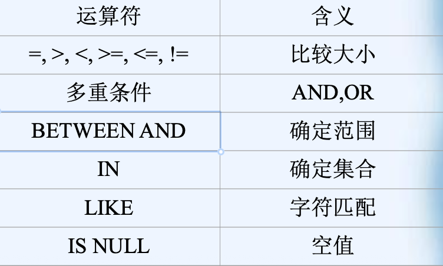
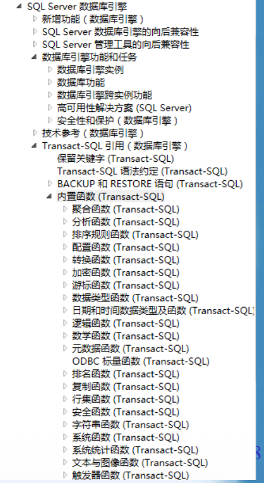
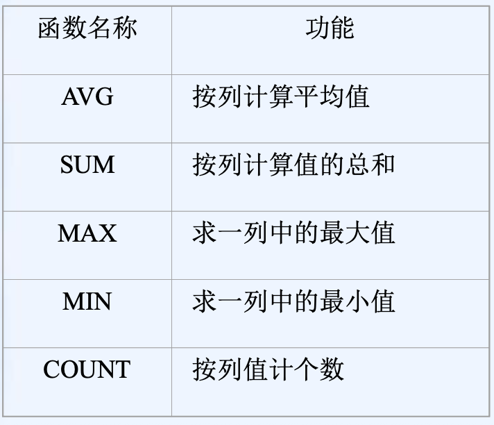
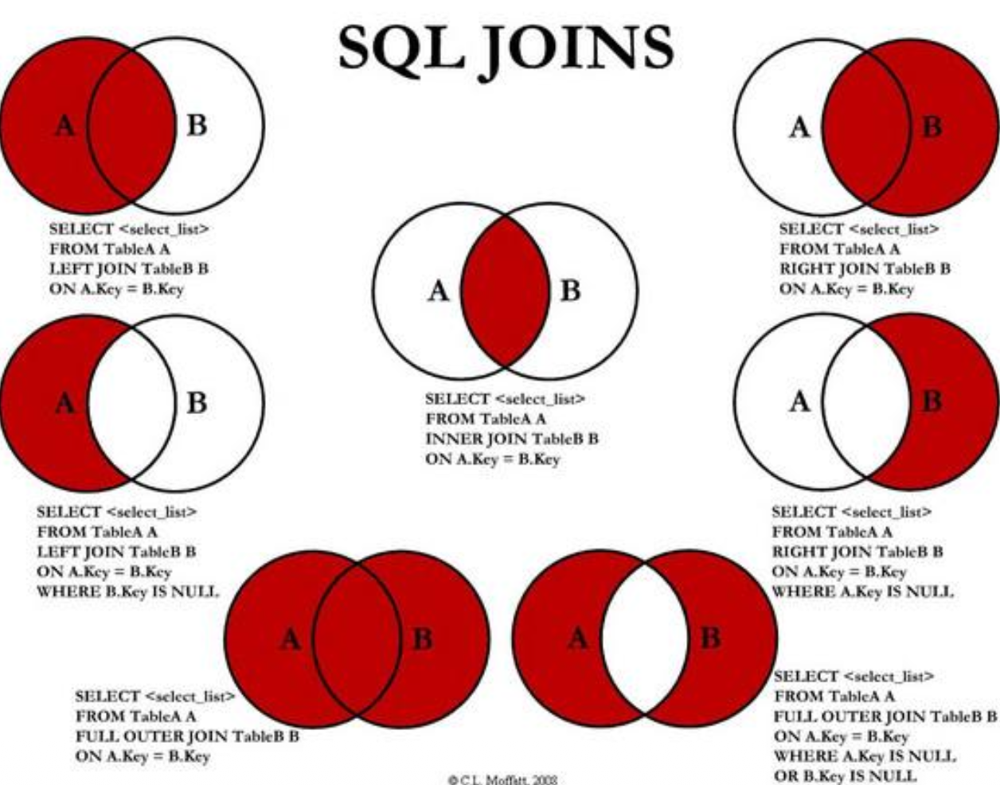
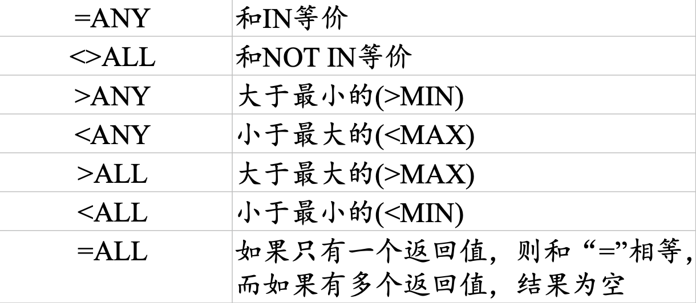

[TOC]

# SQL查询管理


| SQL功能   | 动词                     |
| --------- | ------------------------ |
| 数据定义 | CREATE, DROP, ALTER |
| 数据查询 | SELECT                 |
| 数据操纵 | INSERT, UPDATE, DELETE |
| 数据控制 | GRANT, REVOKE         |


## SQL语言的数据查询(DQL)


### 1 SELECT命令的格式与基本使用

数据查询是数据库中最常见的操作。SQL语言提供SELECT语句，通过查询操作可得到所需的信息。

SELECT语句的一般格式为：
```sql
SELECT〈列名〉[{，〈列名〉}]
FROM〈表名或视图名〉[{，〈表名或视图名〉}]
[WHERE〈检索条件〉]
[GROUP BY <列名1>[HAVING <条件表达式>]]
[ORDER BY <列名2>[ASC|DESC]];
```

SELECT语句的格式：
```sql
SELECT [ALL|DISTINCT][TOP N [PERCENT][WITHTIES]]
列名1 [AS 别名1]
[, 列名2 [ AS 别名2]…]
[INTO 新表名]
FROM 表名 1[[AS] 表1别名]
[INNER|RIGHT|FULL|OUTER][OUTER]JOIN
表名2 [[AS] 表2别名]
ON 条件
```
+ 查询的结果是仍是一个表。
+ SELECT语句的执行过程是:
  + 根据WHERE子句的检索条件，从FROM子句指定的基本表或视图中选取满足条件的元组，再按照SELECT子句中指定的列，投影得到结果表。
  + 如果有GROUP子句，则将查询结果按照<列名1>相同的值进行分组。
  + 如果GROUP子句后有HAVING短语，则只输出满足HAVING条件的元组。
  + 如果有ORDER子句，查询结果还要按照<列名2>的值进行排序。
+ ALL / DISTINCT（去重），ALL 是默认的不去重，通常不写，DISTINCT 去重。去掉重复行，是对整行结果去重，如果写两个，是对 (department, salary) 组合去重。
```sql
SELECT DISTINCT department, salary
```
+ TOP N（SQL Server 特有）
```sql
SELECT TOP 5 * FROM Employee;
```
+ TOP N PERCENT,返回前 百分之几的记录
```sql
SELECT TOP 10 PERCENT * FROM Employee;
``` 
+ WITH TIES,当有多行数据的排序值相同，超过了TOP N的限制时，WITH TIES 会把这些相同排序值的行也返回。WITH TIES 必须配合 ORDER BY。
```sql
SELECT TOP 5 WITH TIES * FROM Employee ORDER BY Salary DESC;
```
+ 列名 + AS 别名，改显示名，不改表结构,比如将Employee表中的salary列重命名为sal。
```sql
SELECT salary AS sal
FROM Employee;
```
例 查询全体学生的姓名、学号和年龄。其中，NAME为SNAME的别名。
```sql
SELECT SNAME NAME, SNO, AGE FROM S
```

例 查询全体学生的出生年份。
```sql
SELECT SNO,SNAME,BIRTH=YEAR(getdate())-
AGE FROM S
```


上述查询均为**不使用WHERE子句的无条件查询**，也称作**投影查询**。另外，利用投影查询可控制列名的顺序，并可通过指定别名改变查询结果的列标题的名字。


### 2 条件查询
+ 当要在表中找出满足某些条件的行时，则需使用WHERE子句指定查询条件。
+ WHERE子句中，条件通常通过三部分来描述：
  + 列名；
  + 比较运算符；
  + 列名、常数。




#### 比较大小
例 查询选修课程号为‘C1’的学生的学号和成绩。
```sql
SELECT SNO,SCORE FROM SC WHERE CNO=’C1’
```
例 查询成绩高于85分的学生的学号、课程号和成绩。
```sql
SELECT SNO,CNO,SCORE FROM SC WHERE
SCORE>85
```


#### 多重条件查询(NOT, AND, OR)
+ 当WHERE子句需要指定一个以上的查询条件时，则需要使用逻辑运算符AND、OR和NOT将其连结成复合的逻辑表达式。
+ 其优先级由高到低为：**NOT、AND、OR**，用户可以使用括号改变优先级。

例查询选修C1或C2且分数大于等于85分学生的的学号、课程号和成绩。
```sql
SELECT SNO，CNO，SCORE
FROM SC
WHERE（CNO=’C1’ OR CNO=’C2’） AND
SCORE>=85
```

#### 确定范围(BETWEEN…AND…)
例查询工资在1000至1500之间的教师的教师号、姓名及职称。
```sql
SELECT TNO,TN,PROF
FROM T
WHERE SAL BETWEEN 1000 AND 1500
```
等价于
```sql
SELECT TNO,TN,PROF
FROM T
WHERE SAL>=1000 AND SAL<=1500
```

例 查询工资不在1000至1500之间的教师的教师号、姓名及职称。
```sql
SELECT TNO,TN,PROF
FROM T
WHERE SAL NOT BETWEEN 1000 AND 1500
```

#### 确定集合(IN…/NOT IN…)
+ 利用“IN”操作可以查询属性值属于指定集合的元组。

例 查询选修C1或C2的学生的学号、课程号和成绩。
```sql
SELECT SNO, CNO, SCORE
FROM SC
WHERE CNO IN(‘C1’, ‘C2’)
```
此语句也可以使用逻辑运算符“OR”实现。
```sql
SELECT SNO, CNO, SCORE
FROM SC
WHERE CNO=‘C1’ OR CNO= ‘C2’
```

利用“NOT IN”可以查询指定集合外的元组。

例查询没有选修C1，也没有选修C2的学生的学号、课程号和成绩。
```sql
SELECT SNO, CNO, SCORE
FROM SC
WHERE CNO NOT IN(‘C1’, ‘C2’)
```
等价于：
```sql
SELECT SNO, CNO, SCORE
FROM SC
WHERE CNO<>‘C1’ AND CNO<> ‘C2’
```


#### 部分匹配查询/模糊查询（LIKE/NOT LIKE）
上例均属于完全匹配查询，当不知道完全精确的值时，用户还可以使用LIKE或NOT LIKE进行部分匹配查询（也称模糊查询）。

LIKE定义的一般格式为：
```
<属性名> LIKE <字符串常量>
```
+ 属性名必须为字符型，字符串常量的字符可以包含如下两个特殊符号：
  + %：表示任意长度的字符串；
  + _：表示任意单个字符；
  + [charlist]和[^charlist] ：匹配集合中任意一个字符或不在集合中的任意一个字符。

例 查询姓名中包含“张”字的学生的学号和姓名。
```sql
-- 以 “张” 开头
WHERE name LIKE '张%'

-- 以 “明” 结尾
WHERE name LIKE '%明'

-- 包含 “计”
WHERE name LIKE '%计%'
```

例 查询学号为2023开头，且第5位为0的学生的学号。
```sql
-- 学号 2023X001
WHERE sno LIKE '2023_001'

-- 学号 20230XX
WHERE sno LIKE '20230__'
```


例 查询姓名第二个字是“明”或“华”的学生的学号和姓名。
```sql
-- 姓名第二个字是 “明” 或 “华”
WHERE name LIKE '_[明华]'

-- 姓名第二个字不是 “明” 或 “华”
WHERE name LIKE '_[^明华]'
```

**NOT LIKE 用于排除符合某种模式的记录**

```sql
-- 不以 “张” 开头
WHERE name NOT LIKE '张%'
```

注意点：
+ LIKE 只能用于字符串
+ % 会影响索引使用（了解）
+ 在 SQL Server 中，LIKE 是否区分大小写，取决于“排序规则（Collation）”，不是 LIKE 本身。SQL Server 常见默认排序规则是：Chinese_PRC_CI_AS，CI = Case Insensitive（不区分大小写），AS = Accent Sensitive（区分重音）
+ LIKE 对 NULL 不成立，NULL 表示“未知”，而不是一个值。任何 列 LIKE '模式'，当列值为 NULL 时，结果都是 UNKNOWN，不会被选中。


#### 空值查询（IS NULL / IS NOT NULL）

某个字段没有值称之为具有空值（NULL）。
+ 通常没有为一个列输入值时，该列的值就是空值。
+ 空值不同于零和空格，它不占任何存储空间。
+ 例如，某些学生选课后没有参加考试，有选课记录，但没有考试成绩，考试成绩为空值，这与参加考试，成绩为零分的不同。

例 查询没有考试成绩的学生的学号和相应的课程号。
```sql
SELECT SNO, CNO
FROM SC
WHERE SCORE IS NULL
```
注意：这里的空值条件为IS NULL ，不能写成SCORE=NULL。


### 3 聚合函数（AVG, SUM, MAX, MIN, COUNT）
SQL提供了许多库函数，增强了基本检索能力。



常用的库函数，如下表所示



例 求学号为S1学生的总分和平均分。
```sql
SELECT SUM(SCORE) AS TotalScore, AVG(SCORE)
AS AveScore
FROM SC
WHERE (SNO = 'S1')
```
注意：函数SUM和AVG只能对数值型字段进行计算。


例 求选修C1号课程的最高分、最低分及之间相差的分数
```sql
SELECT MAX(SCORE) AS MaxScore, MIN(SCORE)
AS MinScore, MAX(SCORE) - MIN(SCORE)
AS Diff
FROM SC
WHERE (CNO = 'C1')
```
例 求计算机系学生的总数
```
SELECT COUNT(SNO)
FROM S
WHERE DEPT='计算机'
```


例 求学校中共有多少个系
```sql
SELECT COUNT(DISTINCT DEPT) AS DeptNum
FROM S
```
+ 注意：加入关键字DISTINCT后表示消去重复行，可计算字段“DEPT“不同值的数目。
+ COUNT函数对空值不计算，但对零进行计算。

例 统计有成绩同学的人数
```sql
SELECT COUNT (SCORE)
FROM SC
```

+ 上例中成绩为零的同学计算在内，没有成绩（即为空值）的不计算。


例利用特殊函数COUNT(*)求计算机系学生的总数
```sql
SELECT COUNT(*)
FROM S
WHERE DEPT=‘计算机’
```
+ COUNT（*）用来统计元组的个数
+ 不消除重复行，不允许使用DISTINCT关键字。


### 4 分组查询（GROUP BY / HAVING）

GROUP BY子句可以将查询结果按属性列或属性列组合在行的方向上进行分组，每组在属性列或属性列组合上具有相同的值。

例 查询各位教师的教师号及其任课的门数。
```sql
SELECT TNO,COUNT(*) AS C_NUM
FROM TC
GROUP BY TNO
```


+ GROUP BY子句按TNO的值分组，所有具有相同TNO的元组为一组，对每一组使用函数COUNT进行计算，统计出各位教师任课的门数。
+ 若在分组后还要按照一定的条件进行筛选，则需使用HAVING子句。

例 查询选修两门以上课程的学生学号和选课门数
```sql
SELECT SNO,COUNT(*) AS SC_NUM
FROM SC
GROUP BY SNO
HAVING COUNT(*)>=2
```
+ GROUP BY子句按SNO的值分组，所有具有相同SNO的元组为一组，对每一组使用函数COUNT进行计算，统计出每位学生选课的门数。
+ HAVING子句去掉不满足COUNT（*）>=2的组。
+ 当在一个SQL查询中同时使用WHERE子句，GROUP BY 子句和HAVING 子句时，其顺序是WHERE－GROUP BY－ HAVING。


WHERE与HAVING子句的根本区别在于作用对象不同。
+ WHERE子句作用于基本表或视图，从中选择满足条件的元组；
+ HAVING子句作用于组，选择满足条件的组，必须用于GROUP BY子句之后，但GROUP BY子句可没有HAVING子句。


### 5 查询的排序（ORDER BY）
+ 当需要对查询结果排序时，应该使用ORDER BY子句
+ ORDER BY子句必须出现在其他子句之后
+ 排序方式可以指定，DESC为降序，ASC为升序，**缺省时为升序**


**升序和降序**：都是从上往下看
+ 升序（ASC）：从小到大，从上往下
+ 降序（DESC）：从大到小，从上往下

例 查询选修C1 的学生学号和成绩，并按成绩降序排列。
```sql
SELECT SNO, SCORE
FROM SC
WHERE CNO='C1'
ORDER BY SCORE DESC
```


例 查询选修C2、C3、C4或C5课程的学号、课程号和成绩，查询结果按学号升序排列，学号相同再按成绩降序排列。
```sql
SELECT SNO,CNO, SCORE
FROM SC
WHERE CNO IN ('C2' ,'C3', 'C4','C5')
ORDER BY SNO,SCORE DESC
```


例 求选课在三门以上且各门课程均及格的学生的学号及其总
成绩，查询结果按总成绩降序列出。
```sql
SELECT SNO,SUM(SCORE) AS TotalScore
FROM SC
WHERE SCORE>=60
GROUP BY SNO
HAVING COUNT(*)>=3
ORDER BY SUM(SCORE) DESC
```


此语句为分组排序，执行过程如下：
1. （FROM）取出整个SC
2. （WHERE）筛选SCORE>=60的元组
3. （GROUP BY）将选出的元组按SNO分组
4. （HAVING）筛选选课三门以上的分组
5. （SELECT）以剩下的组中提取学号和总成绩
6. （ORDER BY）将选取结果排序

`ORDER BY SUM(SCORE) DESC` 可以改写成
`ORDER BY 2 DESC`
+ 2 代表查询结果的第二列。


### 6 INTO子句（创建新表）

SELECT…INTO 在默认字段组中创建一个新表并将来自查询的结果行插入新表中， 把查询结果直接存成一张新表，**新表必须不存在**，是一次性复制结构 + 数据。

```sql
SELECT *
INTO new_Table
FROM S
WHERE Sex = ‘男’
```


### 7 COMPUTE子句（已过时）
生成合计作为附加的汇总列出现在结果集的最后。
```sql
SELECT s.s#,sname,age,sex,c#,grade
FROM s,sc
WHERE s.s#=sc.s# and
s.s#='200203080101'
COMPUTE sum(sc.grade),count(s.s#)
SELECT s.s#,sname,c#,grade
FROM s,sc
WHERE s.s#=sc.s#
ORDER BYs.s#,sname
COMPUTE sum(sc.grade),count(s.s#) BY s.s#
SELECT Country,[State],City, [Population (in Millions)]
FROM tblPopulation
ORDER BY Country,[State],City
COMPUTE SUM([Population (in Millions)]) BY
Country,[State]--,City
GO
```


### 8 ROLLUP
生成合计作为附加的汇总列出现在结果集的最后。
```sql
SELECT s#,c#,sum(grade)
FROM sc
WHERE s# in ('200203080101’, '200203080102’)
group by s#,c# with ROLLUP
SELECT Country,[State],City,
SUM ([Population (in Millions)]) AS [Population (in Millions)]
FROM tblPopulation
GROUP BY Country,[State],City
WITH ROLLUP
```


### 9 *数据表连接及连接查询（JOIN）
+ 数据表之间的联系是通过表的字段值来体现的，这种字段称为**连接字段**。
+ 连接操作的目的就是通过加在连接字段的条件将多个表连接起来，以便从多个表中查询数据。
+ 前面的查询都是针对一个表进行的，当查询同时涉及两个以上的表时，称为**连接查询**。
+ 表的连接方法有两种：
  + 方法1：表之间满足一定的条件的行进行连接，此时FROM子句中指明进行连接的表名，WHERE子句指明连接的列名及其连接条件。
  + 方法2：利用关键字JOIN进行连接。


具体分为以下几种：
+ INNER JOIN ：显示符合条件的记录，此为默认值；
+ LEFT （OUTER） JOIN：显示符合条件的数据行以及左边表中不符合条件的数据行，此时右边数据行会以NULL来显示，此称为左连接；
+ RIGHT （OUTER） JOIN：显示符合条件的数据行以及右边表中不符合条件的数据行，此时左边数据行会以NULL来显示，此称为右连接；
+ FULL （OUTER） JOIN：显示符合条件的数据行以及左边表和右边表中不符合条件的数据行，此时缺乏数据的数据行会以NULL来显示；
+ CROSS JOIN：会将一个表的每一笔数据和另一表的每笔数据匹配成新的数据行。

当将JOIN 关键词放于FROM子句中时，应有关键词ON与之相对应，以表明连接的条件。



#### 等值连接与非等值连接

例 查询刘伟老师所讲授的课程。

方法1：
```sql
SELECT T.TNO ,TN ,CNO
FROM T,TC
WHERE (T.TNO = TC. TNO) AND (TN = ‘刘伟’)
```
+ 这里，TN=‘ 刘伟’为查询条件，而T.TNO =TC.TNO 为连接条件，TNO为连接字段。连接条件的一般格式为：
```
[<表名1>.] <列名1> <比较运算符> [<表名2>.] <列
名2>
```
+ 其中,比较运算符主要有：＝、＞、＜、＞＝、＜＝、
<>。
+ 当比较运算符为“＝“时，称为等值连接，其他情况为非等值连接。
+ 引用列名TNO时要加上表名前缀，是因为两个表中的列名相同，必须用表名前缀来确切说明所指列属于哪个表，以避免二义性。如果列名是唯一的，比如TN，就不必须加前缀。
+ 上面的操作是将T表中的TNO 和TC表中的TNO相等的行连接，同时选取TN为“刘伟“的行，然后再在TN，CNO列上投影，这是连接、选取和投影的操作组合。

方法2：
```sql
SELECT T.TNO,TN,CNO
FROM T INNER JOIN TC
ON T.TNO=TC.TNO AND T.TN='刘伟'
```

方法3：
```sql
SELECT R2.TNO,R2.TN, R1.CNO
    FROM
        (SELECT TNO,CNO
        FROM TC ) AS R1
        INNER JOIN
        (SELECT TNO ,TN
        FROM T
        WHERE TN='刘伟') AS R2
        ON R1.TNO=R2.TNO
```

例 查询所有选课学生的学号、姓名、选课名称及成绩。
```sql
SELECT S.SNO,SN,CN,SCORE
 FROM S,C,SC
WHERE S.SNO=SC.SNO AND
    SC.CNO=C.CNO
```


本例涉及三个表，WHERE子句中有两个连接条件。当有两个以上的表进行连接时，称为多表连接。

#### 自身连接
+ 当一个表与其自已进行连接操作时，称为表的自身连接。

例 查询所有比刘伟工资高的教师姓名、性别、工资和刘伟的工资。

+ 要查询的内容均在同一表T中，可以将表T分别取两个别名，一个是X，一个是Y。将X, Y 中满足比刘伟工资高的行连接起来。这实际上是同一表T的自身连接。

方法1：
```sql
SELECT X.TN,X.SAL AS SAL_a,Y.SAL AS SAL_b
    FROM T AS X ,T AS Y
WHERE X.SAL>Y.SAL AND
Y.TN='刘伟'
```

方法2：
```sql
SELECT X.TN, X.SAL,Y.SAL
    FROM T AS X INNER JOIN T AS Y
        ON X.SAL>Y.SAL AND Y.TN='刘伟'
```

方法3：
```sql
SELECT R1.TN,R1.SAL, R2.SAL
    FROM
    (SELECT TN,SAL
    FROM T ) AS R1
    INNER JOIN
    (SELECT SAL
    FROM T
    WHERE TN='刘伟') AS R2
    ON R1.SAL>R2.SAL
```
例 检索所有学生姓名，年龄和选课名称。

方法1：
```sql
SELECT SN,AGE,CN
    FROM S,C,SC
WHERE S.SNO=SC.SNO AND SC.CNO=C.CNO
```
方法2：
```sql
SELECT R3.SNO,R3.SN,R3.AGE,R4.CN
    FROM
        (SELECT SNO,SN,AGE FROM S) AS R3
        INNER JOIN
        (SELECT R2.SNO,R1.CN
            FROM
                (SELECT CNO,CN FROM C) AS R1
                INNER JOIN
                (SELECT SNO,CNO FROM SC) AS R2
                ON R1.CNO=R2.CNO) AS R4
        ON R3.SNO=R4.SNO
```


#### *外连接
+ 在上面的连接操作中，不满足连接条件的元组不能作为查询结果输出。
+ 如例的查询结果只包括有选课记录的学生，而不会有吴丽同学的信息。若将例*改成：

例 查询所有学生的学号、姓名、选课名称及成绩。（没有选课的
同学的选课信息显示为空）则应写成如下的SQL语句。
```sql
SELECT S.SNO,SN,CN,SCORE
    FROM S
        LEFT OUTER JOIN SC
        ON S.SNO=SC.SNO
        LEFT OUTER JOIN C
        ON C.CNO=SC.CNO
```

则查询结果只包括所有的学生，没有选课的吴丽同学的选课信息显示为空。


### 10 子查询

+ 在 WHERE 子句中包含一个形如SELECT-FROM-WHERE的查询块，此查询块称为子查询或嵌套查询，包含子查询的语句称为父查询或外部查询。
+ 嵌套查询可以将一系列简单查询构成复杂查询，增强查询能力。
+ 子查询的嵌套层次最多可达到32层，以层层嵌套的方式构造查询充分体现了SQL“结构化”的特点。
+ 嵌套查询在执行时由里向外处理，每个子查询是在上一级外部查询处理之前完成，父查询要用到子查询的结果。


子查询的制约规则
+ 子查询的选择列表中不允许出现 ntext、text 和image。
+ 包括 GROUP BY 的子查询不能使用 DISTINCT 关键字。不能指定COMPUTE 和INTO 子句。
+ 只有在子查询中使用TOP 关键字，才可以指定ORDER BY子句。
+ 由子查询创建的视图不能更新。
+ 不能在ORDER BY、GROUP BY或COMPUTE BY之后使用子查询。
+ 子查询中不能使用UNION关键字。
+ LOB(大对象数据)类型的字段不能作为子查询的比较条件。


通常来讲，子查询按照子查询所返回数据的类型，可以分为三种，分别为：
+ 返回单个值(Scalar)
+ 返回一列值(Column)
+ 返回一张数据表(Table)


#### 返回一个值的子查询
当子查询的返回值只有一个时，可以使用比较运算符（=, >, <, >=, <=, <>）将父查询和子查询连接起来。

例 查询与刘伟教师职称相同的教师号、姓名。
```sql
SELECT TNO,TN
    FROM T
    WHERE PROF=
        (SELECT PROF
        FROM T
        WHERE TN='刘伟')
```


此查询相当于分成两个查询块来执行。先执行子查询：
```sql
SELECT PROF
    FROM T
WHERE 
```

子查询向主查询只返回一个值，即刘伟教师的职称“副教授”，然后以此作为父查询的条件，相当于再执行父查询, 查询所有职称为“副教授”的教师号、姓名。
```sql
SELECT TNO,TN
  FROM T
WHERE PROF=’副教授’
```


#### 返回一组值的子查询
如果子查询的返回值不止一个，而是一个集合时，则不能直接使用比较运算符，可以在比较运算符和子查询之间插入ANY或ALL。其具体含义详见以下各例。


##### 使用ANY
例 查询讲授课程号为C5的教师姓名。
```sql
SELECT TN
    FROM T
WHERE TNO=ANY
    (SELECT TNO
    FROM TC
    WHERE CNO='C5')
```
+ 先执行子查询，找到讲授课程号为C5的教师号，为一组值构成的集合(T2,T3,T5)；
+ 再执行父查询，其中ANY的含义为任意一个，查询教师号为T2、T3、T5的教师的姓名。

该例也可以使用前面所讲的连接操作来实现：
```sql
SELECT TN
FROM T,TC
WHERE T.TNO=TC.TNO AND
TC.CNO='C5‘
```
可见，对于同一查询可使用子查询和连接两种方法来解决，可根据习惯任意选用。


例查询其他系中比计算机系某一教师工资高的教师的姓名和工资。
```sql
SELECT TN,SAL
    FROM T
WHERE SAL>ANY
    (SELECT SAL
        FROM T
    WHERE DEPT='计算机')
    AND DEPT<> '计算机'
    /*注意：此行是父查询中的条件*/
```
+ 先执行子查询，找到计算机系中所有教师的工资集合(1500,900)；
+ 再执行父查询，查询所有不是计算机系且工资高于1500或900的教师姓名和工资。

此查询也可以写成：
```sql
SELECT TN,SAL
    FROM T
WHERE SAL>
    (SELECT MIN(SAL )
        FROM T
    WHERE DEPT='计算机')
    AND DEPT<>‘计算机’
```
+ 先执行子查询，利用库函数MIN找到计算机系中所有教师的最低工资——900；
+ 再执行父查询，查询所有不是计算机系且工资高于900的教师。


##### 使用IN
+ 可以使用IN代替“=ANY”。

例查询讲授课程号为C5的教师姓名。
```sql
SELECT TN
    FROM T
WHERE TNO IN
    (SELECT TNO
    FROM TC
    WHERE CNO='C5')
```


##### 使用ALL
+ ALL的含义为全部。
例 查询其他系中比计算机系所有教师工资都高的教师的姓名和工资。
```sql      
SELECT TN,SAL
    FROM T
WHERE SAL>ALL
    (SELECT SAL
        FROM T
    WHERE DEPT='计算机')
        AND DEPT<>‘计算机’
```
+ 子查询找到计算机系中所有教师的工资集合(1500,900)；
+ 父查询找到所有不是计算机系且工资高于1500的教师姓名和工资。

此查询也可以写成：
```sql
SELECT TN,SAL
    FROM T
WHERE SAL>
    (SELECT MAX(SAL )
        FROM T
    WHERE DEPT='计算机')
        AND DEPT<>‘计算机’
```
库函数MAX的作用是找到计算机系中所有教师的最高工资1500。




例 查询不讲授课程号为C5的教师姓名。
```sql
SELECT DISTINCT TN
    FROM T
WHERE 'C5' <>ALL
    ( SELECT CNO
        FROM TC
    WHERE TNO=T.TNO)
```
<>ALL的含义为不等于子查询结果中的任何一个值，也可使用NOT IN代替<>ALL。


+ 子查询包含普通子查询和相关子查询。
+ 前面所讲的子查询均为普通子查询，而本例中子查询的查询条件引用了父查询表中的属性值（T表的TNO值），我们把这类查询称为相关子查询。

**二者的执行方式不同：**
+ 普通子查询的执行顺序是：
  + 首先执行子查询，然后把子查询的结果作为父查询的查询
  条件的值。
  + 普通子查询只执行一次，而父查询所涉及的所有记录行都
  与其查询结果进行比较以确定查询结果集合。
+ 相关子查询的执行顺序是：
  + 首先选取父查询表中的第一行记录，内部的子查询利用此行中相关的属性值进行查询，
  + 然后父查询根据子查询返回的结果判断此行是否满足查询条件。如果满足条件，则把该行放入父查询的查询结果集合中。
  + 重复执行这一过程，直到处理完父查询表中的每一行数据。


由此可以看出，相关子查询的执行次数是由父查询表的行数决定
的。如上例表T中每的一行即每个教师记录都要执行一次子查询以确定该教师是否讲授C5这门课，当 C5不是教师的任一门课时，则该教师被选取。以下几例均为相关子查询。


##### 使用EXISTS
+ EXISTS表示存在量词，带有EXISTS的子查询不返回任何实际数据，它只得到逻辑值“真”或“假”
+ 当子查询的的查询结果集合为非空时，外层的WHERE 子句返回 真值，否 则返回 假 值。NOT EXISTS与此相反。
+ 含有IN的查询通常可用EXISTS表示，但反过来不一定。


例 查询讲授课程号为C5的教师姓名。
```sql
SELECT TN
    FROM T
WHERE EXISTS
    (SELECT *
        FROM TC
    WHERE TNO=T.TNO
        AND C#='C5')
```
+ 当子查询TC表存在一行记录满足其WHERE子句中的条件时，则父查询便得到一个TN值，重复执行以上过程，直到得出最后结果。

例 查询选修所有课程的学生姓名
```sql
SELECT SName
    FROM S
WHERE NOT EXISTS
    (SELECT *
        FROM C
    WHERE NOT EXISTS
        (SELECT *
            FROM SC
        WHERE S# = S.S#
            AND C#=C.C#))
```
选出这样一些学生名单，在SC表中不存在他们没有选修课程的记录。

#### 相关子查询 vs 不相关子查询

子查询可以独立执行，其结果与外层查询无关。 这种子查询称为**不相关子查询**。

```sql
SELECT *
FROM student
WHERE age > (
    SELECT AVG(age)
    FROM student
);
```
子查询
```sql      
SELECT AVG(age) FROM student
```


子查询的执行依赖外层查询，每执行一行外层查询，子查询就执行一次。是**相关子查询**。

```sql
SELECT *
FROM student s
WHERE age > (
    SELECT AVG(age)
    FROM student
    WHERE class_id = s.class_id
);
```
子查询
```sql      
SELECT AVG(age)
FROM student
WHERE class_id = s.class_id
```
依赖上层，因此无法执行。


### 11 集合查询（UNION, INTERSECT, EXCEPT）

集合操作的种类
+ 并操作UNION
+ 交操作INTERSECT
+ 差操作EXCEPT

注意点：
+ 参加集合操作的各查询结果的列数必须相同；
+ 对应项的数据类型也必须兼容；
+ 返回的结果集的列名与操作数左侧的查询返回的列名相同；
+ 比较的两个查询结果集中不能包含不可比较的数据类型（xml、text、ntext、image 或非二进制 CLR 用户定义类型）的列；
+ 通过比较行来确定非重复值时，两个 NULL 值被视为相等。


查询自动化科学系的学生及年龄不大于19岁的学生
```sql
SELECT *
    FROM S
WHERE dept= 'CS'
    UNION
SELECT *
    FROM S
WHERE age<=19
```
+ UNION：将多个查询结果合并起来时，系统自动去掉重复元组。
+ UNION ALL：将多个查询结果合并起来时，保留重复元组。

```sql
SELECT DISTINCT *
FROM S
WHERE dept= ‘自动化' OR age<=19；
```

查询选修了课程C1或者选修了课程C2的学生
```sql
SELECT SNO
    FROM SC
WHERE CNO='C1'
    UNION ALL
SELECT SNO
    FROM SC
WHERE CNO='C2 '
```

查询自动化科学系的学生与年龄不大于19岁的学生的交集
```sql
SELECT *
    FROM S
WHERE dept='电子信息工程'
INTERSECT
SELECT *
    FROM S
WHERE age<=21
```

```sql
SELECT *
    ROM S --学生表
WHERE dept= ‘自动化' AND Sage<=19；
```

查询自动化科学系的学生与学号为300203080218的学生的差集。
```sql
SELECT *
    FROM S
WHERE dept= '电气工程及自动化'
EXCEPT
SELECT *
    FROM S
WHERE S#='300203080218'
```


### 12 基于派生表查询
子查询不仅可以在where子句中，还可以在from子句中，这时子查询生成的临时派生表成为主查询的查询对象。

派生表就是“把一个子查询当成一张临时表来用”。先分组统计，再筛选结果。

例 查询选修两门及以上课程的学生学号。
```sql
SELECT *
FROM (
    SELECT sno, COUNT(*) AS cnt
    FROM SC
    GROUP BY sno
) AS t
WHERE cnt >= 2;
```


## SQL 数据更新(DML)

SQL语言的数据更新语句DML主要包括插入数据、修改数据和删除数据三种语句。

### 插入数据记录（INSERT INTO）

插入数据是把新的记录插入到一个存在的表中。插入数据使用语句INSERT INTO，可分为以下几种情况。

#### 插入一行新记录
+ 语法格式为：
```sql
INSERT INTO <表名>[(<列名1>[,<列名2>…])] VALUES(<值>)
```
+ 其中，<表名>是指要插入新记录的表<列名>是可选项，指定待添加数据的列VALUES子句指定待添加数据的具体值。
+ 列名的排列顺序不一定要和表定义时的顺序一致。
+ 但当指定列名表时VALUES子句值的排列顺序必须和列名表中的列名排列顺序一致，个数相等，数据类型一一对应。

例 在S表中插入一条学生记录（学号：S7；姓名：郑冬；性别：女；年龄：21；系别：计算机）。
```sql
INSERT INTO S
VALUES ('s7','郑冬','女',21,'计算机')
```


注意：
+ 必须用逗号将各个数据分开，字符型数据要用单引号括起来。
+ INTO子句中没有指定列名，则新插入的记录必须在每个属性列上均有值，且VALUES子句中值的排列顺序要和表中各属性列的排列顺序一致。


#### 插入一行的部分数据值

例 在SC表中插入一条选课记录（’S7’,’C1’）。
```sql
INSERT INTO SC (SNO,CNO)
VALUES ('s7','c1')
```
+ 将VALUES子句中的值按照INTO子句中指定列名的顺序插入到表中
+ 对于INTO子句中没有出现的列，则新插入的记录在这些列上将取空值，如上例的SCORE即赋空值。
+ 但在表定义时有NOT NULL约束的属性列不能取空值。


#### 插入多行记录

用于表间的拷贝，将一个表中的数据抽取数行插入另一表中，可以通过子查询来实现。

插入数据的命令语法格式为：
```
INSERT INTO <表名> [(<列名1>[,<列名2>…])]
子查询
```
例 求出各系教师的平均工资，把结果存放在新表AVGSAL中。

首先建立新表AVGSAL，用来存放系名和各系的平均工资
```sql
CREATE TABLE AVGSAL
(DEPARTMENT VARCHAR(20),
    AVGSAL SMALLINT)
```
然后利用子查询求出T表中各系的平均工资，把结果存放在新表AVGSAL中。
```sql
INSERT INTO AVGSAL
    SELECT DEPT,AVG(SAL)
        FROM T
GROUP BY DEPT
```

### 修改数据记录（UPDATE...SET）

SQL语言可以使用UPDATE语句对表中的一行或多行记录的某些列值进行修改，其语法格式为：

```sql
UPDATE <表名>
SET <列名>=<表达式> [,<列名>=<表达式>]…
[WHERE <条件>]
```

其中：
+ <表名>是指要修改的表
+ SET子句给出要修改的列及其修改后的值
+ WHERE子句指定待修改的记录应当满足的条件，WHERE子句省略时，则修改表中的所有记录。


#### 修改一行

例3 把刘伟教师转到信息系。
```sql
UPDATE T
    SET DEPT='信息'
WHERE TN='刘伟'
```

#### 修改多行
例 将所有学生年龄增加1岁
```sql
UPDATE S
    SET AGE=AGE+1
```

例 把教师表中工资小于等于1000元的讲师的工资提高20%。
```sql
UPDATE T
    SET SAL=1.2*SAL
WHERE PROF='讲师'
    AND SAL <=1000
```

#### 用子查询选择要修改的行

例 把讲授C5课程的教师的岗位津贴增加100元。
```sql
UPDATE T
    SET COMN=COMN+100
WHERE TNO IN
    (SELECT T.TNO
        FROM T,TC
    WHERE T.TNO=TC.TNO
        AND TC.CNO='C5')
```

子查询的作用是得到讲授C5课程的教师号。


#### 用子查询提供要修改的值

例 把所有教师的工资提高到平均工资的1.2倍
```sql
UPDATE T
    SET SAL =
        (SELECT 1.2*AVG(SAL)
            FROM T)
```
子查询的作用是得到所有教师的平均工资。


### 删除数据记录（DELETE）

使用DELETE语句可以删除表中的一行或多行记录，其语法格式为：
```sql
DELETE
FROM <表名>
[WHERE <条件>]
```
其中，
+ <表名>是指要删除数据的表。
+ WHERE子句指定待删除的记录应当满足的条件，WHERE子句省略时，则删除表中的所有记录。


#### 删除一行记录
例 删除刘伟教师的记录。
```sql
DELETE
    FROM T
WHERE TN=’刘伟’
```

#### 删除多行记录
例 删除所有教师的授课记录
```sql
DELETE
FROM TC
```
执行此语句后，TC表即为一个空表，但其定义仍存在数据字典中。


```sql
DELETE
FROM S
WHERE SNO NOT IN (
    SELECT SNO
    FROM SC
);
```

#### 利用子查询选择要删除的行


解 删除刘伟教师授课的记录。
```sql
DELETE
    FROM TC
WHERE TNO=
    (SELECT TNO
        FROM T
    WHERE TN=’ 刘伟’)
```

例 删除计算机系学生的选课记录。
```sql
DELETE
FROM SC
WHERE SNO IN (
    SELECT SNO
    FROM S
    WHERE DEPT = '计算机系'
);
```

```sql
DELETE
FROM SC
WHERE EXISTS (
    SELECT *
    FROM S
    WHERE S.SNO = SC.SNO
      AND S.DEPT = '计算机系'
);
```

