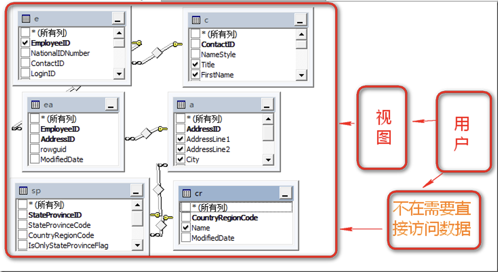
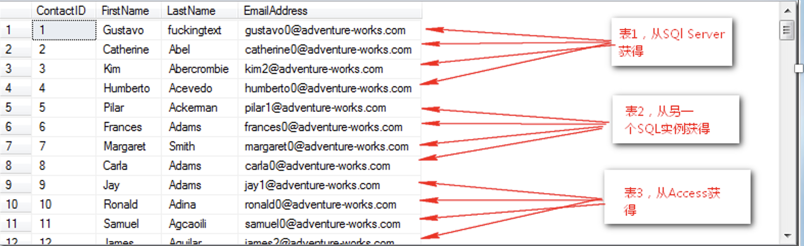
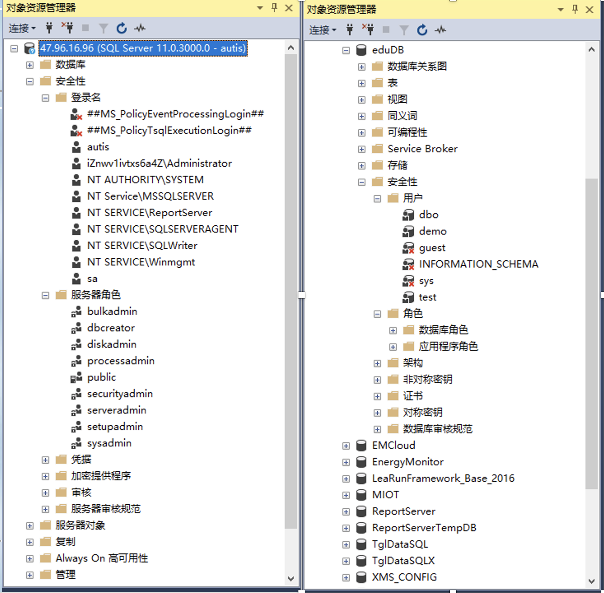
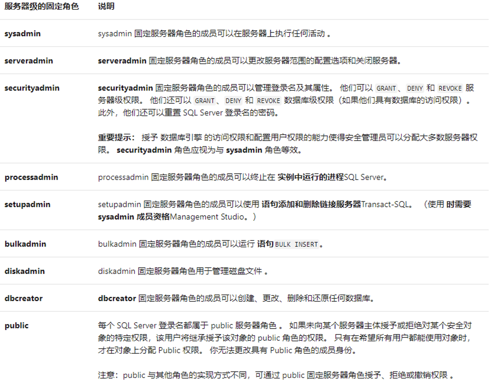
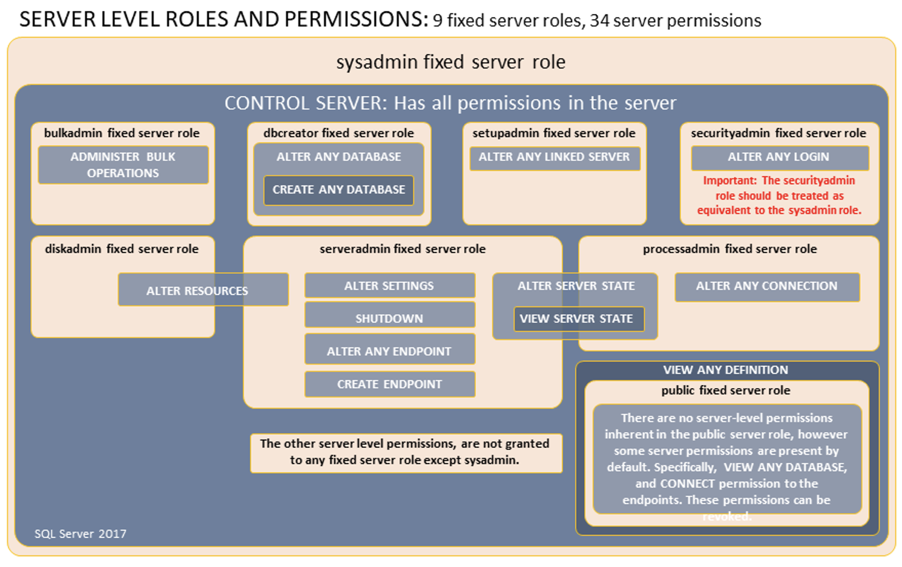
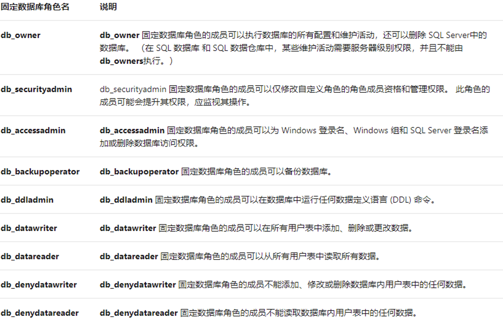
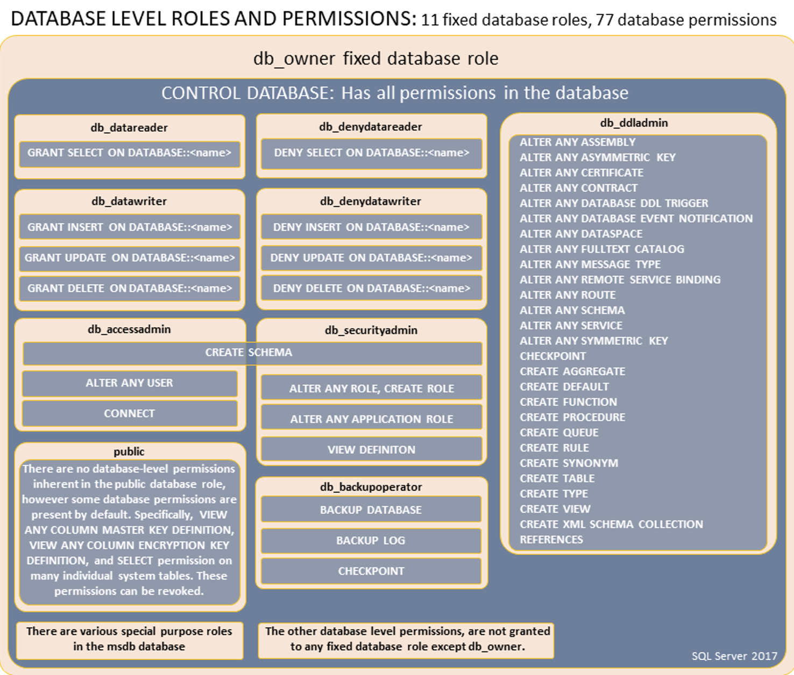
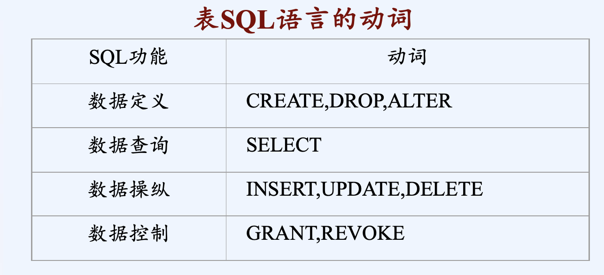

# 视图管理与SQL数据控制


## 视图
视图是虚表，其数据不存储，其记录来自基本表，只在数据库中存储其定义。视图在概念上与基本表等同，用户可以在视图上再定义视图，可以对视图进行查询、删除、更新等操作。





为什么要使用视图?
+ 视图隐藏了底层的表结构，简化了数据访问操作
+ 因为隐藏了底层的表结构，所以大大加强了安全性，用户只能看到视图提供的数据
+ 使用视图，方便了权限管理，让用户对视图有权限而不是对底层表有权限进一步加强了安全性
+ 视图提供了一个用户访问的接口，当底层表改变后，改变视图的语句来进行适应，使已经建立在这个视图上客户端程序不受影响

视图在SQL中可以分为三类
+ 普通视图(Regular View)
+ 索引视图(Indexed View)
+ 分区视图(Partitioned View)


### 1.  定义和删除视图

#### 定义视图


定义视图使用语句CREATE VIEW，其语法格式为：
```sql
CREATE VIEW [架构名].<视图名>[(<视图列表>)]
[WITH  ENCRYPTION]
AS 
    <子查询>
[WITH CHECK OPTION]
```
+ 其中，<视图列表>为可选项，省略时，视图的列名由子查询的结果决定； 
+ WITH ENCRYPTION对创建视图文本进行加密；
+ WITH SCHEMABINDING将视图绑定到基础表的架构。
+ WITH CHECK OPTION强制针对视图执行的所有数据修改句都必须符合在 select_statement 中设置的条件。


以下两种情况下，视图列名不可省略：
1. 视图由多个表连接得到，在不同的表中存在同名列，则需指定列名；
2. 当视图的列名为表达式或库函数的计算结果时，而不是单纯的属性名时，则需指明列名。

在子查询中不允许使用ORDER BY 子句和DISTINCT短语，如果需要排序，则可在视图定义后，对视图查询时再进行排序。

例 创建一个计算机系教师情况的视图V_COMPUTER。
```sql
CREATE VIEW V_COMPUTER
AS 
(SELECT TNO,TN,PROF
     FROM T 
  WHERE DEPT ='计算机' )
```


其中：
+ 视图名字为V_COMPUTER，省略了视图列表。
+ 视图由子查询中的三列TNO,TN,PROF组成。
+ 视图创建后，对视图V_COMPUTER的数据的访问只限制在计算机系内，且只能访问TNO,TN,PROF三列的内容，从而达到了数据保密的目的。

> 视图创建后，只在数据字典中存放视图的定义，而其中的子查询SELECT语句并不执行。只有当用户对视图进行操作时，才按照视图的定义将数据从基本表中取出。


例 创建一学生情况视图V_S_SC_C（包括学号、姓名、课程名及成绩）。
```sql
CREATE VIEW V_S_SC_C(SNO, SN, CN, SCORE) 
AS 
SELECT S.SNO, SN, CN, SCORE
   FROM S, C, SC
WHERE S.SNO = SC.SNO AND 
               SC.CNO = C.CNO
```
此视图由三个表连接得到，在S表和SC表中均存在SNO列，则需指定视图列名。 


例 创建一学生平均成绩视图V_AVG
```sql
CREATE VIEW V_AVG (SNO,AVG)
AS 
      SELECT SNO, AVG (SCORE)
         FROM SC 
GROUP BY SNO
```

此视图的列名之一AVG为库函数的计算结果，则在定义时需指明列名。


创建视图除了需要符合上面的语法规则之外，还有一些规则需要遵守：
+ 在View中，除非有TOP关键字，否则不能用Order By子句（如果你一意孤行要用Order by,这里有个hack是使用Top 100 percent…..)
+ View在每个Schema中命名必须独一无二
+ View嵌套不能超过32层
+ Compute, Compute by, INTO关键字不允许出现在View
中
+ View不能建立在临时表上
+ View不能对全文索引进行查询


#### **删除视图**

视图定义后可随时删除，删除视图的语法格式为：
DROP VIEW <视图名>

例 删除计算机系教师情况的视图V_COMPUTER。
```sql
DROP VIEW V_COMPUTER
```

视图删除后，只会删除该视图在数据字典中的定义，而与该视图有关的基本表中的数据不会受任何影响，由此视图导出的其他视图的定义不会删除，但已无任何意义。用户应该把这些视图删除。


### 2.查询视图

视图定义后，对视图的查询操作如同对基本表的查询操作一样。

例 查找视图V_COMPUTER中职称为教授的教师号和姓名。
```sql
SELECT TNO,TN
   FROM  V_COMPUTER 
WHERE  PROF='教授'
```


此查询的执行过程是系统首先从数据字典中找到V_COMPUTER的定义，然后把此定义和用户的查询结合起来，转换成等价的对基本表T的查询，这一转换过程称为**视图消解**（View Resolution）,相当于执行以下查询
```sql
SELECT TNO,TN
   FROM T 
WHERE DEPT = ’计算机’  AND 
               PROF = ’教授’
``` 

由上例可以看出，当对一个基本表进行复杂的查询时，可以先对基本表建立一个视图，然后只需对此视图进行查询，这样就不必再键入复杂的查询语句，而将一个复杂的查询转换成一个简单的查询，从而简化了查询操作。


### 3.更新视图

+ 由于视图是一张虚表，所以对视图的更新，最终实际上是转换成对基本表的更新。
+ 其更新操作包括插入、修改和删除数据，
+ 其语法格式如同对基本表的更新操作一样。
+ 有些更新在理论上是不可能的，有些实现起来比较困难，以下仅考虑可以更新的视图。


**什么样的视图不允许插入、修改、删除的操作呢？**
1. 若视图的字段是来自字段表达式或常数，则不允许对此视图执行INSERT、UPDATE操作，允许执行DELETE操作；
2. 若视图的字段是来自库函数，则此视图不允许更新；
3. 若视图的定义中有GROUP BY子句或聚集函数时，则此视图不允许更新；
4. 若视图的定义中有DISTINCT任选项，则此视图不允许更新；
5. 若视图的定义中有嵌套查询，并且嵌套查询的FROM子句中涉及的表也是导出该视图的基表，则此视图不允许更新；
6. 若视图是由两个以上的基表导出的，此视图不允许更新；
7. 一个不允许更新的视图上定义的视图也不允许更新；
8. 由一个基表定义的视图，只含有基表的主键或候补键，并且视图中没有用表达式或函数定义的属性，才允许更新。

#### 插入（INSERT）
例 向计算机系教师视图V_COMPUTER中插入一条记录（教师号：T6；姓名：李丹；职称：副教授）。
```sql
INSERT INTO  V_COMPUTER
         VALUES  ('T6','李丹','副教授')
```
系统在执行此语句时，首先从数据字典中找到V_COMPUTER的定义，然后把此定义和插入操作结合起来，转换成等价的对基本表T的插入。相当于执行以下操作：
```sql
INSERT INTO  T
         VALUES  (‘T6’,’ 李丹’，’副教授’，’计算机’)
```


#### 修改（UPDATE）
例  将计算机系教师视图V_COMPUTER中刘伟的职称改为“副教授“。
```sql
UPDATE V_COMPUTER
        SET PROF = '副教授'
    WHERE TN = ‘刘伟’ 
```
转换成对基本表的修改操作：
```sql
UPDATE T
         SET PROF = ’副教授’
  WHERE TN = ’刘伟’AND 
                 DEPT = ’计算机’
```

#### 删除（DELETE）
例  删除计算机系教师视图V_COMPUTER中刘伟教师的记录。
```sql
DELETE 
    FROM V_COMPUTER
 WHERE TN = ’刘伟’
```
转换成对基本表的删除操作：
```sql
DELETE 
    FROM T
 WHERE TN = ’刘伟’ AND 
                DEPT = ’计算机’
```
由于视图中的数据不是存放在视图中的，即视图没有相应的存储空间，对视图的一切操作最终都要转换成对基本表的操作，这样看来使操作更加复杂，那么为什么还要使用视图呢？


使用视图有如下几个优点：
1. 利于数据保密，对不同的用户定义不同的视图，使用户只能看到与自己有关的数据。例如,对教师表创建了计算机系视图，本系教师只能使用此视图，而无法访问其他系教师的数据。
2. 简化查询操作，为复杂的查询建立一个视图，用户不必键入复杂的查询语句，只需针对此视图做简单的查询即可。
3. 保证数据的逻辑独立性。对于视图的操作，比如查询，只依赖于视图的定义。当构成视图的基本表要修改时，只需修改视图定义中的子查询部分。而基于视图的查询不用改变。这就是第一章介绍过的外模式与模式之间的独立性，即数据的逻辑独立性。


### 各种视图

#### 索引视图（Indexed View）


在普通的视图的基础上，为视图建立唯一聚集索引，这时这个视图就变成了索引视图.
```
视图+聚集索引=索引视图
```
```sql
use AdventureWorks2012
go
SELECT p.Name,s.OrderQty
 FROM Production.Product p
             inner join Sales.SalesOrderDetail s
            ON p.ProductID=s.ProductID
```


```sql
--建立视图
CREATE VIEW v_Test_IndexedView
WITH SCHEMABINDING
AS
SELECT p.Name,s.OrderQty,s.SalesOrderDetailID
FROM Production.Product p
 inner join Sales.SalesOrderDetail s
ON p.ProductID=s.ProductID
GO
--在视图上建立索引
CREATE UNIQUE CLUSTERED INDEX indexedview_test1
ON v_Test_IndexedView(SalesOrderDetailID)
```
从上面这个例子中,可以体会到索引视图的强大威力，从而大大的提高了查询性能。索引视图会将数据物理存在数据库中。


#### 分区视图（Partitioned View）

+ 整个视图所返回的数据由几个平行表（即是几个表有相同的表结构，也就是列和数据类型，但存储的行集合不同)进行UNION连接所获得的数据集.
+ 分区视图总体上可以分为两种:
  + 本地分区视图(Local Partitioned View），主要为了兼容老版本。
  + 分布式分区视图(Distributed Partitioned View)

分布式分区视图其实是将由几个由不同数据源或是相同数据源获得的平行数据集进行连接所获得的，一个简单的概念图如下:



## SQL数据控制 

SQL Server提供了两种身份验证模式:
+ Windows身份验证模式：Windows身份验证模式就像其名称所示那样，由Windows来验证主体，SQL Server并不参与验证。
+ SQL Server和Windows身份验证模式（混合模式）：允许由Windows来验证主体身份，又允许SQL Server来验证主体身份，当由SQL Server验证主体身份时，需要用户名和密码来确认主体身份。


“主体” 是可以请求 SQL Server 资源的实体，可以按照作用范围被分为三类:
+ Windows级的主体：
  + Windows 用户的 Windows 身份验证登录名
  + Windows 组的 Windows 身份验证登录名
  + AD 用户的 Azure Active Directory 身份验证登录名
  + AD 组的 Azure Active Directory 身份验证登录名
+ SQL Server服务器级的主体： 
  + SQL Server 身份验证登录名
  + 服务器角色
+ 数据库级别主体：
  + 数据库用户
  + 数据库角色
  + 应用程序角色





**服务器级的固定角色**



**固定服务器角色的权限**



**固定数据库角色**






### 权限与角色


数据库中的数据由多个用户共享，为保证数据库的安全，SQL语言提供数据控制语句**DCL(Data Control Language)**对数据库进行统一的控制管理。


**权限**

在SQL系统中，有两个安全机制：
+ 一种是上一节介绍的**视图机制**，当用户通过视图访问数据库时，不能访问此视图外的数据，它提供了一定的安全性。
+ 主要的安全机制是**权限机制**。
  + 权限机制的基本思想是给用户授予不同类型的权限，在必要时，可以收回授权。
  + 使用户能够进行的数据库操作以及所操作的数据限定在指定的范围内，禁止用户超越权限对数据库进行非法的操作，从而保证数据库的安全性。


在SQL SERVER中，权限可分为**系统权限和对象权限**。
+ 系统权限由数据库管理员授予其他用户，是指数据库用户能够对数据库系统进行某种特定的操作的权力。如创建一个基本表（CREATE TABLE）
+ 对象权限由创建基本表、视图等数据库对象的用户授予其他用户，是指数据库用户在指定的数据库对象上进行某种特定的操作的权力。如查询（SELECT）、插入（INSERT）、修改（UPDATE）和删除（DELETE）等操作。


**角色**

角色是多种权限的集合，可以把角色授予用户或其他角色。当要为某一用户同时授予或收回多项权限时，则可以把这些权限定义为一个角色，对此角色进行操作。这样就避免了许多重复性的工作，简化了管理数据库用户权限的工作。

**服务器角色**是根据任务相对的重要性等级来把具有管理职能的用户划分为不同的用户组，每一组所具有的管理权限都是SQLServer内置的。七种常用的固定服务器角色：
+ 系统管理员（System Administrators）：拥有SQLServer所有的权限许可。
+ 服务器管理员(Sever Administrators)：管理SQL Server服务器端的设置。
+ 磁盘管理员(Disk  Administrators)：管理磁盘文件。
+ 进程管理员(Process  Administrators)：管理SQL Server系统进程。
+ 安全管理员(Security Administrators)：管理和审核SQL Server系统登录。
+ 安装管理员(Setup Administrators)：增加、删除连接服务器，建立数据库复制以及管理扩展存储过程。
+ 数据库创建者(Database Creators)：创建数据库，并对数据库进行修改。


**数据库角色**是为某一用户或某一组用户授予不同级别的管理或访问数据库以及数据库对象的权限，这些权限是数据库专有的，并且还可以使一个用户具有属于同一数据库的多个角色。10个固定的数据库角色（也称为标准角色）：
public：每个数据库最基本的数据库角色，每建立新数据库帐户，系统自动会为其加入public角色。
db_owner：数据库的所有者，可以对所拥有的数据库执行任何操作。
db_accessadmin：可以增加或者删除数据库用户、工作组和角色。
db_ddladmin：可以增加、删除和修改数据库中的任何对象。
db_securityadmin：执行语句许可和对象许可。
db_backupoperator：可以备份和恢复数据库。
db_datawriter ：固定数据库角色的成员可以在所有用户表中添加、删除或更改数据。 
db_datareader ：固定数据库角色的成员可以从所有用户表中读取所有数据。
db_denydatawriter：固定数据库角色的成员不能添加、修改或删除数据库内用户表中的任何数据。 
db_denydatareader：固定数据库角色的成员不能读取数据库内用户表中的任何数据。


### 系统权限与角色的授予与收回

#### 授予


SQL语言使用**GRANT语句**为用户授予系统权限，其语法格式为：
```sql
GRANT <系统权限>|<角色> [,<系统权限>|<角色>]…
TO <用户名>|<角色>|PUBLIC[,<用户名>|<角色>]…
[WITH GRANT OPTION]
```
其语义为：将指定的系统权限授予指定的用户或角色。
+ PULBIC代表数据库中的全部用户。
+ WITH GRANT OPTION为可选项，指定后则允许被授权的用户将指定的系统特权或角色再授予其他用户或角色。


例：为用户ZHANGSAN授予CREATE TABLE的系统权限。
```sql
GRANT CREATE TABLE 
TO ZHANGSAN
```

#### 收回

数据库管理员可以使用**REVOKE语句**收回系统权限，其语法格式为：
```sql
REVOKE <系统权限>|<角色> [,<系统权限>|<角色>]…
FROM <用户名>|<角色>|PUBLIC[,<用户名>|<角色>]…
```
例：收回用户ZHANGSAN所拥有的CREATE TABLE的系统权限。
```sql
REVOKE CREATE TABLE 
FROM ZHANGSAN
```


### 对象权限与角色的授予与收回

#### 授予

数据库管理员拥有系统权限，而作为数据库的普通用户，只对自己创建的基本表、视图等数据库对象拥有对象权限。如果要共享其他的数据库对象，则必须授予他一定的对象权限。

同系统权限的授予类似，SQL语言使用GRANT语句为用户授予对象权限，其语法格式为：
```sql
GRANT ALL|<对象权限>[(列名[,列名]…)][,<对象权限>]…ON <对象名>
TO <用户名>|<角色>|PUBLIC[,<用户名>|<角色>]…
[WITH GRANT OPTION] 
```

其语义为：将指定的操作对象的对象权限授予指定的用户或角色。

其中：
+ ALL代表所有的对象权限。
+ 列名用于指定要授权的数据库对象的一列或多列。如果不指定列名，被授权的用户将在数据库对象的所有列上均拥有指定的特权。实际上，只有当授予INSERT、UPDATE权限时才需指定列名。
+ ON子句用于指定要授予对象权限的数据库对象名，可以是基本表名、视图名等。
+ WITH GRANT OPTION为可选项，指定后则允许被授权的用户将权限再授予其他用户或角色。


例：将对S表和T表的所有对象权限授予USER1和USER2。
```sql
GRANT ALL
        ON S,T
        TO USER1,USER2
```

例：将对C表的查询权限授予所有用户。
```sql
GRANT SELECT
        ON C
        TO  PUBLIC
```


授予 ALL 不会授予所有可能的权限。授予 ALL 等同于授予适用于指定对象的所有 ANSI-92 权限。对于不同权限，ALL 的含义有所不同：
+ 标量函数权限：EXECUTE、REFERENCES。
+ 表值函数权限：DELETE、INSERT、REFERENCES、SELECT、UPDATE。
+ 存储过程权限：EXECUTE。
+ 表权限：DELETE、INSERT、REFERENCES、SELECT、UPDATE。
+ 视图权限：DELETE、INSERT、REFERENCES、SELECT、UPDATE。


例：将查询T表和修改教师职称的权限授予USER3,并允许将此权限授予其他用户。
```sql
GRANT SELECT,UPDATE(PROF)
        ON T
        TO USER3
   WITH GRANT OPTION
```
USER3具有此对象权限，并可使用GRANT命令给其他用户授权，如下例，USER3将此权限授予USER4:
```sql
GRANT SELECT,UPDATE(PROF)
        ON T
        TO USER4
```


#### 收回
所有授予出去的权力在必要时都可以由数据库管理员和授权者收回，收回对象权限仍然使用REVOKE语句，其语法格式为：
```sql
REVOKE <对象权限>|<角色> [,<对象权限>|<角色>]…
FROM <用户名>|<角色>|PUBLIC[,<用户名>|<角色>]…
```

例：收回用户USER1对C表的查询权限。
```sql
REVOKE SELECT 
           ON C
     FROM USER1
```


例：收回用户USER3查询T表和修改教师职称的权限。
```sql
REVOKE SELECT,UPDATE(PROF)
           ON T
      FROM USER3
```

在上例中，USER3将对T表的权限授予了USER4，在收回USER3对T表的权限的同时，系统会自动收回USER4对T表的权限。


## 小结

SQL语言具有数据定义、数据查询、数据更新、数据控制四大功能。其全部功能可以用的9个动词概括出来。




