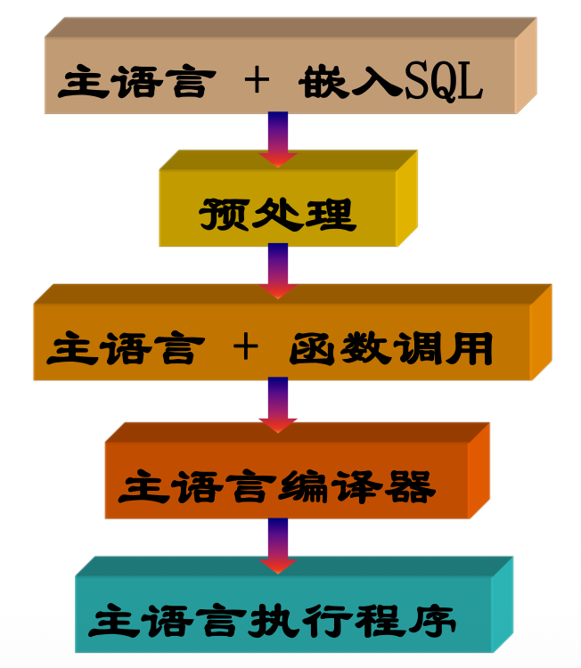

# Transact-SQL程序设计

什么是Transact-SQL?


+ Transact-SQL（又称 T-SQL），是在 Microsoft SQL Server 和 Sybase SQL Server 上的 ANSI SQL 实现，与 Oracle 的 PL/SQL 性质相近（不只是实现ANSI SQL，也为自身数据库系统的特性提供实现支持），在 Microsoft SQL Server 和 Sybase Adaptive Server 中仍然被使用为核心的查询语言。
+ T-SQL是Microsoft公司在关系型数据库管理系统SQL Server中的SQL-3标准的实现，是微软对SQL的扩展,具有SQL的主要特点，同时增加了变量、运算符、函数、流程控制和注释等语言元素，使得其功能更加强大。T-SQL对SQL Server 十分重要，SQL Server中使用图形界面能够完成的所有功能，都可以利用T-SQL来实现。使用T-SQL操作时，与SQL Server通信的所有应用程序都通过向服务器发送T-SQL语句来进行，而与应用程序的界面无关。


## Transact-SQL常用语言元素

### 1.变量
变量有两种形式：
+ 用户自定义的局部变量
局部变量必须先定义，后使用，被引用时要在其名称前加上标志“＠”。
+ 系统提供的全局变量
全局变量被引用时要在其名称前加上标志“＠＠”。

### 2.DECLARE语句

**格式**
+ 格式一：
DECLARE @变量的名称 数据类型[ ,...n]
+ 格式二：
SELECT @变量的名称=表达式[ ,...n]

**功能**
1. DECLARE语句声明局部变量，变量初始化为 NULL。
2. 格式二，在声明局部变量的同时，给变量赋值。
3. 局部变量名必须以@开头。


### 3 注释

**格式**
+ 格式一： / * 注释文本* /
+ 格式二：-- 注释文本


**功能**
多行的注释必须用 /* 和 */ 指明。用于多行注释的样式规则是，第一行用 /* 开始，接下来的注释行用 ** 开始，并且用 */ 结束注释。

-- 注释可插入到单独行中或嵌套（只限--）在命令行的末端，用-- 插入的注释由换行字符分界。注释没有最大长度限制。服务器将不运行注释文本。


### 4 函数

#### 字符函数（SUBSTRING, LTRIM, RTRIM, RIGHT, LEFT, UPPER, LOWER, REVERSE, SPACE, STUFF, CHARINDEX, LEN, ASCII, CHAR）
+ SUBSTRING 函数
  + 格式：SUBSTRING (<字符表达式>,<m>[,<n>])
  + 功能：从字符表达式中的第m个字符开始截取n个字符，形成一个新字符串，m,n都是数值表达式。
+ LTRIM函数
  + 格式：LTRIM (<字符表达式>)
  + 功能：删除字符串起始空格函数，返回varchar类型数据。

+ RTRIM函数
  + 格式：RTRIM (<字符表达式>)
  + 功能：删除字符串尾随空格函数，返回varchar类型数据。

+ RIGHT函数
  + 格式：RIGHT (<字符表达式>,<数据表达式>)
  + 功能：返回字符串中从右边开始指定个数的字符，返回varchar类型数据。

+ LEFT函数
  + 格式：LEFT (<字符表达式>,<数据表达式>)
  + 功能：返回字符串中从左边开始指定个数的字符，返回varchar类型数据。

+ UPPER函数
  + 格式：UPPER(<字符表达式>)
  + 功能：将小写字符数据转换为大写的字符表达式，返回varchar类型数据。

+ LOWER函数
  + 格式：LOWER (<字符表达式>)
  + 功能：将大写字符数据转换为小写的字符表达式，返回varchar类型数据。

+ REVERSE函数
  + 格式：REVERSE (<字符表达式>) 
  + 功能：返回字符表达式的反转。返回varchar类型数据。

+ SPACE函数
  + 格式：SPACE(<整数表达式>)
  + 功能：返回由重复的空格组成的字符串。整数表达式的值表示空格个数。返回char类型数据。


+ STUFF函数
  + 格式：STUFF(字符表达式1, m ,n , 字符表达式2 )
  + 功能：删除指定长度的字符并在指定的起始点插入另一组字符。m,n是整数，m指定删除和插入的开始位置,n指定要删除的字符数,最多删除到最后一个字符。如果m或n 是负数，则返回空字符串。如果m比字符表达式1 长，则返回空字符串。返回char类型数据。

+ CHARINDEX函数
  + 格式： CHARINDEX (表达式1 , 表达式2 [ , m ] )
  + 功能： 在表达式2的第m个字符开始查找表达式1起始字符位置。m是整数表达式，如果m是负数或缺省，则将从表达式2 的起始位置开始搜索。返回int类型数据。

+ LEN函数
  + 格式： LEN (字符表达式)
  + 功能： 返回给定字符串表达式的字符个数，不包含尾随空格。

+ ASCII函数
  + 格式： ASCII(字符表达式)
  + 功能： 返回给定字符串表达式的最左端字符的ASCII码值。返回整型值。

+ CHAR函数
  + 格式： CHAR(整数表达式)
  + 功能： 用于将ASCII码转换为字符，整数表达式的取值
  范围为0到255之间的整数，返回字符型数据值。

#### 数学函数（ABS, EXP, SQRT, ROUND, RAND）
+ ABS函数
  + 格式：ABS(数字表达式)
  + 功能： 返回给定数字表达式的绝对值。
+ EXP函数
  + 格式：EXP (数字表达式)
  + 功能： 返回给定数字表达式的指数值。参数数字表达式是 float 类型的表达式。返回类型为float。
+ SQRT函数
  + 格式：SQRT(数字表达式)
  + 功能： 返回给定数字表达式的平方根。参数数字表达式是 float 类型的表达式。返回类型为float。
+ ROUND函数
  + 格式：ROUND (数字表达式，m)
  + 功能：返回数字表达式并四舍五入为指定的长度或精度。
  + ROUND(<number>, <num_digits>)
    + 如果 num_digits 大于 0（零），则将数字舍入到指定的小数位数。
    + 如果 num_digits 为 0，则将数字舍入到最接近的整数。
    + 如果 num_digits 小于 0，则将数字向小数点左侧舍入。
+ RAND函数
  + 格式：RAND ([seed])
  + 功能：返回 0 到1 之间的随机float 值。参数seed为整型表达式。


#### 日期和时间函数（DATEADD, GETDATE, DAY, YEAR, MONTH）

+ DATEADD函数
  + 格式： DATEADD (日期参数, 数字, 日期)
  + 功能： 在向指定日期加上一段时间的基础上，返回新的 datetime 值。日期参数规定了新值的类型。参数有：
  Year、Month、Day、Week、Hour
+ GETDATE函数
  + 格式： GETDATE ()
+ DAY函数
  + 格式： DAY (日期)
  + 功能：返回代表指定日期的“日”部分的整数。返回类型为int。
+ YEAR函数
  + 格式：YEAR(日期)
  + 功能：返回表示指定日期中的年份的整数。返回类型为int。
+ MONTH函数
  + 格式：MONTH (日期)
  + 功能：返回表示指定日期中的月份的整数。返回类型为int。


#### 数据转换函数（CAST, CONVERT）

+ CAST函数
  + 格式：CAST (表达式 AS 数据类型 )
  + 功能： 将指定的表达式转换成对应的数据类型。
+ CONVERT函数
  + 格式：CONVERT (数据类型[(长度)], 表达式[,样式])
  + 功能：样式是指日期格式样式。

#### 系统函数（@@IDENTITY, DB_NAME, HOST_NAME, HOST_ID, USER_NAME）
+ 函数DB_NAME()的功能是返回数据库的名称。
+ 函数HOST_ NAME()的功能是返回服务器端计算机的名
+ 函数HOST_ID()的功能是返回服务器端计算机的ID号。
+ 函数USER_NAME()的功能是返回用户的数据库用户名。


### 5 PRINT

+ 格式
PRINT 文本字符串| @字符数据类型变量| @@返回字符串结果的函数|字符串表达式
+ 功能
将用户定义的消息返回客户端。必须是 char 或 varchar，或者能够隐式转换为这些数据类型。若要打印用户定义的错误信息（该消息中包含可由@@ERROR 返回的错误号），请使用RAISERROR 而不要使用 PRINT。


## Transact-SQL控制流语句


### BEGIN...END语句
格式
```
BEGIN
Transact-SQL 语句| 语句块
END
```
功能：

BEGIN...END 语句将多个SQL 语句组合成一组语句块，并将些语句块视为一个单元。BEGIN...END 语句块允许嵌套。


例子：
```sql
BEGIN
    DECLARE @i INT
    SET @i = 1
    WHILE @i <= 5
    BEGIN
        PRINT '当前值为：' + CAST(@i AS VARCHAR)
        SET @i = @i + 1
    END
END
```

```sql
IF @score >= 60
BEGIN
    PRINT '及格';
    PRINT '继续学习';
END
```


### IF...ELSE语句
格式
```
IF 逻辑表达式
〈SQL 语句1|语句块1〉
[ ELSE
〈SQL 语句2|语句块2〉
]
```
功能:

IF...ELSE语句是双分支条件判断语句，根据某个条件的
成立与否，来决定执行哪组语句。


```sql
IF @score >= 60
    PRINT '及格'
ELSE
    PRINT '不及格'
```


### CASE语句

格式1：简单 CASE
```
CASE Input_表达式
WHEN when
[WHEN when
[ ...n]
[ ELSE result_表达式n]
END
_
表达式1 THEN result_表达式1
_
表达式2 THEN result_表达式2]
```
格式2： 搜索CASE
```
CASE
WHEN 逻辑表达式1 THEN result_表达式1
[WHEN 逻辑表达式2 THEN result_表达式2]
[ ...n ]
[ ELSE result_表达式n]
END
```

功能说明
1. ELSE参数是可选的。
2. 简单 CASE 函数的执行过程：
计算 Input_表达式的值，按书写顺序计算每个逻辑条“Input_表达式= when_表达式”。 返回第一个使逻辑条件“Input_表达式=when_表达式”为TRUE的 result_表达式。如果所有的逻辑条件“Input_表达式= when_表达式”为FLASE，则返回ELSE 后的result_表达式n；如果没有指定 ELSE 子句，则返回 NULL 值。
3. CASE 搜索函数的执行过程：
按顺序计算每个 WHEN 子句的逻辑表达式。返回第一个使逻辑表达式为 TRUE的 result_表达式。 如果所有的逻辑表达式FLASE，则返回ELSE 后的result_表达式n；如果没有指定ELSE 子句，则返回NULL 值。

```sql
SELECT name,
       CASE
           WHEN score >= 90 THEN '优秀'
           WHEN score >= 60 THEN '及格'
           ELSE '不及格'
       END AS level
FROM SC;
```


### GOTO语句
格式
```
GOTO label - -改变执行
……
label : - -定义标签
```
功能:

GOTO语句将程序流程直接跳到指定标签处。标签定义位置可以在 GOTO 之前或之后。标签符可以为数字与字符的组合，但必须以“：”结尾。在GOTO语句之后的标签不能跟“：”。GOTO 语句和标签可在过程、批处理或语句块中的任何位置使用,但不可跳转到批处理之外的标签处。GOTO语句可嵌套使用。


```sql
IF @x < 0
    GOTO err;

PRINT '正常';

err:
PRINT '出错';
```

### WHILE… CONTINUE…BREAK语句
格式
```
WHILE 逻辑表达式
{ SQL语句|语句块 }
[ BREAK ]
{ SQL语句|语句块 }
[ CONTINUE ]……
END
```
功能:

1. 当逻辑表达式为真时，重复执行 SQL 语句或语句块，直到逻辑表达式为假。可以使用 BREAK 和 CONTINUE 语句改改变WHILE 循环的执行。
2. END 关键字为循环结束标记。BREAK语句可以完全退出本层WHILE循环，执行END后面的语句。
3. CONTINUE语句回到循环的第一行命令，忽略CONTINUE 关键字后面的任何语句，重新开始循环。


例子：
```sql
DECLARE @i INT = 1;

WHILE @i <= 5
BEGIN
    PRINT @i;
    SET @i = @i + 1;
END
```


## 用户自定义函数(CREATE FUNCTION)


### 标量函数


**格式**
```
CREATE FUNCTION [schema_name.] 函数名
([{ @形参名1[AS]数据类型1[=默认值]}[,…n]])
RETURNS 返回值的类型
[ WITH <{ ENCRYPTION | SCHEMABINDING }> [,…n]]
[AS]
BEGIN
  函数体
  RETURN 标量表达式
END
```


**标量函数的调用**

1. 在SELECT语句中调用
格式：SELECT 架构的名称.函数名（实参1,…,实参n）
说明：实参可为已赋值的局部变量或表达式。实参与形参要顺序一致。
2. 使用EXEC语句调用
格式1：EXEC 架构的名称.函数名 实参1,…,实参n
格式2：EXEC 架构的名称.函数名 形参1=实参1,…,形参
n=实参n
说明：格式1要求实参与形参顺序一致，格式2的参数顺序可与定义时的参数顺序不一致。


例子：
```sql
CREATE FUNCTION dbo.fn_add(@a INT, @b INT)
RETURNS INT
AS
BEGIN
    RETURN @a + @b;
END
```
调用：
```sql
SELECT dbo.fn_add(3, 5);
```


### 内嵌表值函数

**格式**
```
CREATE FUNCTION [schema_name.] 函数名
([{ @参数名1[AS]数据类型1[=默认值]}[,…n]])
RETURNS 表
[ WITH <{ ENCRYPTION | SCHEMABINDING }>
[,…n]]
[ AS ]
RETURN [ (内嵌表) ]
```


**标量函数的调用**


在内嵌表值函数中，返回值是一个表。内嵌函数体没有相关联的返回变量。通过SELECT语句返回内嵌表。RETURN [(内嵌表) ] 定义了单个 SELECT 语句，它是返回
值。


函数调用
```
select * from [数据库名][.拥有者](实参1,…实参n)
```
说明：
内嵌表值函数只能使用SELECT语句调用。

例查询课程“数据结构”的成绩列表。
```sql
SELECT * FROM coursegrade('数据结构')
```


例子：
```sql
CREATE FUNCTION dbo.fn_student(@dept NVARCHAR(20))
RETURNS TABLE
AS
RETURN
(
    SELECT *
    FROM Student
    WHERE Department = @dept
);
```
调用：
```sql
SELECT *
FROM dbo.fn_student('计算机');
```


## 嵌入式SQL（游标）

游标是嵌入式 SQL 中用于逐行处理查询结果集的一种机制。


**为什么要使用嵌入式SQL**
+ 有些操作对于交互式SQL是不可能的任务
SQL的表达能力相比高级语言有一定的限制，有些数据访问要求单纯使用SQL无法完成。一方面，SQL在逐渐增强自己的表达能力；另一方面，太多的扩展会导致优化能力及执行效率的降低。
+ 非声明性动作
实际的应用系统是非常复杂的，数据库访问只是其中一个部件。有些动作如与用户交互、图形化显示数据等只能用高级语言实现


**嵌入式SQL的执行过程**
+ 将SQL访问数据库的能力，与宿主语言的过程化能力进行综合
+ 将SQL嵌入到宿主语言，引入变量
+ 嵌入式SQL的实现，可以分为两种方法：
  + 扩充宿主语言的编译程序，使之能处理SQL语言；
  + 预处理方式（通常使用）；
    + 将具有前缀的语句，转换成宿主语言的函数调用语句；由宿主语言的编译器生成目标程序。



+ 存储设备上的数据库是用SQL语句存取的，数据库与宿主语言的信息传递是通过**共享变量**实现的。
+ 共享变量先由宿主语言定义，再用SQL的Declare语句声明，随后SQL语句中就可以引用这些变量
+ 共享变量是宿主语言和SQL的接口


+ SQL 2规定，SQLSTATE是一个特殊的共享变量，起着解释SQL语句执行状态的作用，它是一个有5个字符组成的字符数组的标准（ISO）返回信息码；
+ SQLSTATE(http://msdn.microsoft.com/zh-cn/library/ms714687.aspx)
  + 00000：成功
  + 非零 ：出错
  + 02000：未找到元组
+ 根据SQLSTATE的值可以控制程序的流向


### 嵌入式SQL的使用规定


**在程序中区分SQL语句和宿主语言的语句**


嵌入式SQL语句以Exec SQL开始，以分号（;）结束或者以End_Exec结束（根据具体的语言而定）。
```
Exec SQL <语句> End_Exec. (或;)
```

```sql
Exec SQL Delete From s Where sno = ‘S10’;
```

**允许嵌入式SQL语句引用宿主语言的程序变量（共享变量），但有以下规定：**

+ 宿主变量出现在SQL语句中时，前面必须加（：）以区
别数据库变量（列名）；

宿主变量可出现的地方：SQL的数据操纵语句中可出现
常数的任何地方，select 等的into子句中。
```sql
Exec SQL Select sname,age Into :stu_name,:age
From s Where sno = :stu_no;
```

+ 共享变量的用法：先由宿主语言的程序定义，并用
SQL的Declare语句声明
```sql
EXEC SQL BEGIN DECLARE SECTION
Int stu_no;
Char stu_name[30];
Int age;
EXEC SQL END DECLARE SECTION

Exec SQL Select sname,age Into :stu_name,:age
From s Where sno = :stu_no;
```


+ SQL的集合处理方式与宿主语言的单记录处理方式的协调
  + SQL：一次一集合
  + C语言（或其他宿主语言）：一次一记录
  + 采用游标：在查询结果的记录集合中移动的指针
    + 若SQL返回单个元组，不使用游标；
    + 若SQL返回多个元组，则使用游标；


### 需要使用游标的数据操作

当Select语句的结果中包含多个元组时，可以用游标逐个存取这些元组
+ 活动集：Select语句返回的元组的集合
+ 当前行：活动集中当前处理的那一行，游标即是指向当前行的指针。

游标的分类：
+ 滚动游标：游标的位置可以来回移动，可在活动集中去任意元组
+ 非滚动游标：只能在活动集中顺序的取下一个元组
+ 更新游标：数据库对游标指向的当前行加锁，当程序读下一行时，本行数据解锁，下一行加锁。


#### 定义游标(DECLARE CURSOR)

定义一个游标，使之对应一个select语句
```sql
Exec SQL DECLARE cursor_name
[ INSENSITIVE ] [ SCROLL ] CURSOR
FOR select_statement
[ FOR { READ ONLY | UPDATE [ OF
column_name[ ,...n ] ] } ]
End_Exec
```
+ cursor_name ：是所定义的名称。
+ INSENSITIVE：定义一个游标，以创建将由该游标使用
的数据的临时复本。
+ SCROLL：指定所有的提取选项（FIRST、LAST、PRIOR、NEXT、RELATIVE、ABSOLUTE）均可用。未指定 SCROLL，则 NEXT 是唯一支持的提取选项。
+ select_statement ：是定义游标结果集的标准 SELECT 语句。
+ READ ONLY：在 UPDATE 或 DELETE 语句的 WHERE
CURRENT OF 子句中不能引用游标。UPDATE [OF column_name[,...n ]]：定义游标内可更新的列。如果指定 OF column name[,...n ] 参数，则只允许修改所列出的列。如果在 UPDATE 中未指定列的列表，则可以更新所有列。


```sql
EXEC SQL DECLARE cur_student CURSOR FOR
    SELECT sno, score
    FROM SC;
```

#### 打开游标(OPEN)

打开一个游标，执行游标对应的查询，结果集合为游标的活动集
```sql
Exec SQL OPEN { { [ GLOBAL ] cursor_name} |
cursor_variable_name}
End_Exec
```

+ GLOBAL指定 cursor_name指的是全局游标。
+ cursor_name 已声明的游标的名称。如果全局游标和局部游标都使用 cursor_name作为其名称，那么如果指定了GLOBAL，
cursor_name指的是全局游标，否则 cursor_name指的是局部
游标。
+ cursor_variable_name 游标变量的名称，该名称引用一个游标。


```sql
EXEC SQL OPEN cur_student;
```
执行 SELECT,把结果放入游标,指针指向“第一行之前”

#### 游标的推进/取出语句（FETCH）

在活动集中将游标推进到特定的行，并取出该行数据放到相应的宿主变量中

```sql
Exec SQL FETCH
[ [ NEXT | PRIOR | FIRST | LAST
| ABSOLUTE { n | @nvar}
| RELATIVE { n | @nvar}
]
FROM
]
{ { [ GLOBAL ] cursor_name} |
@cursor_variable_name}
[ INTO @variable_name[ ,...n ] ]
End_Exec
```

+ NEXT 返回紧跟当前行之后的结果行，并且当前行递增为结果行。
+ PRIOR返回紧临当前行前面的结果行，并且当前行递减为结果行。
+ FIRST 返回游标中的第一行并将其作为当前行。
+ LAST 返回游标中的最后一行并将其作为当前行。
+ ABSOLUTE {n | @nvar }如果 n或 @nvar为正数，返回从游标头开始的第 n行并将返回的行变成新的当前行。如果 n或 @nvar为负数，返回游标尾之前的第 n行并将返回的行变成新的当前行。
+ RELATIVE {n | @nvar }如果 n或 @nvar为正数，返回当前行之后的第n行并将返回的行变成新的当前行。
+ cursor_name 要从中进行提取的开放游标的名称。@cursor_variable_name 游标变量名，引用要进行提取操作的打开的游标。
+ INTO @variable_name [,...n ]允许将提取操作的列数据放到局部变量中。


```sql
EXEC SQL FETCH cur_student
    INTO :sno, :score;
```


#### 游标的关闭语句（CLOSE）

关闭游标，释放活动集及其所占的资源，使它不再和查询结果相联系。需要在执行游标时，在执行open语句。
```sql
Exec SQL CLOSE { { [ GLOBAL ] cursor_name} |
cursor_variable_name}
End_Exec
```

```sql
EXEC SQL CLOSE cur_student;
```


#### 销毁游标（FREE/DESTROY/DEALLOCATE）
```sql
Free cursor_name 或者Destroy cursor_name 或
者 Deallocatecursor_name
```
注：@@fetch_status是SQLServer的一个全局变量，其值由数据库管理系统管理，值的改变是通过fetch next from触发的记录值有三种，分别为：
+ 0 FETCH 数据提取成功
+ -1 FETCH 没取到数据，游标中的数据已经取完
+ -2 被提取的行不存在，进程被杀、意外中断

判断是否结束
```sql
WHILE (SQLCODE == 0)
{
    // 处理当前行
    EXEC SQL FETCH cur_student INTO :sno, :score;
}
```
SQLCODE是用于判断是否成功，以及是否到结果集末尾。


### 使用游标的例子


非滚动游标只能按顺序向前读取；滚动游标可以在结果集中前后移动、随机读取。

#### 非滚动游标（Non-scrollable Cursor）
只能“从头到尾，一行一行往前读”的游标，只能用一种方式取出数据：FETCH NEXT

```sql
DECLARE cur_non_scrollable CURSOR FOR
    SELECT sno, score
    FROM SC;    
OPEN cur_non_scrollable;
FETCH NEXT FROM cur_non_scrollable INTO :sno, :score;
```


#### 滚动游标（Scrollable Cursor）
滚动游标是可以在结果集中前后移动、定位到任意行的游标。

滚动游标支持多种 FETCH 方式：
```
FETCH NEXT      -- 下一行
FETCH PRIOR     -- 上一行
FETCH FIRST     -- 第一行
FETCH LAST      -- 最后一行
FETCH ABSOLUTE n  -- 第 n 行
FETCH RELATIVE n  -- 相对当前行
```


例子
```sql
DECLARE cur2 CURSOR SCROLL
FOR
SELECT sno, score FROM SC;

OPEN cur2;

FETCH FIRST FROM cur2 INTO @sno, @score;
FETCH NEXT  FROM cur2 INTO @sno, @score;
FETCH PRIOR FROM cur2 INTO @sno, @score;
```


### 不需要使用游标的数据操作（insert、delete、update、select）

1. 如果是insert、delete、update，加上前缀Exec SQL和End_Exec可以嵌入在宿主语言中使用；
2. 对于select语句，如果查询结果为单元组的可以直接嵌入在宿主语言中使用。

+ Insert语句
```sql
Exec SQL Insert Into s(no,name,age,sex)
Values(:stu_no,:stu_name,:stu_age,:stu_sex);
```
+ Delete语句
```sql
Exec SQL delete from s where age>:stu_age;
```
+ Update语句
```sql
Exec SQL update sc
Set grade = grade+:raise
Where C# in(select C# from c where cname =
‘Mathes’);
```
+ 结果是一个元组的select语句，SELECT 语句如果保证最多只返回一行，可以不用游标。
```sql
Exec SQL select sname,age
into :stu_name,:stu_age
From s where sno = ‘s10’;
```

## 存储过程(Store Procedure)

存储过程（Stored Procedure）是预先编译并存储在数据库中的一组 SQL 语句，用于完成特定功能，可通过名称反复调用。

+ 存储过程是为了完成特定的功能而汇集成一组的SQL语句集，它是 SQL 语句和可选控制流语句的预编译集合，以一个名称存储并作为一个单元处理
+ 被命名，经编译后存储在DBMS中
+ 用户可以指定存储过程的名字并给出参数来执行它
+ 允许多个（有权）用户访问相同的代码
+ 提供一种集中且一致的实现数据完整性逻辑的一种方法
  + 是C/S（B/S）结构的重要组成部分
  + 主要用于：
    + 频繁使用的查询
    + 业务规则
    + 被其它过程使用的公共例行程序
  + 具有以下优点：
    + 可以在单个存储过程中执行一系列 SQL 语句
    + 可以从自己的存储过程内引用其它存储过程，这可以简化一系列复杂语句
    + 存储过程在创建时即在服务器上进行编译，所以执行起来比单个 SQL 语句块
  + 可以分为：系统存储过程(SP_)、用户定义的存储过程


### 创建存储过程（CREATE PROCEDURE）
```sql
CREATE PROC [ EDURE ] procedure_name[ ; number ]
[ { @parameter data_type}
[ VARYING ] [ = default ] [ OUTPUT ]
] [ ,...n ]
[ WITH
{ RECOMPILE | ENCRYPTION} ]
[ FOR REPLICATION ]
AS sql_statement[ ...n ]
```
参数说明
+ procedure_name ：新存储过程的名称。
+ ;number ： 是可选的整数，用来对同名的存储过程分组，使用一个 DROP PROCEDURE 语句可将这些分组过程一起删除。
+ @parameter ：过程中的参数。data_type ：参数的数据类型。
+ RECOMPILE:强制在每次执行此过程时都对该过程进行编译。
+ AS：指定过程要执行的操作。
+ sql_statement ：过程中要包含的任意数目和类型的Transact-SQL 语句。但有一些限制。


例子：

```sql
CREATE PROCEDURE dbo.GetStudent
    @sno CHAR(10)
AS
BEGIN
    SELECT *
    FROM Student
    WHERE sno = @sno;
END;
```
带输出参数的存储过程
```sql
CREATE PROCEDURE dbo.CountStudent
    @count INT OUTPUT
AS
BEGIN
    SELECT @count = COUNT(*)
    FROM Student;
END;
```
```sql
DECLARE @num INT;
EXEC dbo.CountStudent @num OUTPUT;
PRINT @num;
```


阅读系统存储过程的代码
1. sp_helpdb
2. sp_addtype


不带参数的存储过程
1. 查询C4的平均成绩的存储过程
2. 查询所有学生信息的存储过程


带参数的存储过程
1. 系统登陆验证的存储过程
2. 向学生表插入记录的存储过程
3. 创建带默认值的存储过程
4. 带表值参数的存储过程


执行存储过程
```
Exec <procedure_name> < 参数 >
```

### 查看存储过程

### 修改存储过程

### 删除存储过程


## 触发器概述(Triggers)

在上面，我们介绍了一般意义的存储过程，即用户自定义的存储过程和系统存储过程。接下来将介绍**一种特殊的存储过程**，即**触发器(trigger)**。

触发器主要是通过事件进行触发而被执行的，而存储过程可以通过存储过程名字而被直接调用。

当对某一表进行诸如UPDATE、INSERT、DELETE 这些操作时，SQL Server 就会自动执行触发器所定义的SQL 语句。从而确保对数据的处理必须符合由这些SQL 语句所定义的规则。

+ 触发器的主要作用
  + 能够实现由主键和外键所不能保证的复杂的参照完整性和数据的一致性。
  + 除此之外，触发器还有其它许多不同的功能。


**触发器 vs 存储过程**
+ 存储过程是一组 Transact-SQL 语句，在一次编译后可
以执行多次；
+ CREATE PROCEDURE 或 CREATE TRIGGER 语句不能跨越批处理。即存储过程或触发器始终只能在一个批处理中创建并编译到一个执行计划中 ；
+ 触发器是一种特殊类型的存储过程，不由用户直接调用;存储过程可以由用户直接调用（两种情况）。


**触发器vs约束**
+ 触发器可以支持约束的所有功能；
+ CHECK 约束只能根据逻辑表达式或同一表中的另一列来验证列值。如果应用程序要求根据另一个表中的列验证列值，则必须使用触发器。
+ 约束只能通过标准的系统错误信息传递错误信息。如果应用程序要求使用（或能从中获益）自定义信息和较为复杂的错误处理，则必须使用触发器。
+ 除非 REFERENCES 子句定义了级联引用操作，否则FOREIGN KEY 约束只能以与另一列中的值完全匹配的值来验证列值。


**触发器优点**

+ 触发器可通过数据库中的相关表实现级联更改；
+ 触发器可以强制比用 CHECK 约束定义的约束更为复杂的约束，与 CHECK 约束不同，触发器可以引用其它表中的列 。
+ 触发器也可以评估数据修改前后的表状态，并根据其差异采取对策。
+ 一个表中的多个同类触发器（INSERT、UPDATE 或DELETE）允许采取多个不同的对策以响应同一个修改语句。


**应注意的问题**

+ 触发器在操作发生之后执行，约束在操作前起作用；
+ 约束优先于触发器检查；
  + 如果触发器表上有约束，约束在触发器执行前先检查；
  + 如果操作与约束有冲突，触发器就不执行；
+ 表可以用于任意操作的多个触发器；
+ 表的所有者必须有执行在触发器定义中的语句的全部许可；
+ 触发器不应返回结果集；


### 如何创建触发器
1. **展开服务器组**：展开服务器组，然后展开目标服务器。
2. **定位数据库和表**：
   - 展开"数据库"文件夹
   - 展开包含触发器的目标数据库
   - 单击"表"文件夹
3. **打开触发器管理**：
   - 在详细信息窗格中右击目标表
   - 指向"所有任务"菜单
   - 单击"管理触发器"命令
4. **创建新触发器**：
   - 在"名称"框中单击<新建>
   - 在"文本"框中输入触发器代码（使用CTRL+TAB进行缩进）
5. **语法检查**：单击"检查语法"命令验证代码


```sql
CREATE TRIGGER trigger_name 
ON { table | view } 
[ WITH ENCRYPTION ] 
{
  { { FOR | AFTER | INSTEAD OF } 
    { [ INSERT ] [ , ] [ UPDATE ] [ , ] [ DELETE ] }
    [ WITH APPEND ]
    [ NOT FOR REPLICATION ]
    AS
    [ { IF UPDATE ( column )
        [ { AND | OR } UPDATE ( column ) ]
        [ ...n ]
      | IF ( COLUMNS_UPDATED ( ) { bitwise_operator } updated_bitmask )
        { comparison_operator } column_bitmask [ ...n ]
      } ] 
    sql_statement [ ...n ] 
  }
}
```
**关键参数说明**

| 参数 | 描述 |
|------|------|
| `trigger_name` | 触发器名称，必须唯一且符合标识符规则 |
| `table|view` | 触发器绑定的表或视图 |
| `WITH ENCRYPTION` | 加密存储触发器定义 |
| `AFTER` | 触发SQL语句成功执行后触发 |
| `INSTEAD OF` | 替代原SQL语句执行 |
| `[INSERT][UPDATE][DELETE]` | 指定触发激活的操作类型 |
| `IF UPDATE(column)` | 检测指定列是否被INSERT/UPDATE |
| `COLUMNS_UPDATED()` | 返回被更新列的位掩码 |

**创建限制**
- 必须是批处理中的第一条语句
- 只能应用到一个表
- 不支持所有CREATE/DROP语句
- 不支持ALTER TABLE/DATABASE语句

#### 示例代码
**示例A：显示提醒消息**
```sql
USE pubs
GO
CREATE TRIGGER reminder ON titles
FOR INSERT, UPDATE
AS
RAISERROR (50009, 16, 10)  -- 显示用户定义消息
GO
```

**示例B：发送电子邮件**
```sql
USE pubs
GO
CREATE TRIGGER reminder ON titles
FOR INSERT, UPDATE, DELETE
AS
EXEC master..xp_sendmail 
    'MaryM', 
    'Don''t forget to print a report for the distributors.'
GO
```

### 如何修改触发器
1. 按创建触发器的步骤（1-3）定位到目标表
2. 右击表 → "所有任务" → "管理触发器"
3. 在"名称"框中选择现有触发器
4. 修改"文本"框中的代码（使用CTRL+TAB缩进）
5. 单击"检查语法"验证


```sql
ALTER TRIGGER trigger_name 
ON ( table | view ) 
[ WITH ENCRYPTION ] 
{
  { ( FOR | AFTER | INSTEAD OF ) 
    { [ DELETE ] [ , ] [ INSERT ] [ , ] [ UPDATE ] } 
    [ NOT FOR REPLICATION ]
    AS
    sql_statement [ ...n ]
  }
  | 
  { ( FOR | AFTER | INSTEAD OF ) { [ INSERT ] [ , ] [ UPDATE ] }
    [ NOT FOR REPLICATION ]
    AS
    { IF UPDATE ( column )
        [ { AND | OR } UPDATE ( column ) ]
        [ ...n ]
      | IF ( COLUMNS_UPDATED ( ) { bitwise_operator } updated_bitmask )
        { comparison_operator } column_bitmask [ ...n ]
    } 
    sql_statement [ ...n ] 
  }
}
```

#### 示例：修改触发器作用范围
```sql
USE pubs
GO
-- 原触发器对INSERT和UPDATE有效
CREATE TRIGGER royalty_reminder 
ON roysched WITH ENCRYPTION FOR INSERT, UPDATE
AS
RAISERROR (50009, 16, 10)

-- 修改为仅对INSERT有效
ALTER TRIGGER royalty_reminder ON roysched
FOR INSERT
AS
RAISERROR (50009, 16, 10)
GO
```

### 如何删除触发器
1. 按创建触发器的步骤（1-3）定位到目标表
2. 右击表 → "所有任务" → "管理触发器"
3. 选择要删除的触发器名称
4. 单击"删除"按钮并确认


```sql
DROP TRIGGER { trigger } [ ,...n ]
```

#### 示例代码
```sql
USE pubs
GO
IF EXISTS (
    SELECT name FROM sysobjects 
    WHERE name = 'employee_insupd' AND type = 'TR'
)
DROP TRIGGER employee_insupd
GO
```

### 触发器工作原理

**核心机制：inserted和deleted表**
| 表类型 | 用途 | 适用操作 |
|--------|------|----------|
| `deleted` | 存储DELETE/UPDATE操作的旧数据副本 | DELETE, UPDATE |
| `inserted` | 存储INSERT/UPDATE操作的新数据副本 | INSERT, UPDATE |

**触发类型工作流程**
1. **INSERT触发器**
   - 新数据同时写入原表和inserted表
   - 检验Inserted表中的数据，确定该触发器的操作是否该执行、如何执行；

2. **DELETE触发器**
   - 触发器表的数据被删除；
   - 被删除的记录放在Deleted表中，检验Deleted表中的数据，确定该触发器的操作是否该执行、如何执行

3. **UPDATE触发器**
   - 删除触发器表中的一条记录，放在Deleted表中；
   - 新增触发器表中的一条记录，同时增加到Inserted表中；
   - 检验Inserted 、Deleted表中的数据，确定该触发器的操作是否该执行、如何执行；

### 触发器类型扩展
- **DML触发器**：响应数据操作(INSERT/UPDATE/DELETE)
- **DDL触发器**：响应数据定义操作(CREATE/ALTER/DROP)
- **LOGON触发器**：响应用户登录事件(LOGON)


