# 数据库恢复技术

## 事务(Transaction)


### 事务的概念
事务是作为单个逻辑工作单元执行的一系列操作。这些操作要么都做，要么都不做，是一个**不可分割的工作单位**。

SQL中事务的定义
+ 以begin transaction开始
+ 以commit work（或 rollback work）结束

注：commit work表示提交，事务正常结束rollback work表示事务非正常结束，撤消事务已做的操作，回滚到事务开始时状态


示例，以下是模拟银行一次转账的事务伪代码银行转帐：事务T从A帐户过户￥50到B帐户
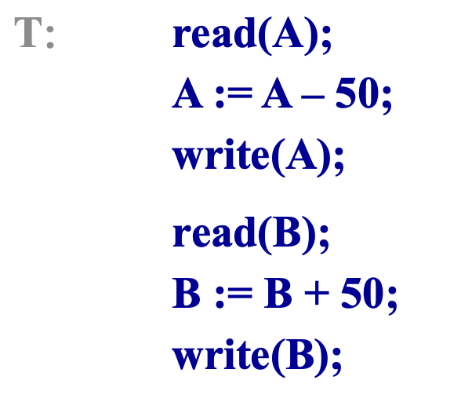

+ read(X) ：从数据库传送数据项X到事务的工作区中
+ write(X)：从事务的工作区中将数据项X写回数据库


### 事务的状态
+ 活动状态：事务开始运行就进入活动状态，直到部分提交或失败；
+ 部分提交状态：事务执行完最后一条语句，进入部分提交状态；
+ 失败状态：事务不能正常进行下去，进入失败状态；
+ 异常结束状态：当失败事务对数据库和其他事务的影响被撤销，数据库恢复到该事务开始执行前的状态以后，该事务退出数据库系统，进入异常结束状态；
+ 提交状态：当事务成功地完成所有操作，并且所有操作对数据库的影响都永久的存入数据库之后，该事务退出数据库系统，进入提交状态。

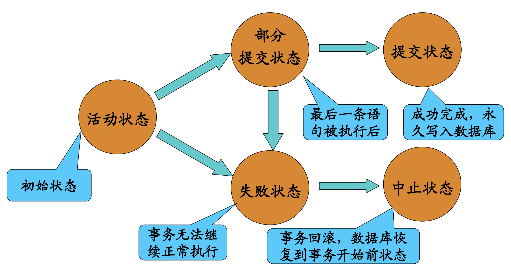

### 事务的性质

+ **原子性（Atomicity）**
一个事务是一个不可分割的工作单位，事务在执行时，应该遵守“要么不做，要么全做”（nothing or all）的原则，即不允许事务部分的完成。
+ **一致性（Consistency）**
事务开始前，数据库处于一致性的状态；事务结束后，数据库必须仍处于一致性状态；
+ **隔离性（Isolation）**
系统必须保证事务不受其它并发执行事务的影响，对任何一对事务T1，T2，在T1看来，T2要么在T1开始之前已经结束，要么在T1完成之后再开始执行；
+ **持久性（ Durability ）**
一个事务一旦提交，它对数据库中数据的改变就应该是持久的，即使数据库因故障而受到破坏，DBMS也应该能够恢复。


### 事务的调度
+ 事务的执行顺序称为一个调度，表示事务的指令在系统中执行的时间顺序。
+ 一组事务的调度必须保证
  + 包含了所有事务的操作指令；
  + 一个事务中指令的顺序必须保持不变；
+ 串行调度
  + 在串行调度中，属于同一事务的指令紧挨在一起；
  + 对于有n个事务的事务组，可以有n！个有效调度；
+ 并行调度
  + 在并行调度中，来自不同事务的指令可以交叉执行；
  + 当并行调度等价于某个串行调度时，则称它是正确；


**并行 vs 串行**
+ 基本比较
    + 并行事务会破坏数据库的一致性
    + 串行事务效率低
+ 并行的优点
    + 一个事务由不同的步骤组成，所涉及的系统资源也不同。这些步骤可以并发执行，以提高系统的吞吐量；
    + 系统中存在着周期不等的各种事务，串行会导致难于预测的时延。如果各个事务所涉及的是数据库的不同部分，采用并行会减少平均响应时间；
+ 核心问题
    + 在保证一致性的前提下最大限度地提高并发度


事务执行示例
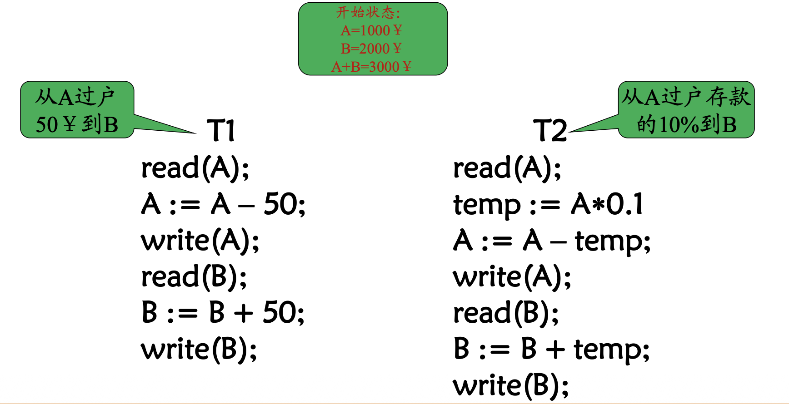

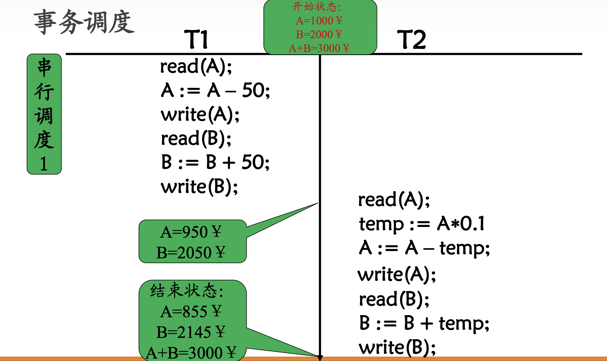

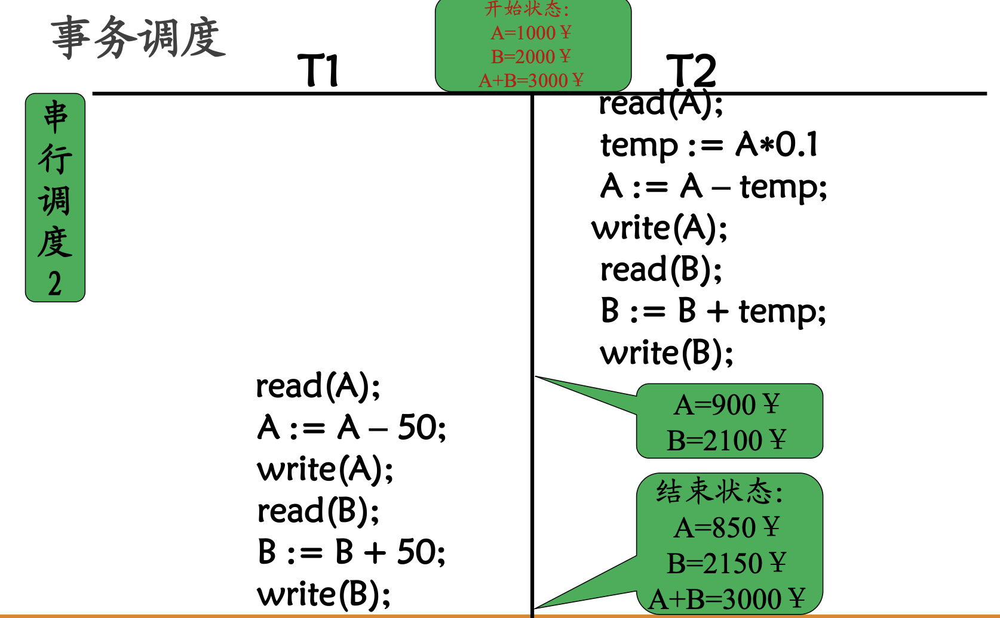

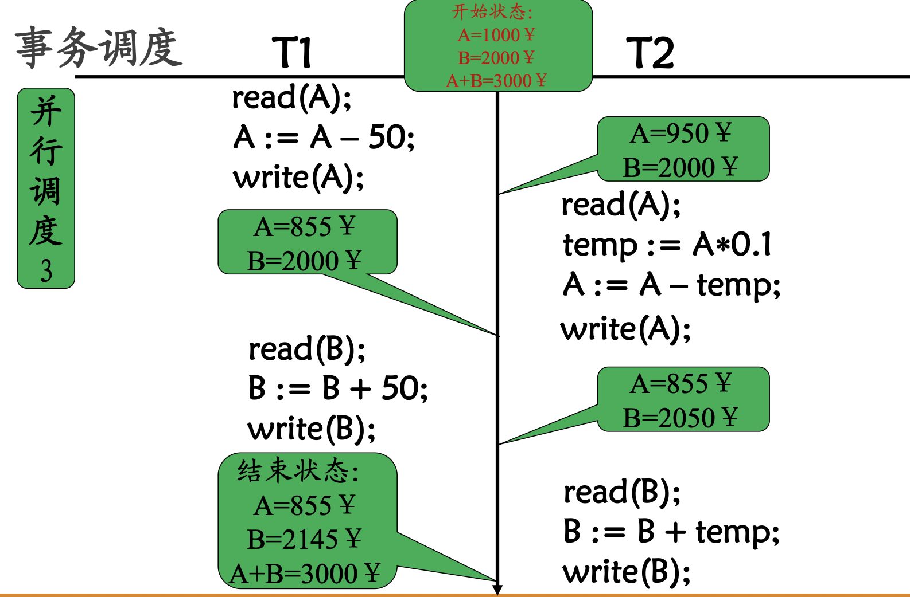


## 并发控制

数据库的最大特点之一就是数据资源是共享
+ 串行执行意味着一个用户在运行程序时，其他用户程序必须等到这个用户程序结束才能对数据库进行存取。
+ 为了充分利用数据库资源，很多时候数据库用户都是对数据库系统并行存取数据，这样就会发生多个用户并发存取同一数据的情况。
+ 如果对并发操作不加控制可能会产生不正确的数据，破坏数据的完整性，并发控制就是解决这类问题，以保持数据库中数据的一致性，即在任何一个时刻数据库都将以相同的形式给用户提供数据。


### 并发产生的问题
多个用户同时访问一个数据库，当它们的事务同时使用相同的数据时可能会发生问题。

并发可能发生问题包括：
+ 数据一致性问题（事务异常）
  + 丢失或覆盖更新
  + 未确认的相关性（脏读）
  + 不一致的分析（非重复读）
  + 幻像读
+ 性能与资源问题（如阻塞、死锁）


#### 丢失更新
当两个或多个事务选择同一行，然后基于最初选定的值更新该行时，会发生丢失更新问题。每个事务都不知道其它事务的存在。最后的更新将重写由其它事务所做的更新，这将导致数据丢失。


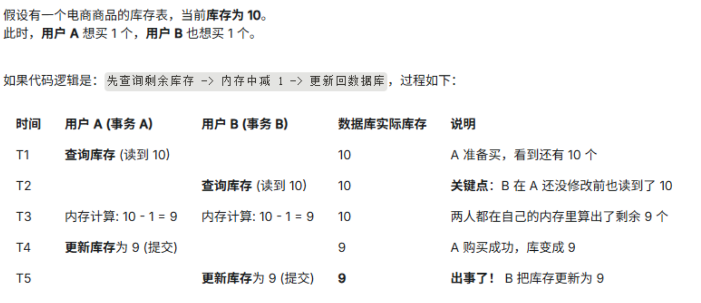


#### 未确认的相关性（脏读）

当第二个事务选择其它事务正在更新的行时，会发生未确认的相关性问题。第二个事务正在读取的数据还没有确认并且可能由更新此行的事务所更改。


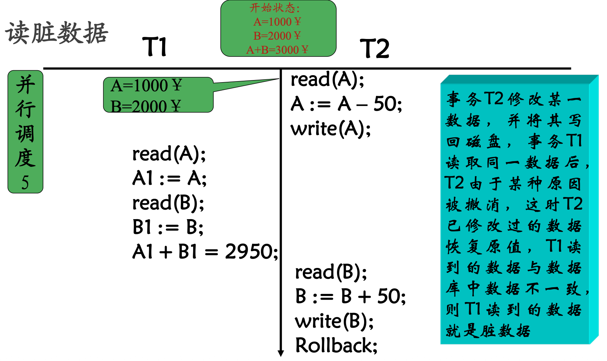


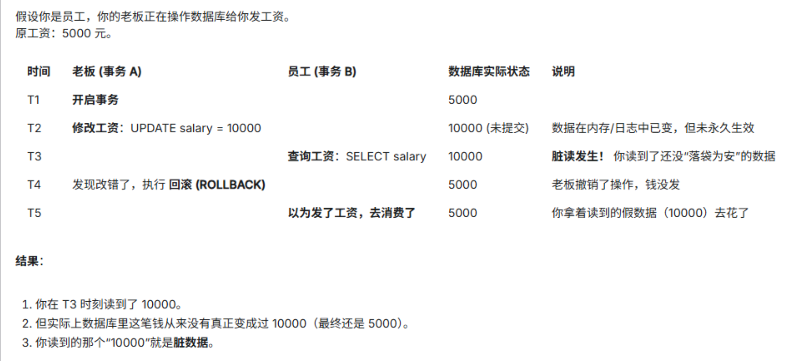


#### 不一致的分析（不可重复读）


当第二个事务多次访问同一行而且每次读取不同的数据时，会发生不一致的分析问题。

+ 不一致的分析与未确认的相关性类似，因为其它事务也是正在更改第二个事务正在读取的数据。
+ 在不一致的分析中，第二个事务读取的数据是由已进行了
更改的事务提交的。而且，不一致的分析涉及多次（两次或更多）读取同一行，而且每次信息都由其它事务更改；因而该行被补课重复读取。

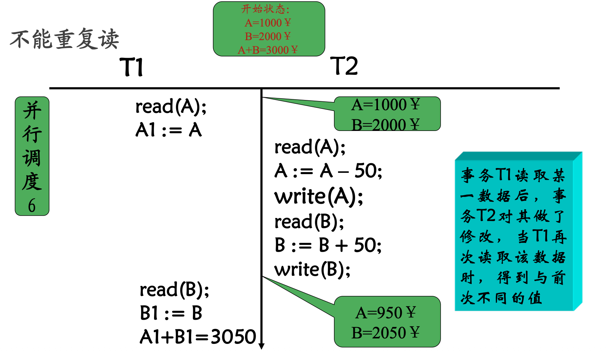

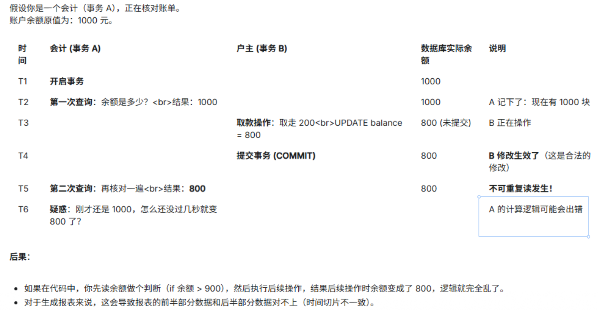


#### 幻像读
+ 当对某行执行插入或删除操作，而该行属于某个事务正在读取的行的范围时，会发生幻像读问题。事务第一次读的行范围显示出其中一行已不复存在于第二次读或后续读中，因为该行已被其它事务删除。
+ 同样，由于其它事务的插入操作，事务的第二次或后续读显示有一行已不存在于原始读中。

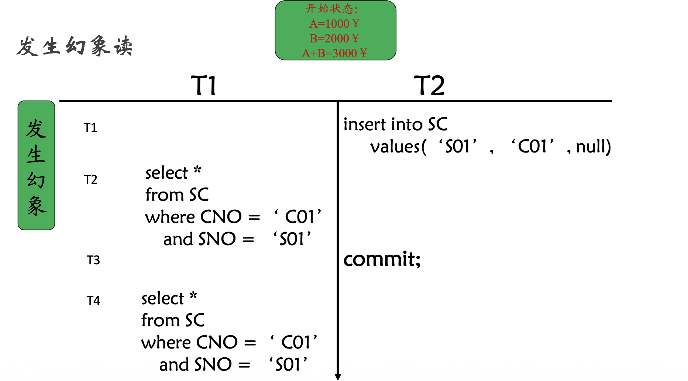

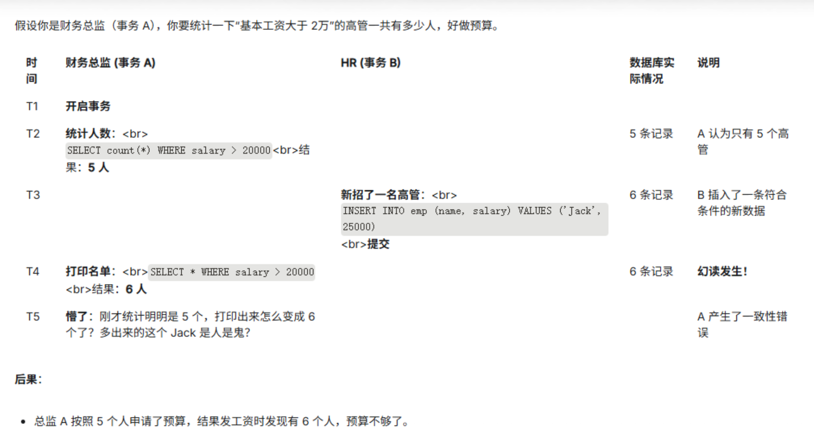


#### 不可重复读 vs 幻读
+ 不可重复读：同一行数据被修改，前后两次读到的值不同。
+ 幻读：前后两次查询，读到的“行数或记录集合”发生变化。


**不可重复读**
假设表 Account(id, balance)：
```
id   balance
1    1000
```
T1：
```sql
SELECT balance FROM Account WHERE id=1; -- 读到 1000
```
T2：
```sql
UPDATE Account SET balance=2000 WHERE id=1; -- 修改为 2000
COMMIT;
```
T1： 
```sql
SELECT balance FROM Account WHERE id=1; -- 读到 2000
``` 
同一行 id=1，被别人改了值,前后两次读到的值不同，称为不可重复读。


**幻读**
假设表 Account(id, balance)：
```
id   balance
1    1000
2    1500
```
T1：
```sql
SELECT * FROM Account WHERE balance > 1200; -- 读到 1 行 (id=2)
```
T2：
```sql
INSERT INTO Account VALUES(3, 2000); -- 插入一行
COMMIT;
```
T1：
```sql
SELECT * FROM Account WHERE balance > 1200; -- 读到 2 行 (id=2, id=3)
```
前后两次查询，读到的“行数或记录集合”发生变化，称为幻读。


```
不可重复读：老东西变了
幻读：新东西冒出来了
```


### 并发控制-封锁

并发存在的这些问题，有没有办法解决呢？
+ 实现并发控制的方法主要有两种：**封锁（Lock）技术和时标（Timestamping）技术** 。这里只介绍封锁技术。
+ 所谓封锁就是当一个事务在对某个数据对象（可以是数据项、记录、数据集、以至整个数据库）进行操作之前，必须获得相应的锁，以保证数据操作的正确性和一致性。
+ 封锁类型（Lock Type）
封锁是目前DBMS普遍采用的并发控制方法，基本的封锁类型有两种：**排它锁**和**共享锁**。


#### 排它锁（Exclusive Lock）与共享锁

+ 排它锁（Exclusive Lock）
  + 排它锁又称写锁，简称为X锁，其采用的原理是禁止并发操作。
  + 当事务T对某个数据对象R实现X封锁后，其他事务要等T解除X封锁以后，才能对R进行封锁。这就保证了其他事务在T释放R上的锁之前，不能再对R进行操作。

+ 共享锁（Share Lock）
  + 共享锁又称读锁，简称为S锁，其采用的原理是允许其他用户对同一数据对象进行查询，但不能对该数据对象进行修改。
  + 当事务T对某个数据对象R实现S封锁后，其他事务只能对R加S锁，而不能加X锁，直到T释放R上的S锁。
  + 这就保证了其他事务在T释放R上的S锁之前，只能读取R，而不能再对R作任何修改。


#### 封锁协议（Lock Protocol）


+ 封锁可以保证合理的进行并发控制，保证数据的一致性。实际上，锁是一个控制块，其中包括被加锁记录的标识符及持有锁的事务的标识符等。
+ 在封锁时，要考虑一定的封锁规则，例如，何时开始封锁、封锁多长时间、何时释放等,这些封锁规则称为封锁协议。对封锁方式规定不同的规则，就形成了各种不同的封锁协议。
+ 封锁协议在不同程序上对正确控制并发操作提供了一定的保证。
+ 上面讲述过的并发操作所带来的丢失更新、脏读和不可重读等数据不一致性问题，可以通过三级封锁协议在不同程度上给予解决，下面介绍三级封锁协议。


##### 一级封锁协议：“我写的时候你别碰，但你可以读我没提交的数据”

一级封锁协议的内容是：事务T在修改数据对象之前必须对其加X锁，直到事务结束。

+ 具体地说，就是任何企图更新记录R的事务必须先执行“XLOCK R”操作，以获得对该记录进行寻址的能力并对它取得X封锁。
+ 如果未获准“X 封锁”，那么这个事务进入等待状态，一直到获准“X封锁”，该事务才继续做下去。
+ 该事务规定事务在更新记录R时必须获得排它性封锁，使得两个同时要求更新R的并行事务之一必须在一个事务更新操作执行完成之后才能获得X封锁，这样就避免了两个事务读到同一个R值而先后更新时所发生的丢失更新问题。

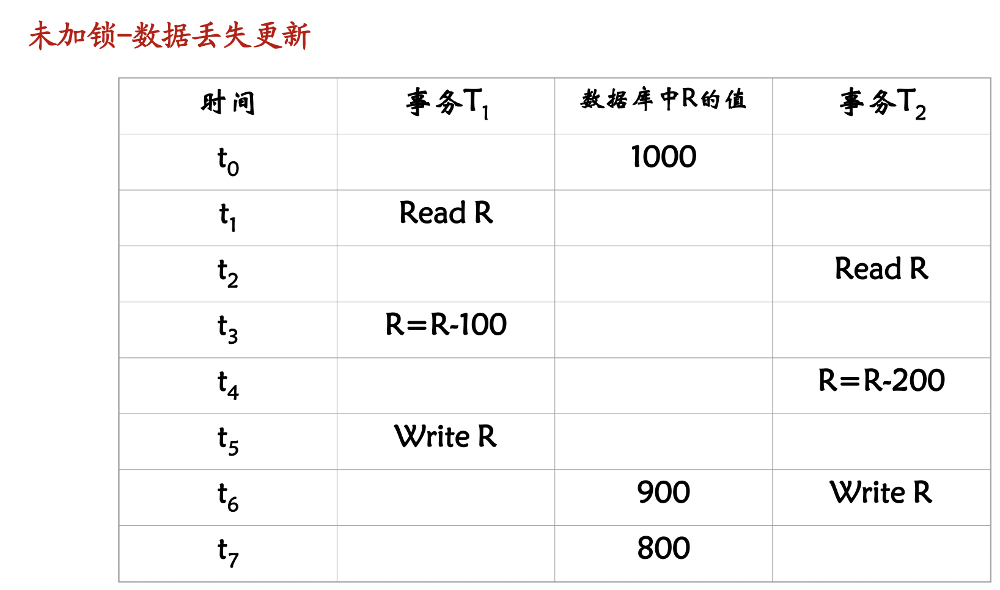

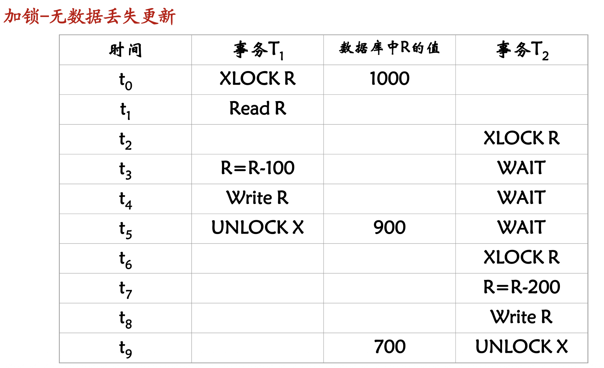

一级封锁协议只有当修改数据时才进行加锁，如果只是读取数据并不加锁，所以**它不能防止“脏读”和“不可重读”数据**的问题。


##### 二级封锁协议：“我写的东西，提交前你别看；我读完就放手。”

+ 二级封锁协议的内容是：在一级封锁协议的基础上，另外加上事务T在读取数据R之前必须先对其加S锁，读完后释放S锁。
+ 所以二级封锁协议不但可以解决更新时所发生的数据丢失问题，还可以进一步防止“脏读”。

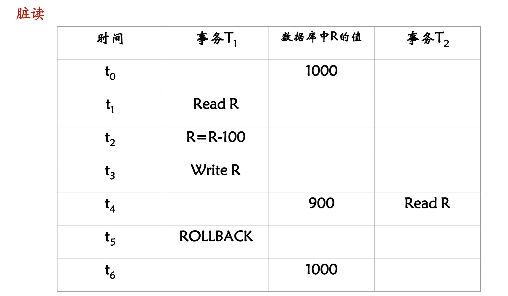


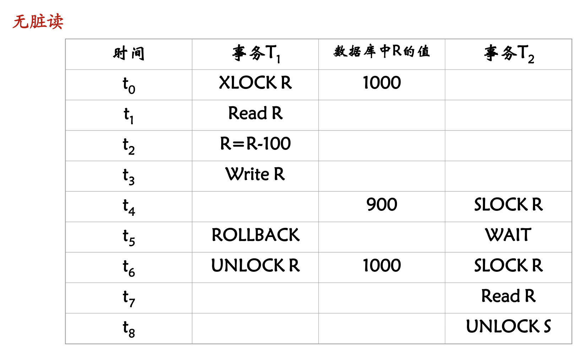

二级封锁协议在读取数据之后，立即释放S锁，所以它仍然不能防止“不可重读”数据。


##### 三级封锁协议：“我读的东西，别人动不了”


+ 三级封锁协议的内容是：在一级封锁协议的基础上，另外加上事务T在读取数据R之前必须先对其加S锁，读完后并不释放S锁，而直到事务T结束才释放，所以在这个事务中，如果重复读，一直都是读到一样的数据。
+ 所以三级封锁协议除了可以防止更新丢失问题和“脏读”数据外，还可进一步防止不可重读数据，彻底解决了并发操作所带来的三个不一致性问题。


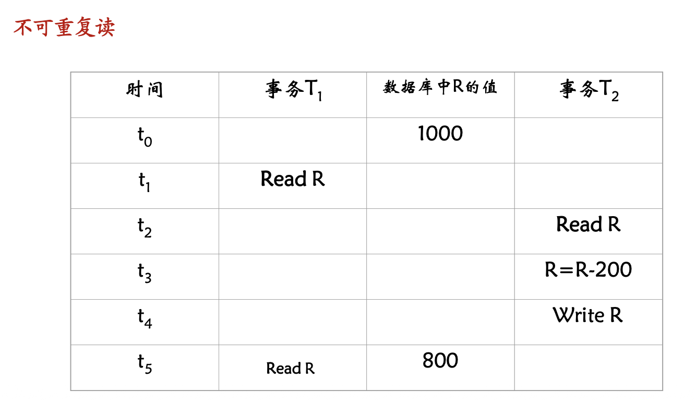

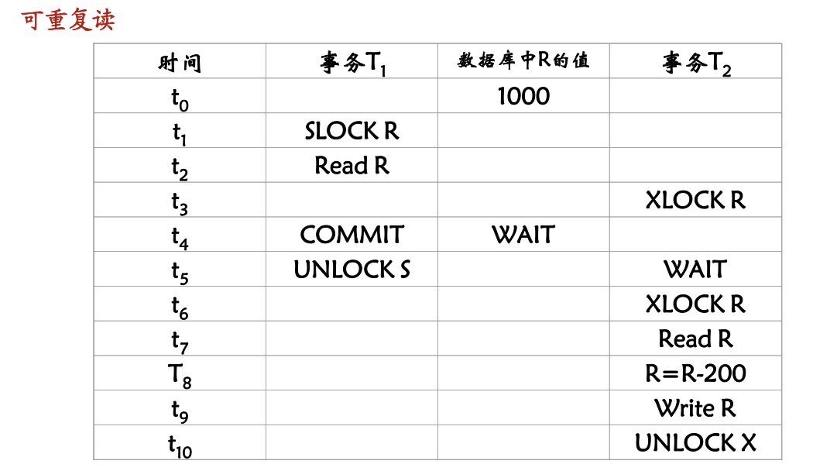


##### 为什么三级封锁解决不了幻读

三级封锁：我读的东西，别人动不了，但是你可以往里面加东西啊！

三级封锁会给 已经存在的行加 S 锁，当插入新行时，并不会影响已经存在的行的 S 锁状态，所以无法阻止幻读的发生。也就是三级封锁协议只对已读取的数据项加共享锁，不能阻止其他事务插入满足查询条件的新记录，因此无法避免幻读。


#### 封锁粒度（Lock Granularity）

封锁粒度指封锁的单位。
+ 根据对数据的不同处理，封锁的对象可以是这样一些逻辑单元：**字段、记录、表、数据库**等。
+ 封锁粒度与系统的并发度和并发控制的开销密切相关。
+ 封锁粒度越小，系统中能够被封锁的对象就越多，并发度越高，但封锁机构复杂，系统开销也就越大。相反，封锁粒度越大，系统中能够被封锁的对象就越少，并发度越小，封锁机构简单，相应系统开销也就越小。
+ 在实际应用中，选择封锁粒度时应同时考虑封锁机构和并发度两个因素，对系统开销与并发度进行权衡，以求得最优的效果。
+ 由于同时封锁一个记录的概率很小，一般数据库系统都在记录级上进行封锁，以获得更高的并发度。


#### 死锁和活锁

封锁技术可有效解决并行操作的一致性问题，但也产生新的问题，即**活锁和死锁**问题。


##### 活锁（Livelock）
+ 当某个事务请求对某一数据的排它性封锁时，由于其他事务对该数据的操作而使这个事务处于永久等待状态，这种状态称为活锁。
+ 例如，事务T1在对数据R封锁后，事务T2又请求封锁R，于是T2等待。T3也请求封锁R。当T1释放了R上的封锁后首先批准了T3的请求，T2继续等待。然后又有又T4请求封锁R，T3释放了R上的封锁后又批准了T4的请求……T2可能永远处于等待状态，从
而发生了活锁。如下表所示：

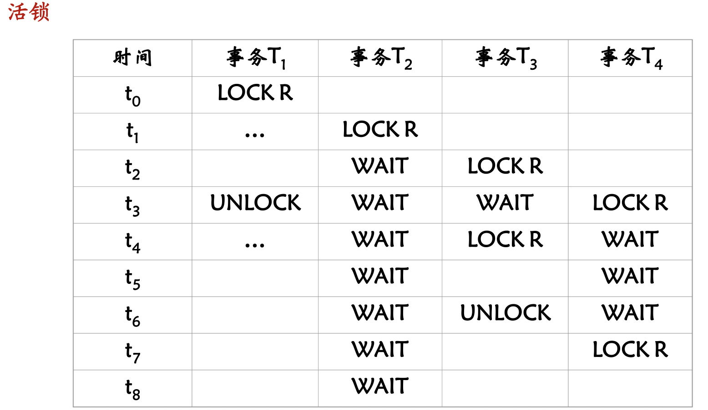

避免活锁的简单方法是**采用先来先服务**的策略，按照请求封锁的次序对事务排队，一旦记录上的锁释放，就使申请队列中的第一个事务获得锁。有关活锁的问题我们不再详细讨论，因为死锁的问题较为常见，这里主要讨论有关死锁的问题。


##### 死锁（Deadlock）
+ 在同时处于等待状态的两个或多个事务中，其中的每一个在它能够进行之前，都等待着某个数据、而这个数据已被它们中的某个事务所封锁，这种状态称为死锁。
+ 例如，事务T1在对数据R1封锁后，又要求对数据R2封锁，而事务T2已获得对数据R2的封锁，又要求对数据R1封锁，这样两个事务由于都不能得到封锁而处于等待状态，发生了死锁。如下表所示：

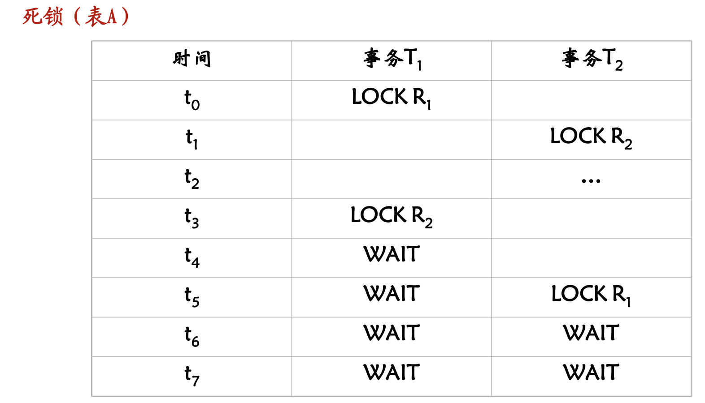


###### 死锁产生的条件
发生死锁的必要条件有以下四条：
1. 互斥条件：一个数据对象一次只能被一个事务所使用，即对数据的封锁采用排它式；
2. 不可抢占条件：一个数据对象只能被占有它的事务所释放，而不能被别的事务强行抢占。
3. 部分分配条件：一个事务已经封锁分给它的数据对象，但仍然要求封锁其他数据；
4. 循环等待条件：允许等待其他事务释放数据对象，系统处于加锁请求相互等待的状态。


###### 死锁的预防

死锁一旦发生，系统效率将会大大下降，因而要尽量避免死锁的发生。在操作系统的多个程序运行中，由于多个进程的并行执行需要分别占用不同资源时，也会发生死锁。**要想预防死锁的产生，就得破坏形成死锁的条件。**

同操作系统预防死锁的方法类似，在数据库环境下，常用的方法有以下两种：
+ 一次加锁法
+ 顺序加锁法


**一次加锁法**

一次加锁法是每个事务必须将所有要使用的数据对象全部依次加锁，并要求加锁成功，只要一个加锁不成功，表示本次加锁失败，则应该立即释放所有已加锁成功的数据对象，然后重新开始从头加锁。

一次加锁法的程序框图如下图所示：
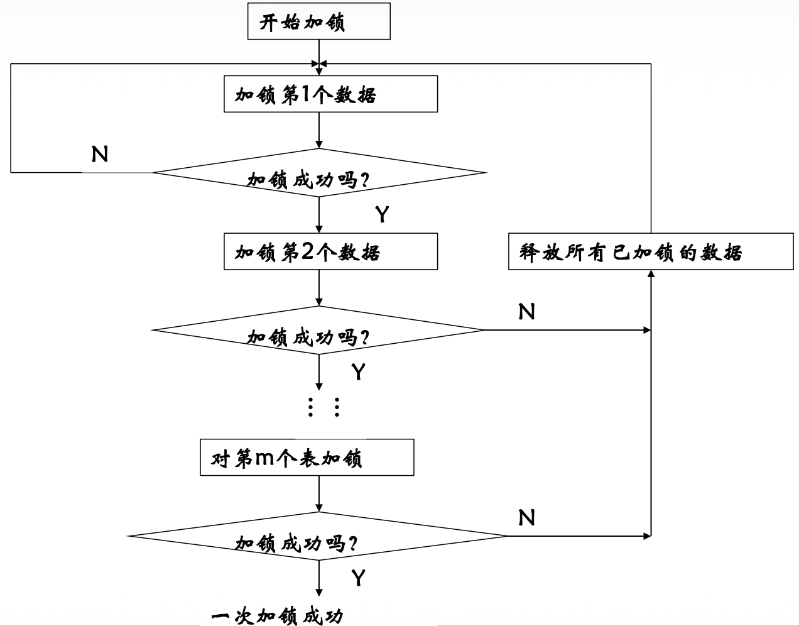

如表A发生死锁的例子，可以通过一次加锁法加以预防。
+ 事务T1启动后，立即对数据R1和R2依次加锁，加锁成功后，执行T1，而事务T2等待。
+ 直到T1执行完后释放R1和R2上的锁，T2继续执行。这样就不会发生死锁。


**一次加锁法虽然可以有效地预防死锁的发生，但也存在一些问题。**

+ 首先，对某一事务所要使用的全部数据一次性加锁，扩大了封锁的范围，从而降低了系统的并发度。
+ 其次，数据库中的数据是不断变化的，原来不要求封锁的数据，在执行过程中可能会变成封锁对象，所以很难事先精确地确定每个事务所要封锁的数据对象，这样只能在开始扩大封锁范围，将可能要封锁的数据全部加锁，这就进一步降低了并发度，影响了系统的运行效率。


**顺序加锁法**

顺序加锁法是预先对所有可加锁的数据对象规定一个加锁顺序，每个事务都需要按此顺序加锁，在释放时，按逆序进行。

例如对于表A发生的死锁，我们可以**规定封锁顺序为R1、R2，事务T1和T2都需要按此顺序加锁**。T1先封锁R1，再封锁R2。当T2再请求封锁R1时，因为T1已经对R1加锁，T2只能等待。待T1释放R1后，T2再封锁R1，则不会发生死锁。


**顺序加锁法同一次加锁法一样，也存在一些问题。**

因为事务的封锁请求可以随着事务的执行而动态地决定，所以很难事先确定封锁对象，从而更难确定封锁顺序。即使确定了封锁顺序，随着数据操作的不断变化，维护这些数据的封锁顺序要需要很大的系统开销。


**总结**

在数据库系统中，由于可加锁的目标集合不但很大，而且是动态变化的；
+ 可加锁的目标常常不是按名寻址，而是按内容寻址，预防死锁常要付出很高的代价，因而上述两种在操作系统中广泛使用的预防死锁的方法并不很适合数据库的特点。
+ 一般情况下，在数据库系统中，可以允许发生死锁，在死锁发生后可以自动诊断并解除死锁。


###### 死锁的诊断与解除

数据库系统中诊断死锁的方法与操作系统类似。可以利用**事务信赖图**的形式来测试系统中是否存在死锁。

例如在下图中，事务T1需要数据R，但R已经被事务T2封锁，那么从T1到T2划一个箭头。如果在事务依赖图中沿着箭头方向存在一个循环，那么死锁的条件就形成了，系统就会出现死锁。

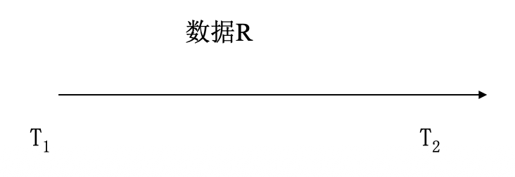


+ 如果已经发现死锁，DBA从依赖相同资源的事务中抽出某个事务作为牺牲品，将它撤销，解除它的所有封锁，释放此事务占用的所有数据资源，分配给其他事务，使其他事务得以继续运行下去，这样就有可能消除死锁。
+ 在解除死锁的过程中，抽取牺牲事务的标准是根据系统状态及其应用的实际情况来确定的，通常采用的方法之一是选择一个处理死锁代价最小的事务，将其撤销。
+ 不重要的用户，取消其操作，释放封锁的数据，恢复对数据库所作的改变。


###### 问题

+ 在SQL Server 数据库管理系统中如何查询死锁？
+ 如果发生死锁会有什么影响？
+ SQL Server如何解决死锁问题的？


## 数据库故障及恢复

虽然数据库系统中已采取一定的措施，来防止数据库的安全性和完整性的破坏，保证并发事务的正确执行，但数据库中的数据仍然无法保证绝对不遭受破坏，比如计算机系统中硬件的故障、软件的错误，操作员的失误，恶意的破坏等都有可能发生，这些故障的发生影响数据库数据的正确性，甚至可能破坏数据库，使数据库中的数据全部或部分丢失。而数据正确性、安全性是后续分析和决策的基础。


因此，系统必须具有检测故障并把数据从错误状态中恢复到某一正确状态的功能，这就是后面讨论的数据库恢复技术。


### 故障分类

+ 事务故障：是指事务没有达到预期的终点，使数据库可能处于不正确状态；如运算溢出、并发事务死锁、违反了某些完整性约束等；
+ 系统故障：是指造成系统停止运行的任何事物，使得系统重新启动；如硬件故障、操作系统故障、DBMS代码错误、突然停电等；
+ 介质故障：又称硬件故障，指外存故障，如磁盘损坏、磁头碰撞、瞬时强磁场干扰等；
+ 病毒破坏：计算机病毒是一种人为的故障或破坏，它像生物学锁称的病毒一样可以繁殖和传播，并造成计算机系统，包括数据库系统损坏。


### 备份和恢复


#### 数据库恢复的原理及其实现技术

数据库恢复的基本原理十分简单，就是**数据的冗余**。数据库中任何一部分被破坏的或不正确的数据都可以利用存储在系统其他地方的冗余数据来修复。

因此恢复系统应该提供两种类型的功能：
+ 一种是生成冗余数据，即对可能发生的故障作某些准备；
+ 另一种是冗余重建，即利用这些冗余数据恢复数据。


生成冗余数据最常用的技术是**登记日志文件和数据转储**，在实际应用中，这两种方法常常结合起来一起使用。


##### 登记日志文件（Logging）

日志文件是用来记录事务对数据库的更新操作的文件。对数据库的每次修改，**都将被修改项目的旧值和新值写在一个叫做运行日志的文件中**，目的是为数据库的恢复保留详细的数据。

典型的日志文件主要包含以下内容：
1. 更新数据库的事务标识（标明是哪个事务）；
2. 操作的类型（插入、删除或修改）；
3. 操作对象；
4. 更新前数据的旧值（对于插入操作而言，没有旧值）；
5. 更新后数据的新值（对于删除操作而言，没有新值）
6. 事务处理中的各个关键时刻（事务的开始、结束及其真正回写的时间等）


日志文件是系统运行的记载，必须高度可靠；所以一般都是双副本的，并且独立写在两个不同类型的设备上；日志信息量很大，一般保存在海量存储器上；在对数据库修改时，在运行日志中要写入一个表示这个修改的运行记录；为了防止这两个操作之间发生故障后，运行日志中没有记录这个修改，以后也无法撤销这个修改。为保证数据库的可恢复性，登记日志文件 **必须遵守两条原则**：
1. 严格按并发事务执行的时间顺序来进行登记；
2. 必须先写日志文件，后写数据库；


##### 数据转储（备份）

数据转储是指定期地将整个数据库复制到多个存储设备，如磁带、磁盘上保存起来的过程，它是数据库恢复中采用的基本手段。

+ 转储的数据文本称为后备副本或后援副本，当数据库遭到破坏后就可利用后援副本把数据库有效地加以恢复。
+ 转储是十分耗费时间和资源的，不能频繁地进行，应该根据数据库使用情况确定一个适当的转储周期。
+ 按照转储方式转储可以分为**海量转储（完全备份）**和增**量转储（差异备份）**。
  + 海量转储（备份）是指每次转储全部数据库。
  + 增量转储（备份）每次只转储上次海量转储后被更新过的数据。


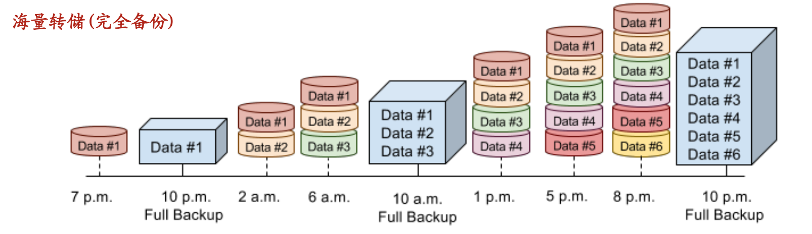

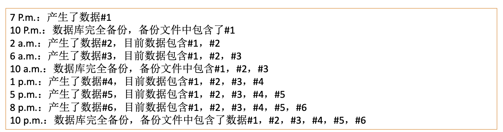

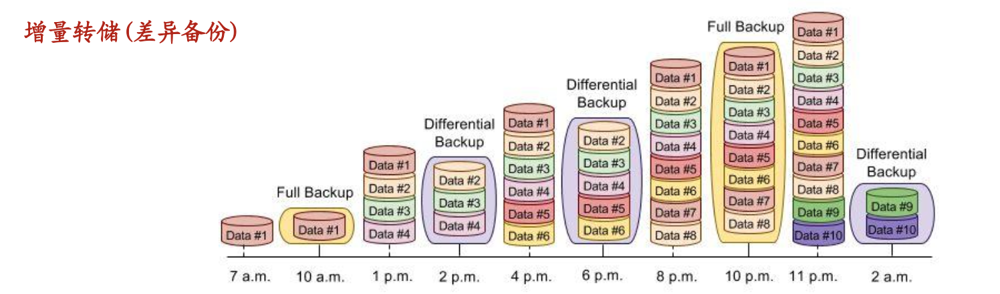

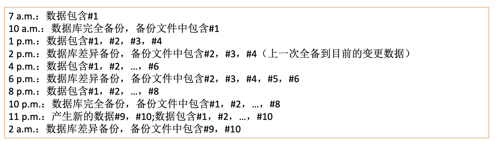


按照转储状态转储又可分为静态转储和动态转储。
+ 静态转储期间不允许有任何数据存取活动，因而需在当前用户事务结束之后进行，新用户事务又需在转储结束之后才能进行，这就降低了数据库的可用性。
+ 动态转储则不同，它允许转储期间继续运行用户事务，但产生的副本并不能保证与当前状态一致。解决的办法是把转储期间各事务对数据库的修改活动登记下来，建立日志文件。


#### 在SQL server上实现海量备份和增量备份


我们分两种实现方式来讨论
+ 在SQL Server Management Studio操作实现
+ 用T-SQL程序实现


##### SQL Server Management Studio操作实现


###### 备份数据库
1）选择要备份的数据库
2）右键->选择任务->备份


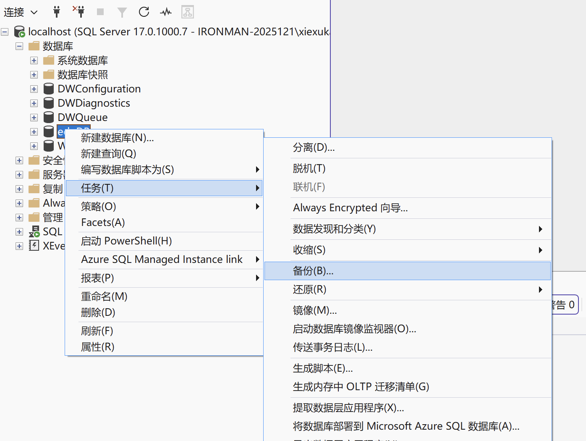


1）选择要备份的数据库
2）右键选择任务->备份
3）打开备份界面，选择备份类型、备份目
标等参数，完成备份

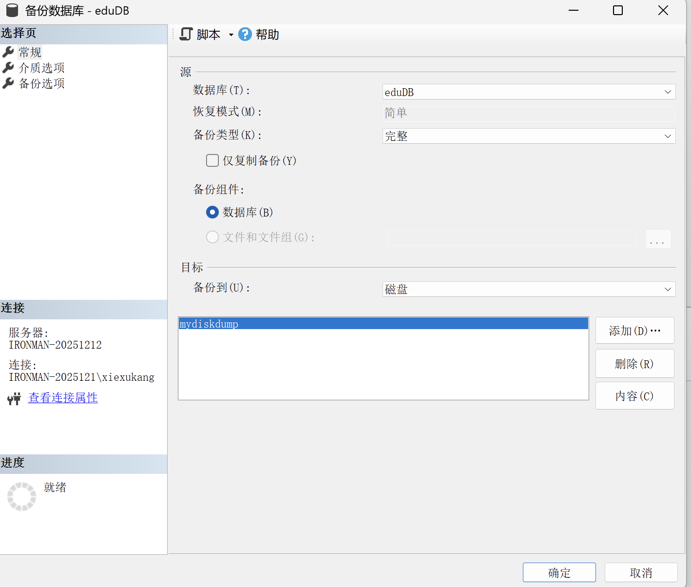


###### 备份到逻辑设备

1）选择服务器对象->备份设备
2）右键新建设备
3）根据需求设置设备参数


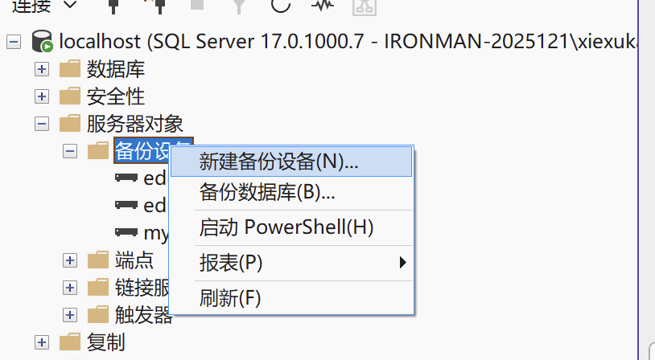


##### T-SQL程序实现


###### 备份数据库

**完全备份**
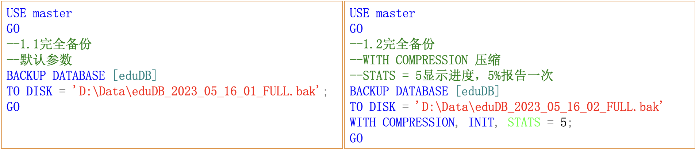

**差异备份**
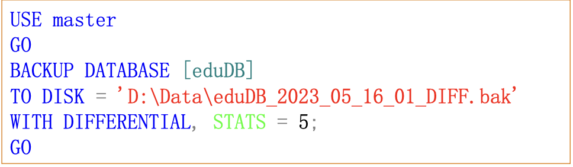


###### 备份到逻辑设备

1）新建备份设备
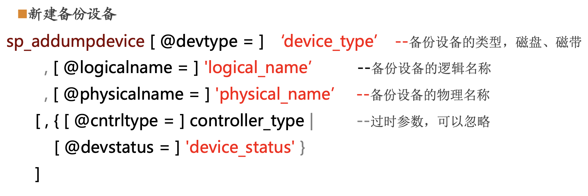

2）备份到数据
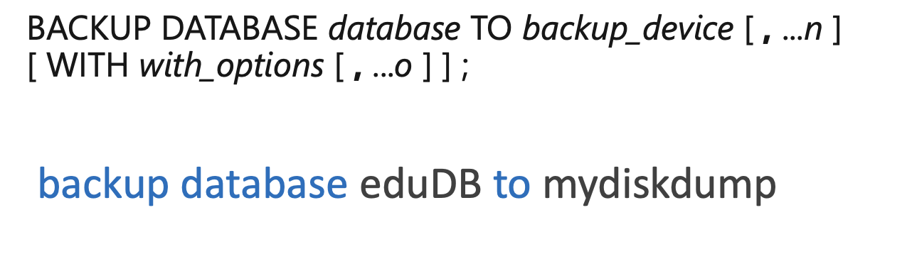


#### 数据库恢复的策略

数据库系统在运行中发生故障后，有些事务尚未完成就被迫中断，这些未完成事务对数据库所做的修改有一部分已写入物理数据库。

+ 这时数据库就处于一种不正确的状态，或者说是不一致的状态，这时可利用日志文件和数据库转储的后备副本将数据库恢复到故障前的某个一致性状态。
+ 数据库运行过程中可能会出现各种各样的故障，这些故障可分为以下三类：
  + 事务故障
  + 系统故障
  + 介质故障
+ 根据故障类型的不同，应该采取不同的恢复策略。


#####  事务故障（Transaction Failure）及其恢复

事务故障表示由非预期的、不正常的程序结束所造成的故障。

+ 造成程序非正常结束的原因包括输**入数据错误、运算溢出、违反存储保护、并行事务发生死锁**等。
+ 发生事务故障时，被迫中断的事务可能已对数据库进行了修改，为了消除该事务对数据库的影响，要利用日志文件中所记载的信息，强行回滚（ROLLBACK）该事务，将数据库恢复到修改前的初始状态。
+ 为此，要检查日志文件中由这些事务所引起的发生变化的记录，取消这些没有完成的事务所做的一切改变。


这类恢复操作称为**事务撤消（UNDO）**，具体做法如下：
1. 反向扫描日志文件，查找该事务的更新操作。
2. 对该事务的更新操作执行反操作，即对已经插入的新记录进行删除操作，对已删除的记录进行插入操作，对修改的数据恢复旧值，用旧值代替新值。这样由后向前逐个扫描该事务己做所有更新操作，并做同样处理，直到扫描到此事务的开始标记，事务故障恢复完毕。


因此，**一个事务是一个工作单位，也是一个恢复单位。** 一个事务越短，越便于对它进行UNDO操作。如果一个应用程序运行时间较长，则应该把该应用程序分成多个事务，用明确的COMMIT语句结束各个事务。

##### 系统故障（System Failure）及其恢复

系统故障是指系统在运行过程中，由于某种原因，造成系统停止运转，致使所有正在运行的事务都以非正常方式终止，要求系统重新启动。

+ 引起系统故障的原因可能有：**硬件错误（如CPU故障）、操作系统或DBMS代码错误、突然断电**等。
+ 这时，内存中数据库缓冲区的内容全部丢失，存储在外部存储设备上的数据库并未破坏，但内容不可靠了。


系统故障发生后，对数据库的影响有两种情况：
+ 一种情况是一些未完成事务对数据库的更新已写入数据库，这样在系统重新启动后，要强行撤消（UNDO）所有未完成事务，清除这些事务对数据库所做的修改。这些未完成事务在日志文件中只有BEGIN TRANSCATION标记，而无COMMIT标记。
+ 另一种情况是有些己提交的事务对数据库的更新结果还保留在缓冲区中，尚未写到磁盘上的物理数据库中，这也使数据库处于不一致状态，因此应将这些事务己提交的结果重新写入数据库。这类恢复操作称为事务的重做（REDO）。这种己提交事务在日志文件中既有BEGIN TRANSCATION标记，也有COMMIT标记。

因此，系统故障的恢复要完成两方面的工作，既要撤消所有未完成的事务，还需要重做所有己提交的事务，这样才能将数据库真正恢复到一致的状态。具体做法如下：
1. 正向扫描日志文件，查找尚未提交的事务，将其事务标识记入撤消队列。同时查找已经提交的事务，将其事务标识记入重做队列。
2. 对撤消队列中的各个事务进行撤消处理。方法同事务故障中所介绍的撤消方法相同。
3. 对重做队列中的各个事务进行重做处理。进行重做处理的方法是：正向扫描日志文件，按照日志文件中所登记的操作内容，重新执行操作，使数据库恢复到最近某个可用状态。


**但是！** 系统发生故障后，由于无法确定哪些未完成的事务己更新过数据库，哪些事务的提交结果尚未写入数据库，这样系统重新启动后，就要撤消所有的未完成事务，重做所有的已经提交的事务。

+ 在故障发生前已经运行完毕的事务有些是正常结束的，有些是异常结束的。所以无需把它们全部撤消或重做。
+ 通常采用设立**检查点（Checkpoint）** 的方法来判断事务是否正常结束。每隔一段时间，比如说5分钟，系统就产生一个检查点，做下面一些事情：
1. 把仍保留在日志缓冲区中的内容写到日志文件中；
2. 在日志文件中写一个“检查点记录”；
3. 把数据库缓冲区中的内容写到数据库中，即把更新的内容写到物理数据库中；
4. 把日志文件中检查点记录的地址写到“重新启动文件”中。


每个检查点记录包含的信息有：**在检查点时间的所有活动事务一览表，每个事务最近日志记录的地址**。

在重新启动时，恢复管理程序先从“重新启动文件”中获得检查点记录的地址，从日志文件中找到该检查点记录的内容，通过日志往回找，就能决定哪些事务需要撤消，恢复到初始的状态，哪些事务需要重做。


##### 介质故障（Media Failure）及其恢复

介质故障是指系统在运行过程中，由于辅助存储器介质受到破坏，使存储在外存中的数据部分丢失或全部丢失。

+ 这类故障比事务故障和系统故障发生的可能性要小，但这是最严重的一种故障，破坏性很大，磁盘上的物理数据和日志文件可能被破坏，这需要装入发生介质故障前最新的后备数据库副本，然后利用日志文件重做该副本后所运行的所有事务。
+ 具体方法如下：
1. 装入最新的数据库副本，使数据库恢复到最近一次转储时的可用状态。
2. 装入最新的日志文件副本，根据日志文件中的内容重做已完成的事务。
3. 首先正向扫描日志文件，找出发生故障前已提交的事务，将其记入重做队例。
4. 再对重做队列中的各个事务进行重做处理，方法是：正向扫描日志文件，对每个重做事务重新执行登记的操作，即将日志文件中数据己更新后的值写入数据库。


##### 总结  
通过以上对三类故障的分析，我们可以看出故障发生后对数据库的影响有两种可能性：


1. 数据库没有被破坏，但**数据可能处于不一致状态**。这是由事务故障和系统故障引起的，这种情况在恢复时，不需要重装数据库副本，直接根据日志文件，撤销故障发生时未完成的事务，并重做己完成的事务，使数据库恢复到正确的状态。这类故障的恢复是系统在重新启动时自动完成的，不需要用户干预。
2. **数据库本身被破坏。** 这是由介质故障引起的，这种情况在恢复时，把最近一次转储的数据装入，然后借助于日志文件，再在此基础上对数据库进行更新，从而重建了数据库。这类故障的恢复不能自动完成，需要DBA的介入，先由DBA重装最近转储的数据库副本和相应的日志文件的副本，再执行系统提供的恢复命令，具体的恢复操作由DBMS来完成。


> DBA（Database Administrator）是负责数据库系统管理、维护和优化的专业人员。


#### 数据库恢复的具体实现

##### 在SQL Server Management Studio操作实现
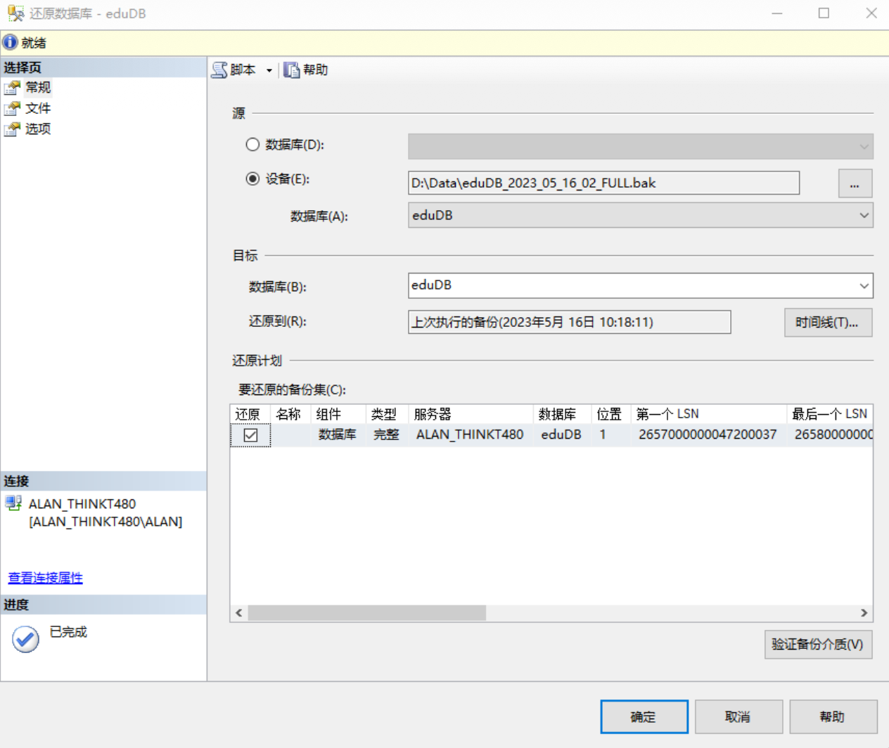


##### 用T-SQL程序实现

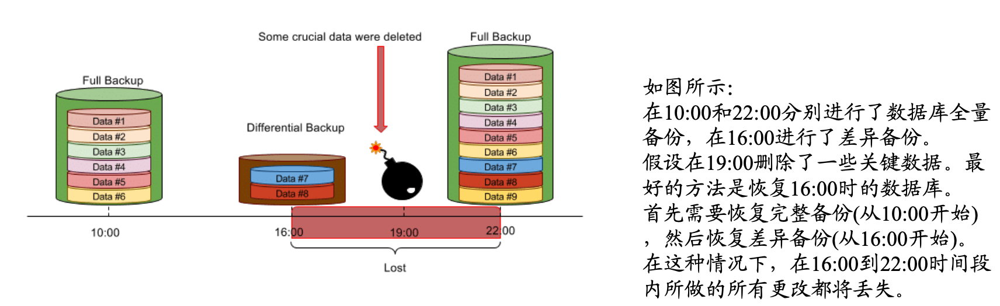


```sql
RESTORE DATABASE { database_name | @database_name_var } [ FROM
<backup_device> [ ,...n ] ] [ WITH { [ RECOVERY | NORECOVERY | STANDBY =
{standby_file_name | @standby_file_name_var } ] | , <general_WITH_options>
[ ,...n ] | , <replication_WITH_option> | , <change_data_capture_WITH_option>
| , <FILESTREAM_WITH_option> | , <service_broker_WITH options> | ,
\<point_in_time_WITH_options-RESTORE_DATABASE> } [ ,...n ] ] [;]
```


```sql
RESTORE DATABASE your_databaseFROM
DISK = 'full_10_00.bak' WITH NORECOVERY
RESTORE DATABASE your_databaseFROM
DISK = 'diff_16_00.bak' WITH RECOVERY
```


注：NORECOVERY 指定不发生回滚。RECOVERY（默认值）表示，应在完成当前备份前滚之后执行回滚。

```sql
RESTORE DATABASE your_databaseFROM
mydiskdump WITH NORECOVERY
RESTORE DATABASE your_databaseFROM
mydiskdump WITH RECOVERY
```


注：NORECOVERY 指定不发生回滚。RECOVERY（默认值）表示，应在完成当前备份前滚之后执行回滚。


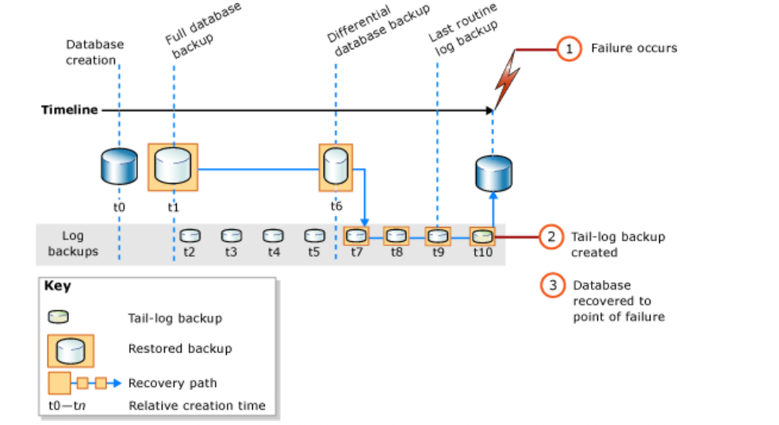


