# 数据库系统设计

## 关系数据库系统的设计思路

### DBS设计内容
+ 结构特性设计
  + 通常指数据库模式或者数据库结构设计；
  + 应该具有最小的冗余，能满足不同用户数据需求，能实现数据共享；
  + 静态的，一旦形成轻易不能再变动结构设计又称为**静态模型设计**；
  + 又要考虑用户需求的更新多变，设计时要考虑可扩充性，可修改性；
+ 行为特性设计
+ 通常指应用程序，事务处理的设计；
+ 用户通过应用程序访问和操作数据库，用户的行为和数据库结构紧密相关；
+ 用户的行为总是使数据库的内容发生变化，所以行为设计是动态的，行为设计又称为**动态模型设计**；


### DBS设计的特点
+ “三分技术，七分管理，十二分基础数据”
  + 硬件、软件和管理相结合
  + 结构设计和行为设计相结合
+ 是一项综合性技术


### DBS设计的过程
+ 按照软件工程要求的规范化设计方法，一般将数据库系统设计分为7个阶段。
+ 以教学管理系统为例简要说明。


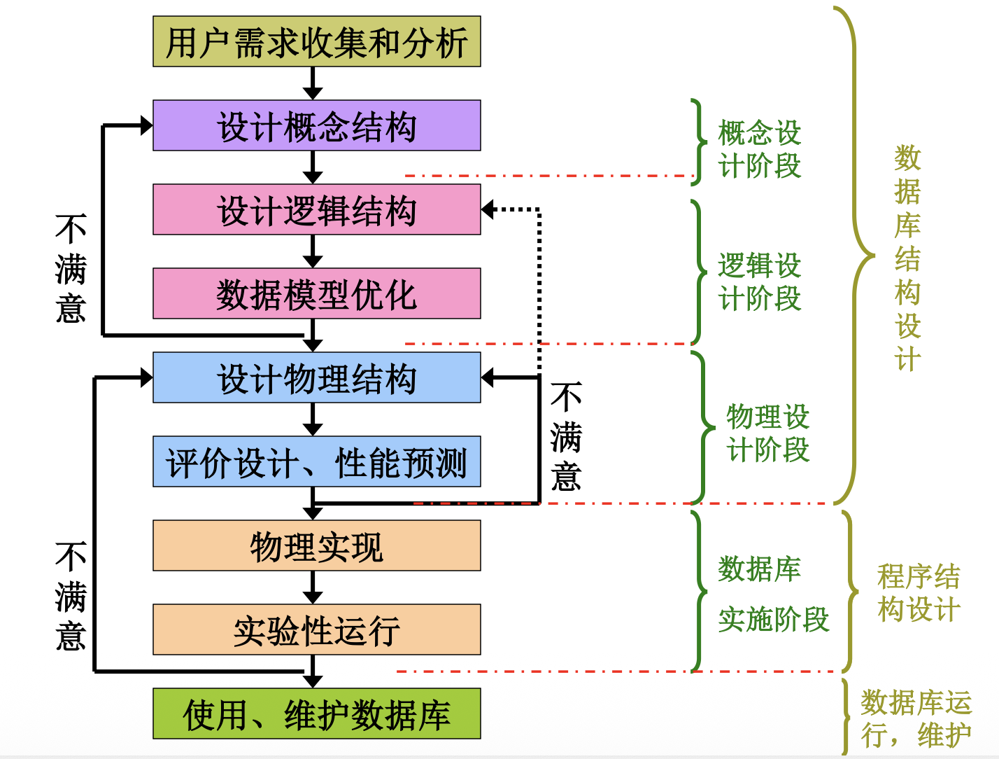


#### 规划阶段
+ 目标
  + 进行建立数据库的必要性和可行性研究，确定数据库系统在组织和信息系统中的地位，以及各个数据库之间的关系。
+ 规划阶段的三个步骤
  + 系统调查:对企业组织作全面的调查，画出组织层次图，以了解企业的组织结构；
  + 可行性分析:从技术、经济、效益、法律等族方面对建立数据库的可行性进行分析；写出可行性分析报告；组织专家进行讨论其可行性；
  + 确定数据库系统的总目标和制定项目开发计划


#### 用户需求收集分析阶段
+ 目标
  + 准确了解系统环境
  + 了解并分析用户对数据及数据处理的需求
+ 重要性
  + 整个设计过程中最重要的一步，是后面各阶段的基础。（方向性的指导）
+ 难点
  + 需求的一致性确定。（用户缺乏计算机知识/数据库设计人员缺乏用户的专业知识）
+ 需求分析的步骤
  + 步骤1：收集需求信息
    +  实施：由数据库设计人员和用户共同完成，必须有用户的参与。(对计算机技术应用
    不广泛的用户单位，数据库设计人员还应帮助用户分析他的具体应用。)
    +  一般用户对数据库的要求：
       + 信息需求：需要从数据库中获得的信息的内容和性质。
       +  处理需求：要完成哪些处理功能，应说明对系统处理 的时间、处理方式的要求。
       +  安全性和完整性要求：上述需求满足后，考虑系统的安全性和完整性要求。
       +  性能需求：定义相应时间、吞吐量、并发数等性能要求。
  + 步骤2：分析整理
    +  内容：对收集到的数据进行抽象的过程。要从用户处理入手。对于复杂过程可以分解到若干子处理。
    + 教学管理系统的需求分析：
      + 学生的资料的输入
        + 基本资料输入
        + 分配学号号，设置进入系统访问的初始密码（自动）。
      + 选课、课程成绩登录。
      + 学生、课程信息的查询，修改，删除。
      + 教师、授课信息

#### 设计逻辑结构

+ 基于概念模型进一步细化，将概念模型转化为关系数据库模型
+ 数据库设计要依据一定的规范
+ 关系数据库的规范化理论主要包括三个方面的内容：
  + 函数信赖
  + 范式（Normal Form）
  + 模式设计
+ 其中，**函数信赖**起着核心的作用，是**模式分解**和**模式设计**的基础，**范式**是模式分解的标准。


数据库的逻辑设计为什么要遵循一定的规范化理论？
什么样的逻辑结构是好的关系模式？
某些不好的关系模式可能导致哪些问题？

下面通过例子进行分析:

例如，要求设计教学管理数据库，其关系模式SCD如下：
```
SCD(SNO,SN,AGE,DEPT,MN,CNO,SCORE)
```
其中，SNO表示学生学号，SN表示学生姓名，AGE表示学生年龄，DEPT表示学生所在的系别，MN表示系主任姓名，CNO表示课程号，SCORE表示成绩。

根据实际情况，这些数据有如下语义规定：
  + 一个系有若干个学生，但一个学生只属于一个系；
  + 一个系只有一名系主任，但一个系主任可以同时兼几个系的系主任；
  + 一个学生可以选修多门功课，每门课程可有若干学生选修；
  + 每个学生学习课程有一个成绩。


在此关系模式中填入一部分具体的数据，则可得到SCD关系模式的实例，教学管理数据库一部分。
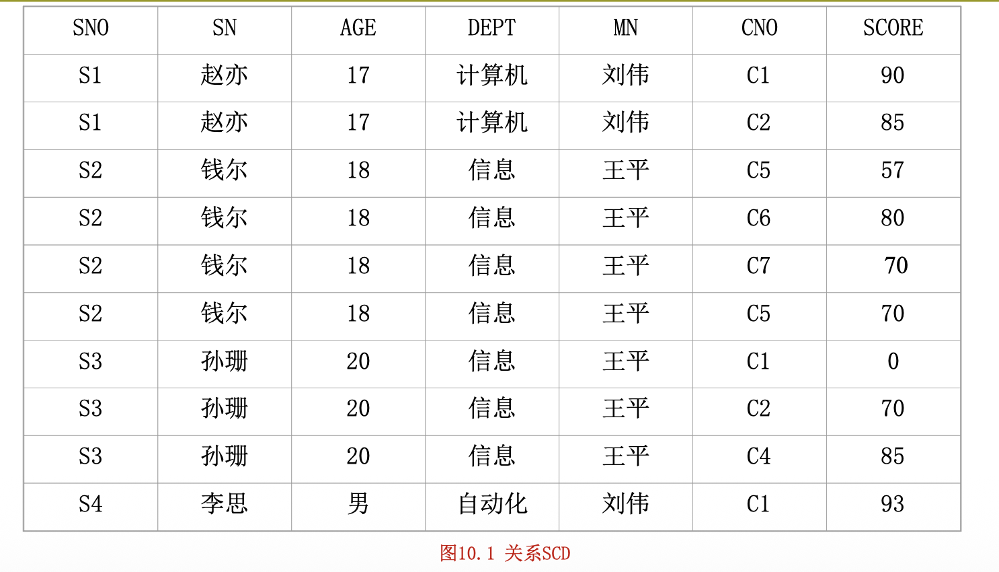


## 关系模式的存储异常问题
根据上述的语义规定，并分析以上关系中的数据，我们可以看出：(SNO,CNO)属性的组合能唯一标识一个元组，所以(SNO,CNO)是该关系模式的主关系键。但在进行数据库的操作时，
会出现以下几方面的问题：
+ **数据冗余。** 每个系名和系主任的名字存储的次数等于该系的学生人数乘以每个学生选修的课程门数，同时学生的姓名、年龄也都要重复存储多次，数据的冗余度很大，浪费了存储空间。
+ **插入异常。** 如果某个新系没有招生，尚无学生时，则系名和系主任的信息无法插入到数据库中。
  + 因为在这个关系模式中，(SNO,CNO)是主关系键。根据关系的实体完整性约束，主关系键的值不能为空，而这时没有学生，SNO和CNO均无值，因此不能进行插入操作。
  + 另外，当某个学生尚未选课，即CNO未知，实体完整性约束还规定，主关系键的值不能部分为空，同样不能进行插入操作。
+ **删除异常**
  + 某系学生全部毕业而没有招生时，删除全部学生的记录则系名、系主任也随之删除，而这个系依然存在，在数据库中却无法找到该系的信息。
  + 另外，如果某个学生不再选修C1课程，本应该只删去C1，但C1是主关系键的一部分，为保证实体完整性，必须将整个元组一起删掉，这样，有关该学生的其它信息也随之丢失。
+ **更新异常**
  + 如果学生改名，则该学生的所有记录都要逐一修改SN；
  + 又如某系更换系主任，则属于该系的学生记录都要修改MN的内容，稍有不慎，就有可能漏改某些记录，这就会造成数据的不一致性，破坏了数据的完整性。


由于存在以上问题，我们说，SCD是一个不好的关系模式。产生上述问题的原因，直观地说，是因为关系中“包罗万象”，内容太杂了。

那么，怎样才能得到一个好的关系模式呢？

把关系模式SCD分解为下面三个结构简单的关系模式，如图所示。
+ 学生关系S(SNO,SN,AGE,DEPT)
+ 选课关系SC(SNO,CNO,SCORE)
+ 系关系D(DEPT,MN)

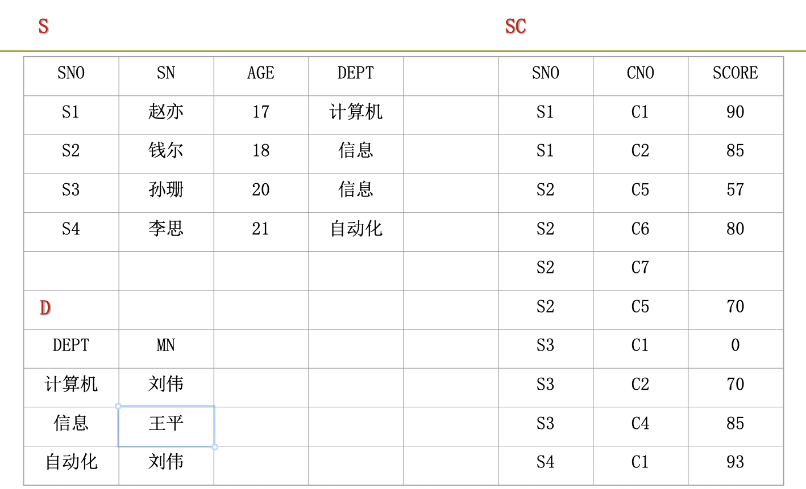


+ 在以上三个关系模式中，实现了信息的某种程度的分离，
  + S中存储学生基本信息，与所选课程及系主任无关；
  + D中存储系的有关信息，与学生无关；
  + SC中存储学生选课的信息，而与所学生及系的有关信息无关。
+ 与SCD相比，分解为三个关系模式后，数据的冗余度明显降低。
  + 当新插入一个系时，只要在关系D中添加一条记录。
  + 当某个学生尚未选课，只要在关系S中添加一条学生记录，而与选课关系无关，这就避免了插入异常。
  + 当一个系的学生全部毕业时，只需在S中删除该系的全部学生记录，而关系D中有关该系的信息仍然保留，从而不会引起删除异常。
  + 同时，由于数据冗余度的降低，数据没有重复存储，也不会引起更新异常。

经过上述分析，分解后的关系模式是一个好的关系数据库模式。从而得出结论，一个好的关系模式应该具备以下四个条件：
+ 尽可能少的数据冗余。
+ 没有插入异常。
+ 没有删除异常。
+ 没有更新异常。


注意，一个好的关系模式并不是在任何情况下都是最优的，比如查询某个学生选修课程名及所在系的系主任时，要通过连接，而连接所需要的系统开销非常大，因此要以实际设计的目标出发进行设计

有没有理论指导我们设计好的关系模式呢？

+ 如何按照一定的规范设计关系模式，将结构复杂的关系分解成结构简单的关系，从而把不好的关系数据库模式转变为好的关系数据库模式，这就是**关系的规范化**。
+ 规范化又可以根据不同的要求而分成若干级别。

## 范式

规范化的基本思想是消除关系模式中的数据冗余，消除数据依赖中的不合适的部分，解决数据插入、删除时发生异常现象。关系数据库的规范化过程中为不同程度的规范化要求设立的不同标准称为**范式（Normal Form）**。

由于规范化的程度不同，就产生了不同的范式。满足最基本规范化要求的关系模式叫第一范式。在第一范式中进一步满足一些要求为第二范式。以此类推就产生了第三范式等概念。每种范式都规定了一些限制约束条件。


范式的概念最早由E.F.Codd提出。从1971年起，Codd相继提出了关系的三级规范化形式，即第一范式（1NF）、第二范式（2NF）、第三范式（3NF）。1974年，Codd和Boyce以共同提出了一个新的范式的概念，即Boyce-Codd范式，简称BC范式。1976年Fagin提出了第四范式，后来又有学者定义了第五范式。至此在关系数据库规范中建立了一个范式系列：1NF,2NF,3NF,BCNF,4NF,5NF,一级比一级有更严格的要求。

各个范式之间的联系可以表示为：
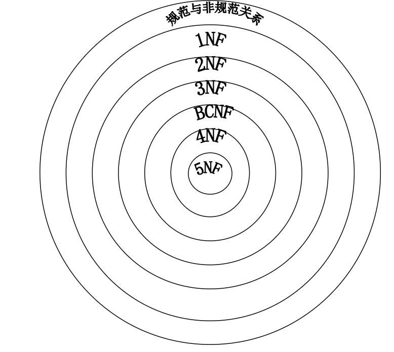


### 第一范式（First Normal Form）
是最基本的规范形式，即关系中每个属性都是不可再分的简单项。

定义：如果关系模式R，其所有的属性均为简单属性，即每个属性都是不可再分的，则称R属于第一范式，简称1NF，记作：
R∈1NF。

+ 在前面讨论关系的性质时，把满足这个条件的关系称为规范化关系。
+ 在关系数据库系统中只讨论规范化的关系，凡是非规范化的关系模式必须化成规范化的关系。
+ 在非规范化的关系中去掉组合项就能化成规范化的关系。
+ 每个规范化的关系都属于1NF，这也是它之所以称为“第一”的原因。

然而，一个关系模式仅仅属于第一范式是不适用的。
+ 在前面章节中给出的关系模式SCD属于第一范式，但其具有大量的数据冗余，具有插入异常、删除异常、更新异常等弊端。
+ 为什么会存在这种问题呢？
+让我们分析一下SCD中的函数依赖关系，它的关系键是（SNO，CNO）的属性组合，所以有：

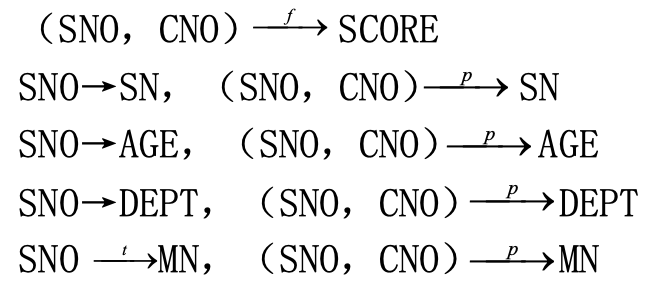


关系模式中的各属性之间相互依赖、相互制约的联系称为数据依赖。数据依赖一般分为**函数依赖、多值依赖和连接依赖**。其中**函数依赖是最重要的数据依赖**。

设关系模式R(U)，U是属性全集，X和Y是U的子集，
+ 如果对于R(U)的任意一个可能的关系r，r中不可能存在两个元组在X上属性值相等，而在Y上的属性值不等，则称X 函数确定 Y或Y 函数依赖于 X，记作 X→Y

设关系模式R(U)，U是属性全集，X和Y是U的子集，


用函数信赖图表示以上函数依赖关系
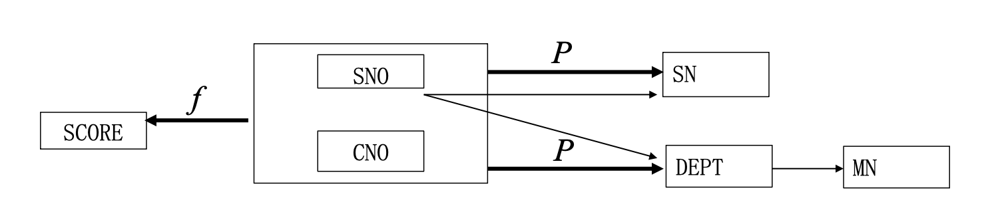

+ 由此可见，在SCD中，既存在完全函数依赖，又存在部分函数依赖和传递函数依赖。
+ 这种情况往往在数据库中是不允许的，也正是由于关系中存在着复杂的函数依赖，才导致数据操作中出现了种种弊端。
+ 克服这些弊端的方法是用投影运算将关系分解，去掉过于复杂的函数依赖关系，向更高一级的范式进行转换。


### 第二范式（Second Normal Form）

第二范式的定义

定义 如果关系模式R1NF，且每个非主属性都完全函数依赖于R的每个关系键，则称R属于第二范式（Second Normal Form），简称2NF，记作R∈2NF。
+ 在关系模式SCD中，SNO，CNO为主属性，AGE，DEPT，MN，SCORE均为非主属性，经上述分析，存在非主属性对关系键的部分函数依赖，所以SCD不属于2NF。
+ 而如图10.2所示的由SCD分解的三个关系模式S，D，SC，其中S的关系键为SNO，D的关系键为DEPT，都是单属性，不可能存在部分函数依赖。
+ 而对于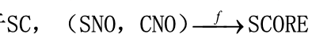。所以SCD分解后，消除了非主属性对关系键的部分函数依赖，S，D，SC均属于2NF。


又如关系模式TCS（T，C，S），
+ 一个教师可以讲授多门课程，一门课程可以为多个教师讲授，
+ 同样一个学生可以选听多门课程，一门课程可以为多个学生选听，
+ (T,C,S)三个属性的组合是关系键，T,C,S都是主属性，而无非主属性，所以也就不可能存在非主属性对关系键的部分函数依赖，TCS∈2NF。

经以上分析，可以得到两个结论：
+ 从1NF关系中消除非主属性对关系键的部分函数依赖，则可得到2NF关系。
+ 如果R的关系键为单属性，或R的全体属性均为主属性，则R∈2NF。


### 2NF规范化

2NF规范化是指把1NF关系模式通过投影分解转换成2NF关系模式的集合。分解时遵循的基本原则就是“一事一地”，让一个关系只描述一个实体或者实体间的联系。如果多于一个实体或联系，则进行投影分解。

下面以关系模式SCD为例，来说明2NF规范化的过程
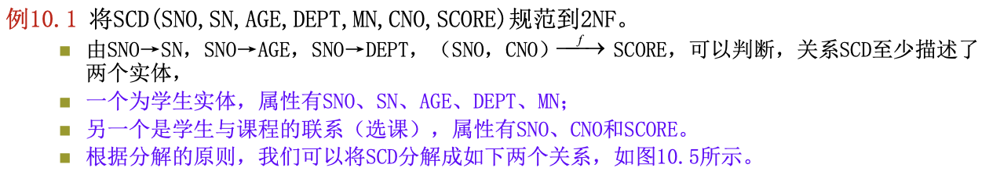


对于分解后的两个关系SD和SC，主键分别为SNO和（SNO，CNO），非主属性对主键完全函数依赖。因此，SD∈2NF，SC∈2NF，而且前面已经讨论，SCD的这种分解没有丢失任何信息，具有无损连接性。

分解后，SD和SC的函数依赖分别如图
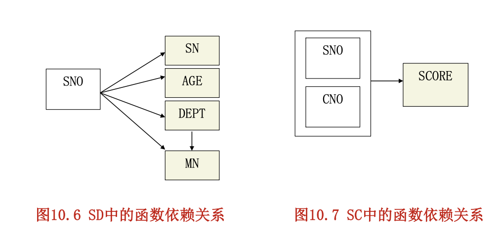

+ 1NF的关系模式经过投影分解转换成2NF后，消除了一些数据冗余。
+ 分析图10.5中SD和SC中的数据，可以看出，它们存储的冗余度比关系模式SCD有了较大辐度的降低。
+ 学生的姓名、年龄不需要重复存储多次。
+ 这样便可在一定程度上避免数据更新所造成的数据不一致性的问题。
+ 由于把学生的基本信息与选课信息分开存储，则学生基本信息因没选课而不能插入的问题得到了解决，插入异常现象得到了部分改善。
+ 同样，如果某个学生不再选修C1课程，只在选课关系SC中删去该该学生选修C1的记录即可，而SD中有关该学生的其它信息不会受到任何影响，也解决了部分删除异常问题。
+ 因此可以说关系模式SD和SC在性能上比SCD有了显著提高。


### 2NF的缺点
2NF的关系模式解决了1NF中存在的一些问题，2NF规范化的程度比1NF前进了一步，但2NF的关系模式在进行数据操作时，仍然存在着一些问题：
+ 数据冗余。每个系名和系主任的名字存储的次数等于该系的学生人数。
+ 插入异常。当一个新系没有招生时，有关该系的信息无法插入。
+ 删除异常。某系学生全部毕业而没有招生时，删除全部学生的记录也随之删除了该系的有关信息。
+ 更新异常。更换系主任时，仍需改动较多的学生记录。

之所以存在这些问题，是由于在SD中存在着非主属性对主键的传递依赖。分析SD中的函数依赖关系，SNO→SN，SNO→AGE，SNO→DEPT，DEPT→MN，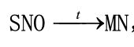，非主属性MN对主键SNO传递依赖。

为此，对关系模式SCD还需进一步简化，消除这种传递依赖，得到3NF。

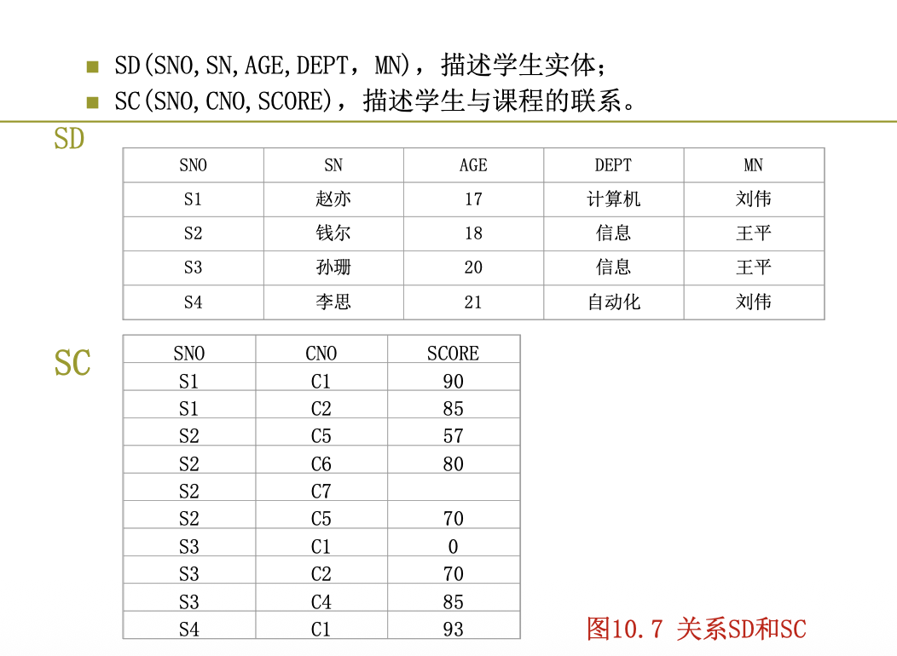


### 第三范式（Third Normal Form）

定义 如果关系模式R∈2NF，且每个非主属性都不传递依赖于R的每个关系键，则称R属于第三范式（Third Normal Form），简称3NF，记作R∈3NF。

第三范式具有如下性质：
1. 如果R∈3NF，则R也是2NF。
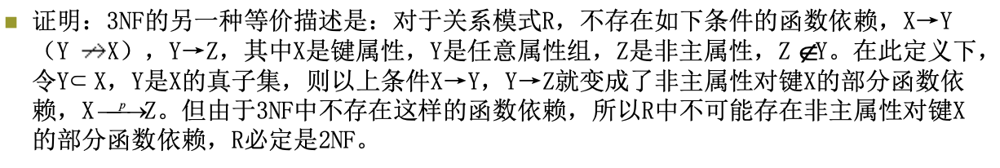

2. 如果R∈2NF，则R不一定是3NF。


### 3NF规范化
3NF规范化是指把2NF关系模式通过投影分解转换成3NF关系模式的集合。和2NF的规范化时遵循的原则相同，即“一事一地”
的联系。让一个关系只描述一个实体或者实体间。


下面以2NF关系模式SD为例，来说明3NF规范化的过程。

将SD(SNO,SN,AGE,DEPT,MN)规范到3NF。

+ 分析SD的属性组成，可以判断，关系SD实际上描述了两个实体：
  + 一个为学生实体，属性有SNO，SN，AGE，DEPT；
  + 另一个是系的实体，其属性DEPT和MN。

+ 根据分解的原则，我们可以将SD分解成如下两个关系，如图所示。
  +  S(SNO,SN,AGE,DEPT)，描述学生实体；
  +  D(DEPT，MN)，描述系的实体。

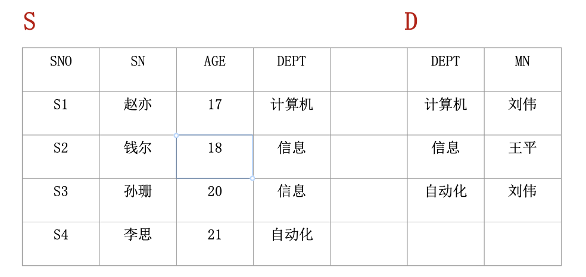
对于分解后的两个关系S和D，主键分别为SNO和DEPT，不存在非主属性对主键的传递函数依赖。因此，S∈3NF，D∈3NF。


分解后，S和D的函数依赖分别如图所示。

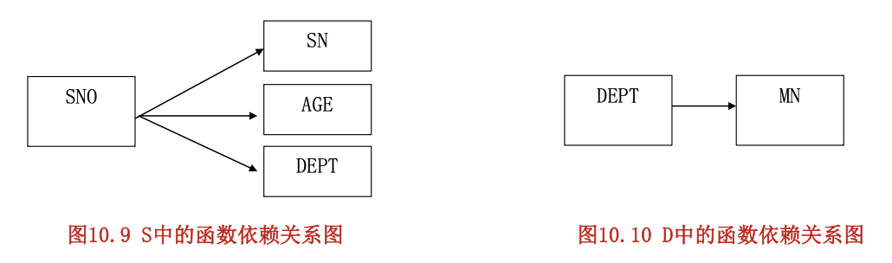

由以上两图可以看出，关系模式SD由2NF分解为3NF后，函数依赖关系变得更加简单，既没有非主属性对键的部分依赖，也没有非主属性对键的传递依赖，解决了2NF中存在的四个问题。
1. 数据冗余降低。系主任的名字存储的次数与该系的学生人数无关，只在关系D中存储一次。
2. 不存在插入异常。当一个新系没有学生时，该系的信息可以直接插入到关系D中，而与学生关系S无关。
3. 不存在删除异常。要删除某系的全部学生而仍然保留该系的有关信息时，可以只删除学生关系S中的相关学生记录，而不影响系关系D中的数据。
4. 不存在更新异常。更换系主任时，只需修改关系D中一个相应元组的MN属性值，从而不会出现数据的不一致现象。

SCD规范到3NF后，所存在的异常现象已经全部消失。

但是，3NF只限制了非主属性对键的依赖关系，而没有限制主属性对键的依赖关系。如果发生了这种依赖，仍有可能存在数据冗余、插入异常、删除异常和修改异常。这时，则需对3NF进一步规范化，消除主属性对键的依赖关系，为了解决这种问题，Boyce与Codd共同提出了一个新范式的定义，这就是Boyce-Codd范式，通常简称BCNF或BC范式。它弥补了3NF的不足。

关系规范化的基本步骤如图

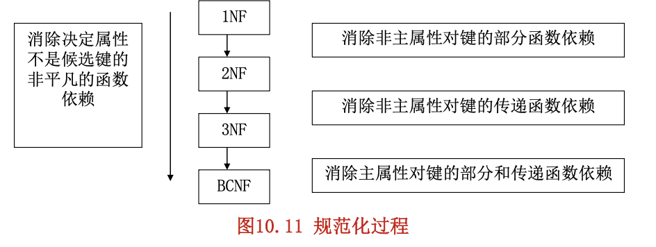

+ 一般情况下，我们说没有异常弊病的数据库设计是好的数据库设计，一个不好的关系模式也总是可以通过分解转换成好的关系模式的集合。
+ 但是在分解时要全面衡量，综合考虑，视实际情况而定。
+ 对于那些只要求查询而不要求插入、删除等操作的系统，几种异常现象的存在并不影响数据库的操作。这时便不宜过度分解，否则当要对整体查询时，需要更多的多表连接操作，这有可能得不偿失。
+ 在实际应用中，最有价值的是3NF和BCNF，在进行关系模式的设计时，通常分解到3NF就足够了。

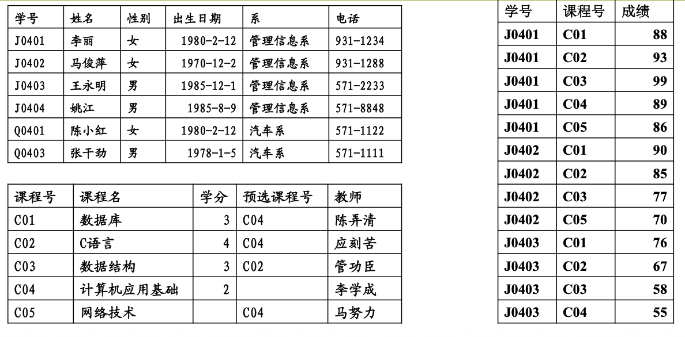


## 问题
+ 逻辑结构设计完成后，怎么实施到SQL Server 2019等 DBMS?
+ 怎么装载基础数据?

